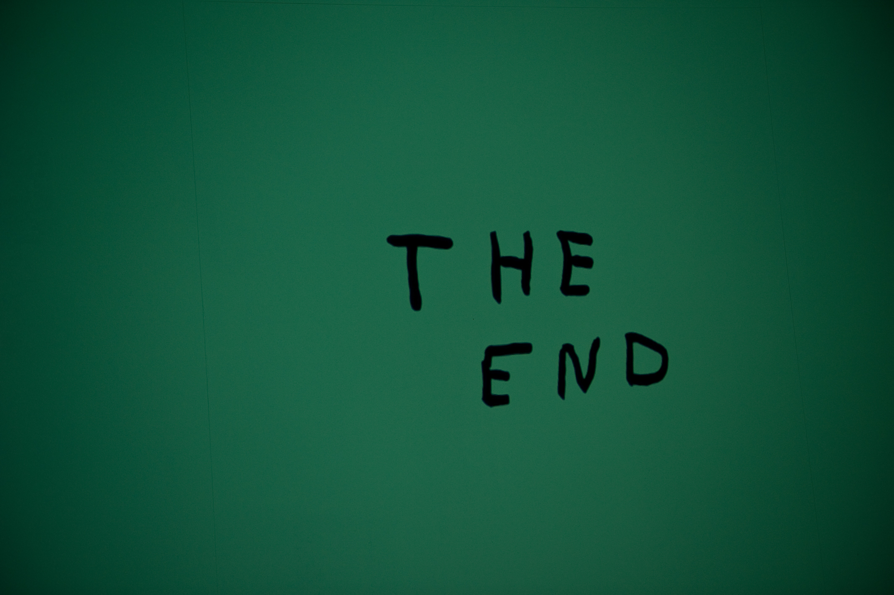

# 知識の貿易を始める〜自分にとっての常識は他人のとっての学び〜

## 知識の貿易

商業の１つに貿易というものがある。これは自国と他国で商品・金品のやりとりを行うわけだが、さて、ではなぜ貿易が行われるか？それは国によってモノの価値が異なるからだ。海の近くでは塩の値段はそこまで高くないが、山岳地域や内地では高値で取引されるだろう。

**同じように知識もそれを取り扱う場所によって価値が大きく変動する。**

また、日本では昔は鎖国を続けてきていたが、いざ海外との貿易が始まった時にその文化の特異性や職人技術に大変な価値がついていたと言われる。だが、自国の日本の人々からしたら、それらの文化や技術は当たり前の知識やモノであり、なんら特別性・意外性もないようなモノであっても、だ。

**つまり、捉える人によっても価値は大きく変動する**

さて、まず最初に伝えたいのは**これは知識でも当てはまる**いうことだ。

例えば、旅行中においしい店を見つけたければ現地の人におすすめを聞くとよい。その現地の人たちにとっては当たり前の場所でも旅行で訪ねた人にとっては貴重な情報だ。カフェを経営してみたいと思うなら既に過去に経営したことのある人物にその経験を聞くのも良いだろう。

## 自国の特産物を見てみる

では、「_知識の貿易を行うべきだ_」と言うと大抵の人が最初に思うのは「_自分には価値ある知識が無い_」つまり貿易となる商品がない、だ。だが、それは本当なのか。他の人にとってあなたの知識に価値がないと、なぜあなたが断言できるのか。先にも述べたとおり「現地の人たちが知っている美味しい店」なんて、そこらへんのおばちゃんでも知ってるような内容だ。既にあなたは何十年もの人生を生きてきたわけで、それだけあなたは人生を通して知識を溜め込んできているはずなのだ。つまり、自覚していないだけである。

そうなると、次に大事なのは**自国の特産物を見極めること**だろう。つまり自分がどのような知識があるのか、だ。

これを見極めるにも色々な方法がある。だが、自分がおすすめする最も良い方法は簡単だ。あなたの友人に聞くことだ。貿易商や商人は鋭く他国の特産物を見極めるだろう。とはいえ、聞く相手は鋭い観点を持っている人だけでなくとも良い。最終的に自国の特産物たる知識の客はもしかすると、そこらへんにいるおばちゃんになるかもしれない。それならそういった「一般的な普通の観点」を持っている人に聞くのも良いかもしれない。

だが、やってはいけないことは**自分で自分のことを決めつけること**だ。

もちろん、自分の何十年もの人生経験から自分という人間を知っているとも思う。だが、それは主観を通した自分であり客観性に欠けた情報だ。他の人に意見を聞くのは自分ではどうやっても得られない客観性という視点を補うことにほかならない。もし、それしきの知識を出し惜しむような友人しか居ないような人生を送ってきている人は残念ながら頑張って自分で考えてもらうしかない。だが、アナタはそうでないのならぜひ友情の力を借りよう。

## 知識の貿易を始める

では、自国の特産物を見極めたアナタも知識の貿易を始めよう。

早速、自国の特産物を市場に出してみなよう。市場に出し続ければあとは客たちがその知識に価値をつけてくれるだろう。また、客からの意見を集め、問題があれば都度軌道を修正するのも良い。

最後に考えるべきは**どの市場にだすか**、だ。今の時代のなんとも良きことか、世は大 SNS 時代、Twitter からブログ、はたまた Instagram や Youtube のように文章だけでなく画像や動画の媒体を取って客に知識を届けることは出来るわけだ。アナタの知識をどう加工してどの市場に出すかはアナタ次第だが、何より大事なのはまずは市場に出すこと、そしてそこからも市場に出し続けることであろう。そうでなければ始まらないし固定客もつかない。

貿易を行いやすい今の時代、あとはやるかやらないかの違いだけだろう。

## 終わりに

自分の戒めとしてアウトプットに対する大事さを書いた。
