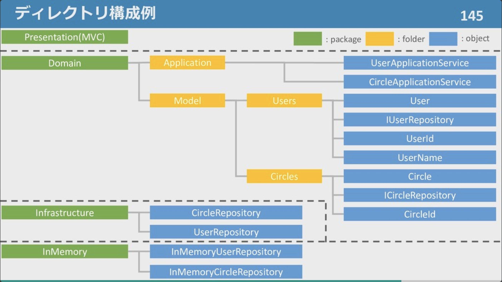

# 「第二回ボトムアップドメイン駆動設計」に行ってきて軽量 DDD を完全に理解した話

「[ボトムアップドメイン駆動設計 │ nrslib](https://nrslib.com/bottomup-ddd/)」の資料がものすごくよかったので、掲題のイベントに参加して聴講してきた。

そのため、この記事は、『「第二回ボトムアップドメイン駆動設計」のイベントのまとめ記事』です。

## 「第二回ボトムアップドメイン駆動設計」の趣旨

- ドメイン駆動開発をボトムアップに実装ベースで理解していく
- ドメイン駆動設計の本質に集中できる下地を作る

## 資料群

スライド

- [ボトムアップドメイン駆動設計 前編 / bottomup-ddd-1 - Speaker Deck](https://speakerdeck.com/nrslib/bottomup-ddd-1)

- [ボトムアップドメイン駆動設計 後編 / bottomup-ddd-2 - Speaker Deck](https://speakerdeck.com/nrslib/bottomup-ddd-2)

資料

- [ボトムアップドメイン駆動設計 │ nrslib](https://nrslib.com/bottomup-ddd/)

Conpass

- [第二回ボトムアップドメイン駆動設計 - connpass](https://ddd-community-jp.connpass.com/event/107106/)

Twitter

- `#bu_ddd`

## セミナー内容

### はじめに

- 会場アンケートで「エリック・エヴァンスのドメイン本」を読んで → 読み切った人 → 理解した人ー＞０人
- ドメイン駆動設計は要は OOP
- ドメイン駆動設計が怖い／辛い原因は「知らない」だけだが用語が難しい
- 用語は「マインド」「パターン」の２つに分かれる。「マインド」はエリック・エヴァンスのポエムなので感じるしか無い、が「パターン」は実装出来る！
- 構想を一年間練った

- このセミナーの流れ

  - ① イントロはセミナーで
  - ② 細かい部分は記事
  - ③ マインドは書籍で

- ゴール「Evans の本を読む下地を作る」

### 値オブジェクト

＝「値」＋「オブジェクト」

- 値の変更は**「代入」**で行う。専用の関数などは使わない。
- **「（値を表す）オブジェクト」を「値らしくしよう」＝「値オブジェクト」**
- 値の性質
  - ① 状態を不変に保つ：値の変更は代入でのみ行い、関数を用いた変更は行わない
  - ② 比較可能：比較を行う関数を用意
  - ③ 完全に交換可能：① によって代入による交換のみしか行えないので、交換可能になる
- 値オブジェクトのモチベーション

  - ① 表現力が増す
  - ② 存在しない値を存在させない
  - ③ 誤った代入を防ぐ

- プリミティブな値ではなく、「システム固有の値」を作ることで「表現力が増す」＋「実装上の安全性が増す」

### エンティティ

- FW のエンティティとは違うので注意！！！そのため「エリック・エヴァンスのエンティティ」と呼んだほうがよいと思う。

- エンティティとは、「値オブジェクトの逆」のこと。
- エンティティの性質

  - ① 可変
  - ② 区別される：例えば同姓同名かもしれないので**識別子が必要**
  - ③ 同一性を持つ：名称が変わっても同一人物なので**識別子が必要**

- ライフサイクルを持っている

### ドメインサービス

- ドメインサービスとは「ドメインに関する処理だが、値オブジェクト・エンティティに実装するのが自然でない処理を実装するオブジェクト」
  - 例えば、「ユーザ名の重複チェック処理」
  - 雑多な処理が多く入ってくる。
  - エンティティとドメインサービスのどちらに書くか？で迷ったら**必ずエンティティに書く**。ドメインサービスは最後の手段なので。

### リポジトリ

- データの永続化を担うオブジェクト

- **永続化の対処は「エンティティ」**

- リポジトリオブジェクトに対するインターフェースを作成して使用すると、テスト時に差し替えることが出来る　 → 　リポジトリパターン
  - 具象オブジェクトへの依存がなくなる
  - 本番と同じロジックでテスト可能

### アプリケーションサービス

- アプリケーションサービスとは、ビジネスロジックの API で何が出来るかを表現。
  - 「エンティティ」「値オブジェクト」「ドメインサービス」「リポジトリ」を強調させる
  - 最終的にユースケースを達成させる　 → 　アプリが作れる

### Dependency Injection

- 依存オブジェクトをコンストラクタで注入する
- 調べればよく出てくるので、詳細割愛

### セパレートインターフェース

- エラー調査時に、例外が発生するような「整合性のある不正なデータ」を用意するのは大変。
- セパレートインターフェースにしておけば、データを準備しなくても例外を投げるオブジェクトに差し替えられる

### コントローラー

- フロント都合で来ているリクエストをアプリケーションサービスに渡すだけが責務
  - 日付の変換など
- それ以上の処理はアプリケーションサービスで行う

---

_ここまで前半、ここから後半_

---

### ファクトリ

- ファクトリとは「作成する機能」担う。
- 「エリック・エヴァンスのファクタリー」で「GoF のファクトリ」とは関係ない
- 「ユーザの知識」と「ユーザを作る知識」は別物。ユーザが「ユーザの作り方」を知っているのがおかしい。そのため、「作り方」を担うのがファクトリ
- カプセル化・DI されるので差し替え可能
- 採番処理などは、リポジトリに採番処理を行うケースもあるが、ファクトリを作成してここで担うのがおすすめ。

### トランザクションとトランザクションスコープ（DDD のパターンではないが）

- 同時にユーザ登録すると重複エラーが発生する。DB レイヤーでユニークキーで担保する？コード内で明示的に「重複を許さない」ということを表せられない
- トランザクションを行うことで「整合性を求められる」ということが明示的に表現される
- 「ユニットオブワーク」という実装でも出来るので考慮してもよいかも

### 集約 (Affregate Root)

- 集約とはエンティティ同士の集まり

  - Circle の中の User のエンティティを利用する

- デメテルの法則

  - `circle.Users.Add(newUser)`　 → 　`circle.join(newUser)`

- 「ドメインモデル貧血症」＝ただただ getter しているようなもので、ドメインモデルが何も語っていない。

- どのくらいの粒度で作るの？　 → 　整合性の境界・変更の単位。

- リポジトリは集約の単位で作成する

- やろうと思えばデメテルの法則を違反できてしまう対策
  - 「Circle の中に User」ではなく「Circle の中に UserID」にする
  - getter をなくす　 → 　次はリポジトリで使えなくなってしまうのっで没
  - Notification パターン
  - Scala なら最強

### ディレクトリ構成イメージ

- IUser など I 始まりは Interface を指す

### DDD の用語で書くアーキテクチャを見る

- レイヤードアーキテクチャ

  - 依存方向が外から中

- ヘキサゴナルアーキテクチャ

  - ビジネスロジックを中心に考える
  - 依存方向が外から中

- オニオンアーキテクチャ

  - ヘキサゴナルの内側

- クリーンアーキテクチャ

  - ヘキサゴナルの外側

- まとめ
  - 依存関係の整理
  - 外界の変更がビジネスロジックに伝播しない
  - ビジネスロジックが外界に伝播する

### その他

- モデリング（値オブジェクト、エンティティ、ドメインサービス）を設計して、その結果を元に集約・リポジトリなどが設計される

- 形を模倣しただけでは軽量 DDD、真の DDD はマインドを得てから。そのためにも、本を読みましょう。

## 所感

- 事前に[ボトムアップドメイン駆動設計 │ nrslib](https://nrslib.com/bottomup-ddd/)を読み終わっていたので内容的に重複していた。が、読んだのが、しばらく前だったので良い復習になった。
- また、DDD について「知りたい人」「知らない人」「心折られた人」はこの資料・セミナーはかなりおすすめなので、是非読んだり聞きに行って欲しい。
- 他の 4 アーキテクチャについてもわかった気にさせてもらえるお買い得な内容だった。
