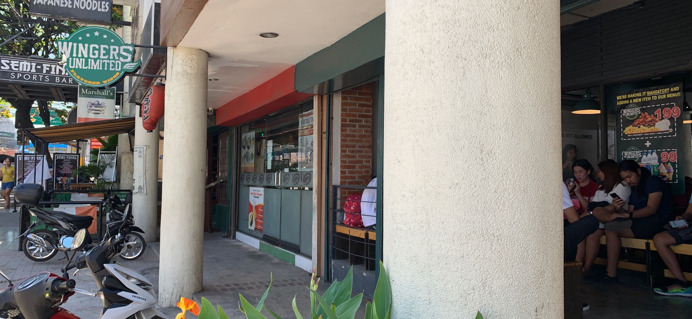
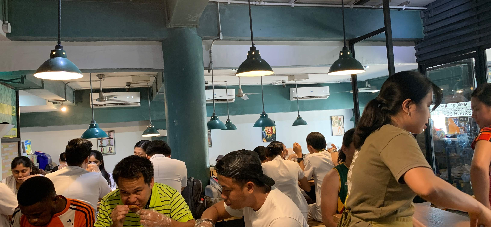
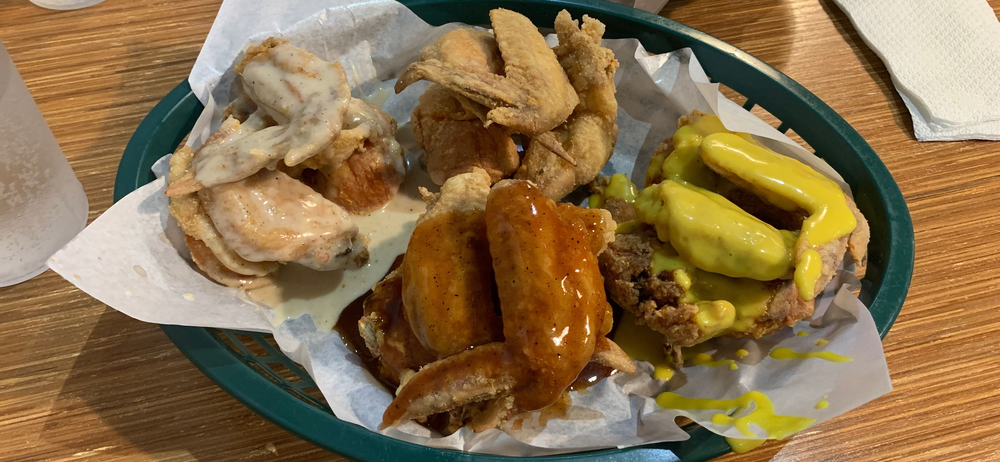
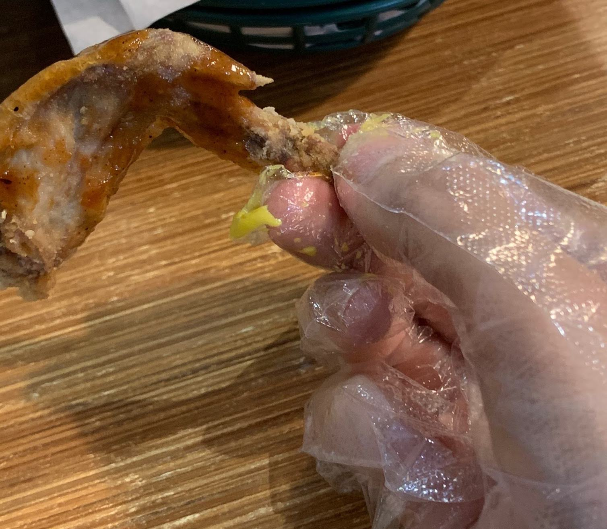
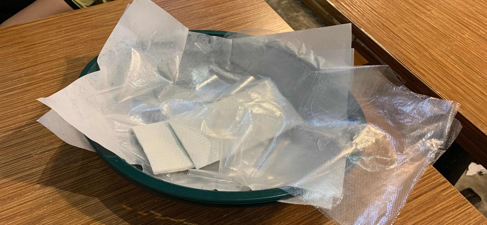
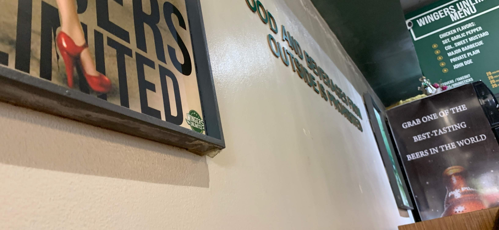

# フィリピンの食べ物で人気の、WingersUnlimited に行ってきた話

こんにちは。食べ放題には、あまり行かない Nash です。

この記事では、

「WingersUnlimited という、地元民にメチャクチャ人気の、チキン食べ放題の店に行ってきた」

という、内容の記事になります。

結論ですが、こんな人にオススメでした。

- 食べ放題の店で、コスパ良く食べたい
- 素手で食事する店を、経験をしてみたい
- 地元民が、どんな店に行くのか知りたい
- 衛生面が、安全な店が良い

逆に、こんな人にはオススメしないです

- この店、味付けは「普通〜まぁまぁおいしい」くらいです
- この店、インスタ映えしないです

味がめちゃくちゃ美味しい店なら、下記とかをオススメします。

» [フィリピンで魚の食べ物が美味しい、PAOLITO'S に行ってきた](./philippines-paolitos)

では、書いていきます。

## フィリピンの食べ物で人気の、WingersUnlimited に行ってきた話

<iframe src="https://www.google.com/maps/embed?pb=!1m18!1m12!1m3!1d2024.8802094386067!2d123.89534053537007!3d10.310507741494968!2m3!1f0!2f0!3f0!3m2!1i1024!2i768!4f13.1!3m3!1m2!1s0x0%3A0x49e6efa4ee720763!2sWingers+Unlimited!5e0!3m2!1sja!2sph!4v1554283010538!5m2!1sja!2sph" width="600" height="450" frameborder="0" style="border:0" allowfullscreen></iframe>

まずは、場所ですが、MangoSquareMall の近くになります。

メインストレートに面しているので、治安レベルは普通です。

夜になると、ストリートチルドレンがたまにいたり、いなかったり。

まぁ、フィリピンでは、普通ですね。

### 人気なので行列ですね

（写真だと、ちょっとわかりにくいでしが、行列になってます）

自分が行ったのが週末の昼の時間帯だったのもあり、かなり混んでいました。

店内に入るときも何組か既に並んでいましたね。

日陰の位置に、行列が座るための椅子があったりするので、常に人気のようです。

ただ、時間を少しずらせば、ピーク時間は割と簡単に回避できるらしいです。

### 店内も混雑しています

店内の画像です。混雑していますね。

周りを見渡しても、観光客は居なくて、地元民だけでした。

完全なローカルな店で地元民しか居ない環境に、少しドキドキしながら注文した料理が来るのを待ちます。

### いざ実食

というわけで、頼んだ料理がこちらです。

はい、ものすごくシンプルですね。

ひたすら「チキン」です。

味付けが、時計回りに上から順に下記のようになります。

- プレイン
- マスタード
- バーベキュー
- ガーリック

そして、料理を食べるのに箸やフォークはありません。

手袋で食べます。

画像だとわかりにくいですが、ビニルの手袋渡されます。

この店では、そもそもフォークなどの食器は出てこないので、選択の余地はないですね。

## フィリピンの食べ物で人気な理由は、コスパが良い

味の感想は、「普通〜まぁまぁ、おいしい」です。

そして、チキンを味わうというよりも、色々なソースの味で楽しむ感じですね。

とはいえ、299 ペソでチキン＋ドリンク＋ポテトが食べ放題なので、値段は圧倒的に安いです。

このコスト感に対して、味が「普通〜まぁまぁ、おいしい」というクオリティなので、やはり、地元民に愛されるだけはあります。

### おわりに

というわけで、「超美味しい店！」というよりも、「地元民がよく行く、コスパが良い店」でした。

ただ、地元民が周りにいる環境で食べたり、素手でチキンを食べるのは、わりと経験としては面白いです。

そういう観点で、楽しめる人にはオススメします。

ちなみに、英語のメニューなので、コミュニケーションは問題なく行えます。

---

フィリピン留学中に毎日必ず Tweet してたので、その内容をまとめました。興味がある人はこちらもどうぞ

» [Twitter - フィリピン留学(2019/2/2~2019/4/27)(バギオ → セブ)](https://twitter.com/i/moments/1108015112575541249)

「いいね」してもらえると喜びます。
