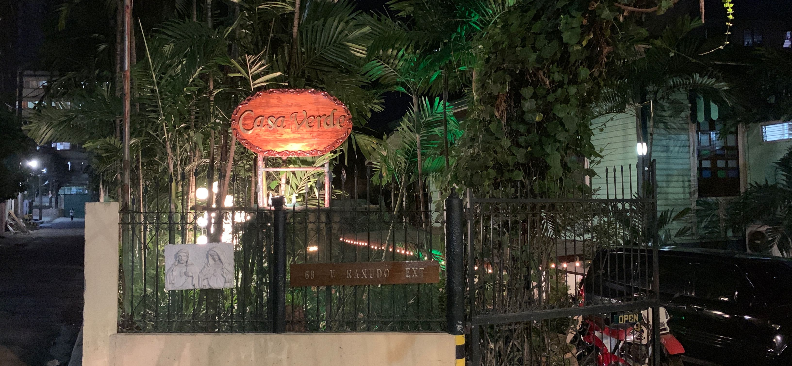
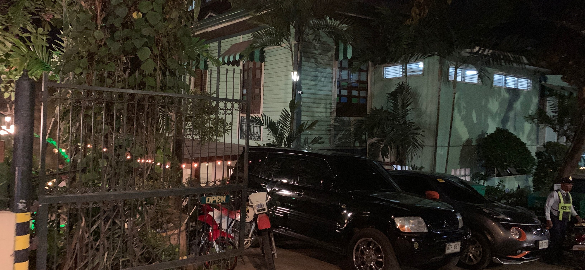
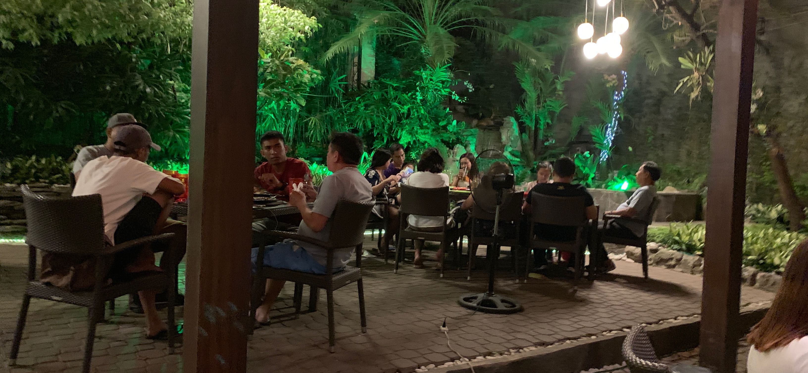
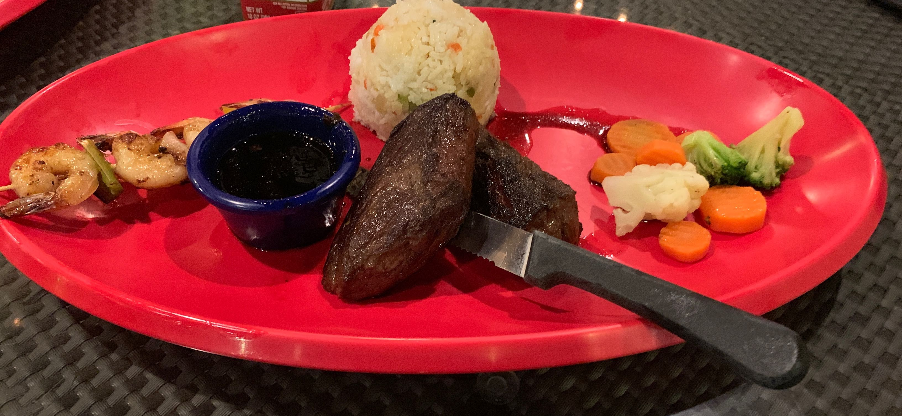
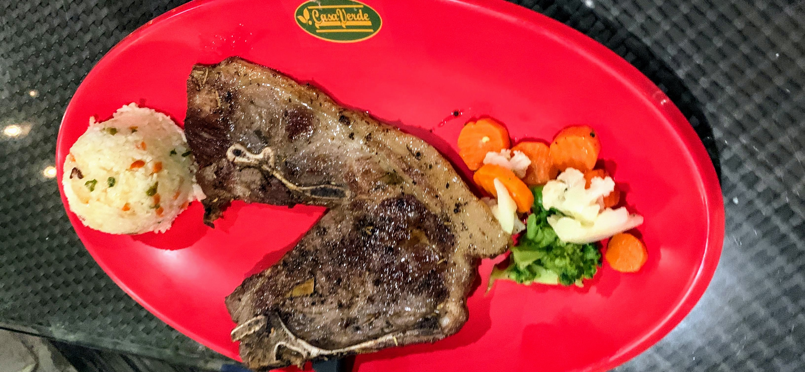

# 【フィリピンでの食べ物】肉が美味い CasaVerde に行ってきた話

こんにちは。フィリピンの豚肉料理を食べて後悔した、Nash です。

この記事では、『肉が美味しいことで有名なレストラン「CasaVerde」の体験レビュー記事』になります。

ちなみに、フィリピンの豚肉料理を食べて後悔した件は下記で記事にしているので、よかったら、こちらもどうぞ。

[フィリピンで豚の食べ物にトライして、後悔した話【レチョン＝豚の丸焼き】](./philippines-zubuchon)

さて、では、CasaVerge についてレビューを書いていきます。

## 【フィリピンの食べ物】肉が美味い CasaVerde に行ってきた話

アメリカンスタイルのカジュアルダイニングレストランです。

そのため、ステーキやハンバーガーなどがありますが、後で聞いた所リブステーキが特にオススメらしいです。

価格帯は、フィリピン人からしたらかなり高級店になりますが、日本人からしたらかなり安い店です。１食、1000 円以下で、美味しい肉が大量に食べられます。

### 場所は、Fuente Osmena Circle の近く

<iframe src="https://www.google.com/maps/embed?pb=!1m18!1m12!1m3!1d2381.7493312083725!2d123.89548866480811!3d10.306509627819606!2m3!1f0!2f0!3f0!3m2!1i1024!2i768!4f13.1!3m3!1m2!1s0x33a9995023e44bfd%3A0x23f1299947769fc7!2z44Kr44O844K144O744O044Kn44Or44OH!5e0!3m2!1sja!2sph!4v1554299169020!5m2!1sja!2sph" width="600" height="450" frameborder="0" style="border:0" allowfullscreen></iframe>

場所は上記の場所になります。表の通りは、ジョリビーなどがあり、かなり活発ですが、この店は、やや裏通りにあります。

そのため、自分が行った時は夜だったのですが、街頭が少ないので少し注意して行かれることをオススメします。

とはいえ、ホームレスやストリートチルドレンなどは、メインストリートに居るので、むしろこの辺りには居なかったです。

### 外装はクラシックな家

外から見たら画像になります。

１つのレストランにしては、車の駐車スペースがかなりあります。

理由は、人気で遠方からも人が来るのかな？とか思いながら、中に進みます。

### 内装のテラスはライトアップされてる

店内は、完全な店内か、屋根付きのテラスがあります。

今回自分が行った時は屋根付きのテラスの座席に案内されました。

こちらは、周りが観葉植物で囲まれているので、きちんと空間作りがされていますね。

ただ、グリーンのライトで更にライトアップされている辺りが、海外らしいです。

とか、考えている辺りで、注文していた料理が来ました。

### 料理の画像

（おいしいそうに、写真取らなくて、すみません・・・雑ですね）

ぱっと見た感じ、少し肉が小さいです。

後で先生に聞いたところ、先生からも「この肉は小さいね」と言われました。

「リブ」がオススメだったようなので、時間があれば次回注文します。

ただ、その分、味はかなり美味しいです。久しぶりに、良い肉を食べた感があります。

他にもこんな肉の料理です。

（ブレてて、すみません。）

ちょっと、胡椒が強かったですが、力強くて美味しいお肉です。

有名店だけあって、両方とも普通に美味しいですね。

### 終わりに

結論、自分の料理の画像があまりにひどい・・・。

美味しくなさそうに見えますが、ただ、メチャクチャ美味しいのでおすすめです。

量も少なく見えるかと思いますが、完全に自分の選択ミスですね。

メニューを見る限り、リブステーキがページ１つまるまる使ってるのと、先生からのオススメでもあるので、とりあえず自分としても、リブステーキをおすすめしておきます。

---

フィリピン留学中に毎日必ず Tweet してたので、その内容をまとめました。興味がある人はこちらもどうぞ

[Twitter - フィリピン留学(2019/2/2~2019/4/27)(バギオ → セブ)](https://twitter.com/i/moments/1108015112575541249)

「いいね」してもらえると喜びます。
