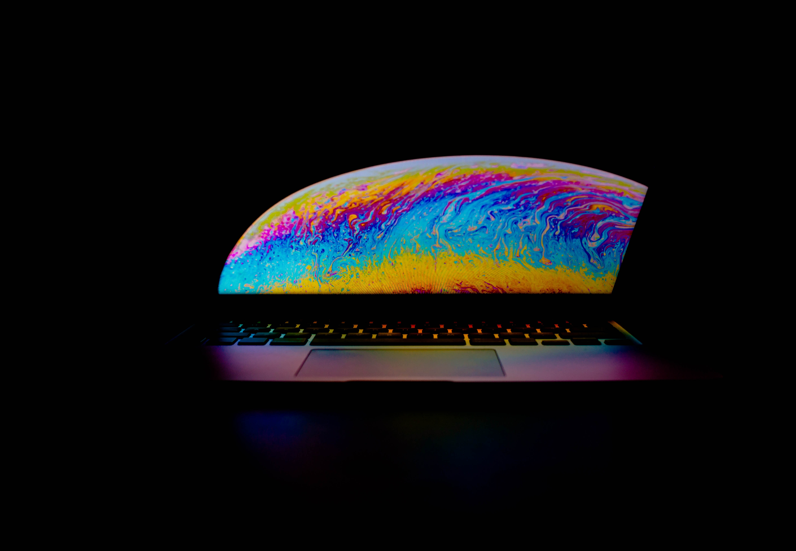

# フィリピン留学用にサブ PC を選定した話【IT 留学じゃないです】

こんにちは。フィリピンで語学留学しながらフリーランスの仕事してる Nash です。

この記事は「フィリピン留学中に使う PC を選定したときの、調査まとめ記事」です。
フィリピンに行く前に選定していたときの思考などを、まとめておきます。

結論は、中古 MacBook(2015)を買いました。

<blockquote class="twitter-tweet" data-lang="ja">
エンジニアのPCスペックは人権だ！と叫ばれてる中 macbook(2015)でしばらく仕事してみたけど 高望みしなければ意外とどうにかなるな
&mdash; Nash🌏留学中Webエンジニア (@snamiki1212) <a href="https://twitter.com/snamiki1212/status/1076377911718891520?ref_src=twsrc%5Etfw">2018年12月22日</a></blockquote>

＜文言整理＞

- Mac Book Pro ＝ MBP

- Mac Book Air ＝ MBA

- Mac Book ＝ MacBook

＜ Reference ＞

PC のハードについて詳しくなりたければ下記のサイトで学習するのが一番良かったです。メチャクチャ詳しく、UI も見やすく、キレイにまとまってます。→[https://chimolog.co](https://chimolog.co/)

## フィリピン留学用にサブ PC を選定した理由

前提として自分が持っていたメイン PC は Mac Book Pro(2017 / 15inchi)になります。

ただ、別途でサブ PC を購入することにしました。
理由は、大きくわけて 2 つです。

- 母艦の Mac Book Pro(2017 / 15inchi)が物理的に重すぎる(2kg over)
- 母艦を紛失したら金額面での損失がでかい（50 万くらい）

語学学校でのセキュリティレベルがわからないのもあり、サブ PC を購入することにしました。

### 仕事や語学留学について

仕事は軽めのタスクのみです。
具体的には、Rails/Slim/SASS+Docker で小規模な Web アプリケーションの開発です。
また、語学留学の期間は 3 ヶ月です。

では、まず選定において重視した点からです。

## 重視した点

### モビリティ：軽いは正義

気軽に持ち運び可能で、荷物としても負担にならないことを重視しました。
理由は、メインで使っていた MBP が重すぎたので、常に肩こりに悩まされてたからです。

### スタンドアローン：NoNetwork, NoProgramming

PC 単独で完結して作業が行えることを重視しました。

Cloud9 などのクラウド環境を使った開発はサブ PC において定石ですが、それは日本で作業する際の定石です。ネットワークが安定している場所では開発環境・性能をクラウドに依存させる選択は「あり」だと思います。

ですが、フィリピンのような発展途上国では、ネットワーク速度・安定がどこまで担保されるのかが、不透明です。

そのため、PC 単独で作業が完結できるようにする、スタンドアローン性を重視しました。

### ライフタイム：USB Type-C に統一したい

長期的に長く使えることを重視しました。
具体的には USB Type-A の規格は選ばないで、Type-C の端子の PC を選ぶことにしました。

現状(2019/1 頃)は、TypeA→C の過渡期ですが、将来的に確実に Type-C に統一されるます。そのため、今の時点で Type-A の PC を選択すると、端子の観点で PC のライフタイムが短くなるかと思いました。

Type-A の PC のほうが価格が安い傾向がありますが、長期的に見た時にライフタイムが長い PC のほうがコスパは良いかと思います。また、複数デバイスを持つ時に 2 端子に対応させるために、複数コードを持ちたくなかったです。

そのため、長期的なコストの観点でライフタイムを重視しました。

### キーボード：US 配列

メイン PC が US なので、揃えることは必須にしました。

以前、US 配列・JS 配列の２つの PC を同時に使っていたときがありましたが、生産性が劇的に落ちます。具体的に言うと、タイポが劇的に増えます。

そのときの教訓から、絶対にここは譲れなかったです。

## 重視しなかった点

### コスパ：性能に対する値段

「性能に対する値段」という意味合いのコスパは重視しなかったです。というのも、他に重視したいポイントが多かったので、金で解決することにしました。

世の中は金で大抵のことが解決します。良い世の中ですね。

### カスタマイズ性：メモリ交換したい

メモリの差し替え、バッテリーの交換などのカスタマイズ性は重視しなかったです。

カスタマイズ性が高いと、コスパがよくなる傾向があります。例えば、メモリも自分で差し替えたほうが性能の高い RAM を安価で揃えられるし、バッテリーの寿命からくる交換も安いです。

とはいえ、金ですべて解決できます。

### スペック：最低限ライン

高スペックはそこまで、求めないことにしました。

とはいえ、譲れないポイントは少なくとも下記です。

- RAM 　=　 8GB
- CPU 　＝　 Y 系 orPentium 以上
- Storage 　＝　 SSD

CPU については、Y 系（Pentium）は弱すぎると思っていましたが、<b>同僚がメモリ 4GB ＋ Y 系 CPU の MBA(2010?)で Unity 動かしながら Docker 上で Elixir をコンパイルする開発スタイル</b>でも仕事が出来ていたので、ここを最低ラインにすることにしました。

ちなみに、同僚の開発スタイルをとると MBA が熱くなりすぎて焼き肉が焼けるレベルです。

ただ、さすがに RAM=4GB は辛いと思ったので、8GB を最低ラインにしてます。DDR4 についても、DDR3 で OK です。

ストレージは「SSD であること」を最低ラインにしました。CPU と RAM で性能を下げている分、SSD にすることで性能のバランスを保ちたかったのが理由です。ちなみに、PCIe/NVMe でなくても SATA で OK にしてました。

## 【結論】中古 Mac Book(2015)にした【理由】

というわけで、選定基準を決めて色々と PC を選定しました。

結果として、買ったものは中古 MacBook(2015)で、買った場所は秋葉原の softmap で、金額は 10 万くらいです。

はじめて秋葉原で中古 PC 巡りをしましたが、かなり楽しいですね。ただ、リアル店舗に見に行くメリットはなく、ネットで探すほうが効率性の観点からは良いです。

とはいえ、リアル店舗を色々と見て回るのは楽しかったので、良しとしています。

では、中古 Mac Book(2015)を購入した理由を挙げていきますね。

### 中古の理由

最新 MacBook(2018)よりも、中古 MacBook(2015)のほうが値段が安いです。まぁ当たり前ですね。

ちなみに、通常だとメルカリで購入するほうが更に安くなりますが、保証がないのでトラブルのリスクを考慮して softmap にしました。

ちなみに、この時期に PayPay 祭りだったので 2 割還元されましたので、メルカリより安く買えたのはデカイですね。

### CPU が、MB(2018)よりそこまで悪くない

CPU の性能についてですが、自分の購入時期だと最新の Mac Book は 2018 モデルです。そして、MacBook(2018)の CPU は第 7 世代です。

後述しますが、CPU は第 7→8 世代で飛躍的に性能が向上します。逆に言うと、2015 モデル →2018 モデルの CPU の成長曲線はリニアかつ緩やかです。

そのため、最新モデルの MB(2018)ではなく MB(2015)でも性能面はそこまで極端に大きくは変わらないです。

### RAM／端子／Storage の要求を満たす

RAM ＝ 8GB が MB のレパートリーにあるので、少なくとも自分が設定していた最低ラインは超えてくれます。また、端子も MacBook(2015)は USB Type-C です。Storage も SSD です。

というわけで、要求している性能は全部クリアしていました。

## 他の PC にしなかった理由

### なぜ、MBA(~2017)にしなかった？

ライフサイクルが短いと感じました。

具体的には、USB-TypeA かつ充電規格が magsafe だったのが理由です。

ただ、ライフタイムを捨ててコスパを重視するならおすすめです。中古なら、5 万でメモリ 8GB の MacBookAir が秋葉原に転がってます。

「Mac の PC がとりあえず欲しい」という人に最初におすすめするなら、これですね。

### なぜ、MBA(2018)にしなかった？

MacBook より少し重いのでやめました。このとき自分の中で、モビリティはかなり大事でした。

### なぜ、MBP(13inchi)にしなかったの？

そもそも、MBP(15Inchi)を持っていたのと、語学留学中に紛失の可能性がどれだけあるかが、わからなかったのでやめました。

ただ、性能と重量のバランスが一番良いので、将来的に自分の母艦は MBP(13inchi)にすると思います。

### なぜ、Windows 系にしなかったの？

開発環境を作るコストを大きく払いたくなかったからです。

昨今の Docker 事情からも、Windows でも開発環境を整えることはできると思います。ですが、Windows での環境構築を整えるコストを払うのはそれなりに高くつくと思っています。

そのため、金を積めば Mac 製品が買えるので、今回は金で解決しました。

ちなみに、具体的には「ThinkPad」「LG gram」「SurfacePro」などが Windows 系の候補でした。

### なぜ、iPad(無印)/(Pro)にしなかったの？

スタンドアローン性が低いからです。

タブレット端末による開発はクラウド依存が必須です。ネットワークが死んだ時に、母艦にてサーバを立てられないと詰みます。

それと、iPad で開発をするナレッジがまだまだ少ないので、今の自分はそこにコストは払わないことにしました。

## 学んだこと

というわけで、選定を割とガッツリ行ったのですが、その時に学んだ内容もまとめておきます。

### IntelCPU の第７ → ８世代がターニングポイント

端的に言えば、第 7→8 世代で性能が 1.5 倍に跳ね上がっています。

そのため、「値段が安いので、第 7 世代 CPU の PC を買う！」みたいな、選択は結果としてコスパが悪いケースが多いと思っています。

背景として、CPU の性能の観点でムーアの法則の成長曲線に限界を迎え始めました。つまり、シングルコアでは性能が頭打ちになりはじめたわけですね。そこで、更に性能を引き出すため物理的にコア数を増やしたマルチコアが主流になっています。（最近では、機械学習などのジャンルでは GPU を使って更に性能を引き出してると思いますが。）

つまり、コア数に処理性能が大きく依存しているわけですね。

そして、Intel のライバル社が新 CPU を投入してきたので、それをぶっ潰すために Intel は今までの IntelCPU のコア数を 1.5 倍にしました。そのタイミングが第７ → ８世代というわけです。

そのため、見た目は数字が 7→8 に上がっただけですが、実態はアーキテクトレベルで CPU 数が増加しているメジャーアップデートなわけです。

結論、CPU 選定においては「第７世代以前か？第８世代以降か？」がターニングポイントになります。

### 「軽い」は「機能」

自分の結論ですが、PC 選定してわかったのは、PC が「軽い」という特長はもはや機能の１つです。

ソフトウェアにおける「速い」に似ています。ソフトウェアにおいても、「速い」は１つの機能として捉えられることもあります。

そのため、同一性能の PC でも「軽い」と値段が確実に高くなります。

「できれば軽い PC にしたいな〜」は、考えが甘くて、「お金を払ってでも、軽いという機能を買うか？」という思考を持っていると選定が楽になります。

### トレードオフの関係性

もちろん PC ごとに違いますが、いくつかの観点で共通したトレードオフがあるように感じました。

- 値段 ↔ 性能
- 軽量性 ↔ 値段

- 軽量性 ↔ カスタマイズ性
- 軽量性 ↔ 稼働時間：（バッテリーの重さに比例する）
- 軽量性 ↔ タッチパッド機能

改めてまとめると「軽量性」の観点が多いですね。

### 終わりに

色々調べた結果、落ち着いたのが MacBook です。

開発者が MacBook を使っているケースが少ないので、使ってみた結果とかも後々でまとめていこうと思います。

<blockquote class="twitter-tweet" data-conversation="none" data-lang="ja">
数少ないmacbookエンジニア仲間ですねー  エンジニアは大抵MBPかMBAなのでmacbook使うエンジニアってあんまり見ないんですよね
&mdash; Nash🌏留学中Webエンジニア (@snamiki1212) <a href="https://twitter.com/snamiki1212/status/1076398485593706496?ref_src=twsrc%5Etfw">2018年12月22日</a></blockquote>

