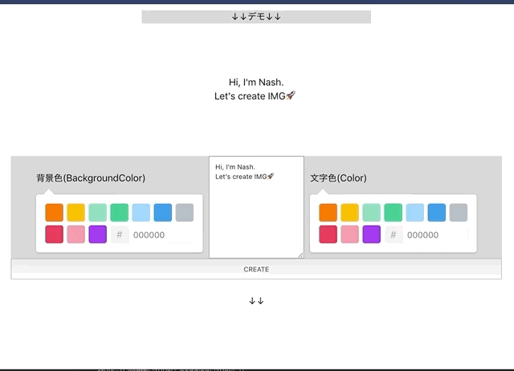

# Redux を使ってアイキャッチジェネレータを作った話

[Redux の BasicTutorial](https://redux.js.org/basics/basic-tutorial)を読み終わったので、その復習としてアプリを作りました。

<blockquote class="twitter-tweet" data-lang="ja">
ReduxのGettingGuideのTODOアプリの写景おわた Redux完全に理解した
&mdash; Nash🌏エンジニア@🇹🇭バンコク (@snamiki1212) <a href="https://twitter.com/snamiki1212/status/1123138809342726144?ref_src=twsrc%5Etfw">2019年4月30日</a></blockquote>

## Redux を使ってアイキャッチジェネレータを作った話

作ったアプリは、『[アイキャッチジェネレータ - icatch](https://github.com/snamiki1212/example-react-redux-icatch)』です。([Github](https://snamiki1212.github.io/example-react-redux-icatch/))

文言を入力フォームに入力して、背景・文字色をカラーピッカーで選択すると、アイキャッチのデモ表示が作成され、Create ボタンの押下で画像が生成されます。

使った技術系をまとめていきます。

### React

以前に QiitaViewer を作ったのと、このブログ自体が React なので、特にコンポーネントを作成していく思考は全く問題なく進みました。

[React で Qiita のアプリケーションを作った話](./create-qiita-viewer-with-react)

[Netlify + Netlify CMS + GatsbyJS ( React + GraphQL )でブログ作ったときにハマった点](./create-blog-with-netlify-netlifycms-gatsbyjs)

コールバックで返されるオブジェクトの細かな動きなどで、微妙に詰まったりはしました。が、ググればすぐに出てくるような内容なので、特に問題なかったです。具体的には下記。

`onChange` コールバックの第一引数で渡されるオブジェクトから、その DOM の値を取得する際の方法は `e.currentTarget.value` を使う：(例)`onChange={(e) => updateInputText(e.currentTarget.value)}`

» https://stackoverflow.com/questions/40676343/typescript-input-onchange-event-target-value

### Redux

理解にそれなりに時間がかかりましたが、基本的な思想とこのアプリで使うくらいにはなりました。

自分の理解として下記のとおりです。

| 名前           | 処理内容                                                                                                                                                                                                                                                                                                       |
| -------------- | -------------------------------------------------------------------------------------------------------------------------------------------------------------------------------------------------------------------------------------------------------------------------------------------------------------- |
| ActionCreaters | Action を生成するためだけの関数。                                                                                                                                                                                                                                                                              |
| Action         | 「What happen? 何が起きる？」の責務を持つデータ。実態は生 JavaScript オブジェクト。type 要素が必須。例えば、`{type: 'ADD', num: 3}`みたいなデータのみで、方法は Action には定義しない。                                                                                                                        |
| Reducers       | 「How the app's state changes? どう変更するか？」を責務に持つ処理。「旧 Store ＋ Action→ 新 Store」の生成器。２つの要素を畳み込んで１つの要素にするので、Reducer の名称。値の更新は、値の Mustate でも ShallowCopy でもなく、DeepCopy されたオブジェクトで必ず置き換える。副作用はないようにしないといけない。 |
| Store          | データを保持する領域。シングルトン。すべてのコンポーネントからアクセスできるように、`App`コンポーネントを更に`Provider`コンポーネントでラッピングして、Store を定義する。                                                                                                                                      |
| Dispatcher     | イベントを検知して、Reducer に Action を渡す処理。                                                                                                                                                                                                                                                             |

詰まった点として 2 点で、「フロー図から理解がしにくい」と「Store と Props がある」という点でした。

１つ目ですが、Redux のフローを見ても、かなり理解しにくかったです。

その理由として、例えばフローに出てくる「Action」は、その文言からは「動き」を連想しますが、実際には JavaScript の生オブジェクトのことを指したりするので<b>「処理なのか？データなのか？イベントなのか？」がフローからわからないのが原因でした</b>。

そこの整理をしてからは、かなり理解が進みました。

２つ目ですが、「Store」という新しい概念が出てきたので、Props が消えるのかと思って進めていたので、理解が詰まりました。もちろん、結論は Props と Store はそれぞれ別々にあり「Store はアプリケーション全体でただ１つの保存領域なのに対して、Props はコンポーネントごとに一時保持されている情報群」という理解で一旦は落ち着きました。あくまで、Store が SingleSourceOfTruth なので、そこから Props が生成されるイメージだと考えています。

## Redux：Presentational and Container Components

「表示＝ Components」と「ロジック＝ Containers」で、別のモジュールに分けることで責務を分割する設計手法です。`connect`関数を使って１つに統合できます。(ex) `connect(ContainerComponents)(PresentationalComponent)`。

さらに、Containers では２つの処理を定義します。

- その ①：`mapStateToProps`：`Redux store`の値を`props`に流しこむところの HowTo を記述。それが、`PresentationalComponent`に流れていく
- その ②：`mapDispatchToProps` ：Dispatch 処理内容を Props に流し込む。

いきなり２つに分解して作り始めると、わからなくなるので慣れるまでは雑にコンポーネントを作って、そのあとにリファクタをする形で分割していったところ、特に詰まるところなく進めました。

### GithubPages

ホスティングは毎度のことながら GithubPages を利用。`gh-pages`ライブラリで手軽にデプロイできるので、楽ですね。

### [react-color](<(http://casesandberg.github.io/react-color/)>)

ただのカラーピッカーです。ライブラリを持ってきて、import すればすぐに使えます。

### [dom-to-image](https://github.com/tsayen/dom-to-image)

DOM を元に画像データを生成してくれるすごいやつ。今回、アイキャッチの画像を生成するところのキモになります。

とはいえ、導入と使い方はかなり簡単で、ライブラリをインストールして、import すれば、こいつもすぐに使えます。

サンプルの書き方通りだと、古めな JavaScript の書き方だったので、ささっとリファクタしておくくらいです。

ただ、生成される画像は少し画素が粗いです。「画素の粗さをよりキレイにできるか？」などのチューニングは見ていないですが、このデフォルトで生成される画像レベルでしか生成できないとなると、案件で使うレベルだと厳しいかもな、という感想です。

### おわりに

以前は React で１つアプリを作りましたが、今回は React+Redux でアプリを作りました。

「同時に TypeScript を使いたい」という欲求を我慢して、今回も TypeScript は使わずに開発をしたおかげで、ほぼ詰まることなく開発できました。

やはり、<b>チュートリアル系を１つ終わらせるたびに、その技術だけに絞って、他に学びたい内容を同時に入れ込まない、というやり方が、今のところ自分には良さそうです。</b>

次は Recomponent か TypeScript を使ってなにかを作ろうと思います。
