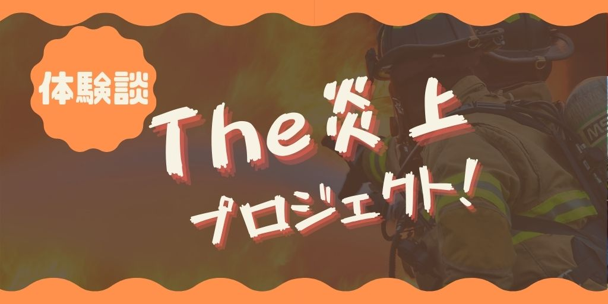

# 炎上プロジェクトに既存メンバーと同数の新人をぶっこまれたときの話

こんにちは。マネジメントよりも開発が好きな Nash です。

この記事は「<b>ゲームのバックエンドチームのリーダをしてたときに、既存メンバーとほぼ同じ数だけ新人をぶっこまれたときに行った、方針・施策・結果についてのまとめ</b>」の記事です。

概要の結果をまとめると、下記の通りです。

- 【方針・施策】暗黙知よりも形式知を中心にしたドラスティックなコミュニケーション文化を中心に、新人にはスパルタ教育をしつつ既存メンバーへのストレスを最低限にする方針にした。

- 【結果】ドラスティックな方針だからこそ、心理的安全性を育む施策・環境を手厚く作るべきだったです。

では見ていきましょう。

※ 一般論では既存チームにニューカマーがジョインさせることは、チームに対して負荷がかかるので、慎重に行うべきです。間違っても、既存メンバーとほぼ同じ人数を、同じタイミングで、しかも経験が浅い人を入れないように。相手は死にます。

## 炎上プロジェクトに既存メンバーと同数の新人をぶっこまれたときの話

先に背景について列挙していきますね。

- すでにプロジェクトは楽しく炎上中
- バックエンドの既存メンバーは 3 人
- 新たにジョインする新人は 3 人
- 新人の力量はプログラミング始めて数ヶ月〜1 年くらいのレベル
- 新人の担当範囲はゲームの「バックエンド」＋「インフラを少し」

新人が入ってくるまでに少し猶予があったので、まずは方針を決めることにしました。

### 大方針は、既存メンバーを守ること

これは、自分で勝手に決めましたが<b>大方針は「既存メンバーを守る」</b>ことにしました。

すでにプロジェクトが炎上していて、既存メンバーは肉体的・精神的にそれなりに摩耗している状態です。更に時間的・精神的な負荷をかけると、ストレスでヤバイことになることがわかっていました。

自分が過去に違うプロジェクトで「<b>プロジェクトに新人を大量に入れられて、質問地獄に合ってストレスがヤバかった</b>」という経験をすでにしていたのもあります。

というわけで、新規メンバーには申し訳ないが、今回は「既存メンバーを守ること」を最優先にしました。

この大方針のもと、方針・ルール・施策などを既存メンバーと会話して決めました。

### 質問地獄を回避するため、ドキュメント文化

新人から既存メンバーへの質問地獄を回避するために、基本的にドキュメント文化で進めることにしました。具体的には、環境構築 HowTo・インフラ構成・仕様・既存システムの詳細などです。

つまり、<b>口伝を中心にした暗黙知ではなく、ドキュメントを中心にした形式知でのコミュニケーションをメインにする</b>、というものです。

もちろん、口頭の方が速い内容は口頭で OK ですし、最初にレクチャーをするときなどは MTG ルームに集めてホワイトボード＋口頭で行いました。

この方針の狙いの１つとしてコミュニケーションコストを減らすためです。過去の経験上、<b>たいてい「新人 → 既存メンバー」の流れでやってきた質問は、まったく同じ内容を違うタイミングで「他の新人 → 既存メンバ」に聞いてきます</b>。原因は、既存メンバーから新人への説明漏れかと思いますが・・・。いずれにしても、ドキュメント中心のコミュニケーションなら「既存メンバ → 新人」のフローでドキュメントを配布すれば 1 回のコストで済む、という思惑です。もし、内容を忘れてもドキュメントを見返せば良いですし、仮に「新人 → 既存メンバ」のフローで QA に来ても「ここに、ドキュメントがあります。（リンク送る）」で一発で QA が終わるので、既存メンバーの負荷が少ないかと思いました。

ちなみに、今どきの開発現場ではどちらかといえば「口伝を中心にした暗黙知をチームで共有するには、どうチームビルディングするか？」などが、より高度なマネジメントな手法かと思いますが、今回の大方針は「新規メンバーから、既存メンバーを守ること」ので、心理的安全性や高度なマネジメントは捨ててドラスティックに進めることにしました。

### 新規メンバーだけで自律的なチーム

新人メンバーだけでチームとして成り立つように目指しました。理由は、新人メンバーの管理を行いだすとマネジメントコストが高くて自分の開発が全然出来ないからです。

そのため、<b>思い切って最初からチームを２つに分けました</b>。新人メンバーの中でサブリーダーという、新人チームを引っ張ってもらう役割の人を決めて、その人が主導で新人チームの方針を決めることをお願いしました。

とはいえ、バックエンドチームとして統一すべき開発のフローなどは、自分から既存・新人メンバーに通達していたので、正確には２つのチームというよりも「<b>既存チームの傘下に独立した新人チームを入れた</b>」という表現が適切かもしれないです。

### QA は、口頭よりも Slack

QA は Slack を中心にしてもらうことを新人チームにはお願いしました。狙いは「質問のハードルを少し上げる」「質問をブラッシュアップしてもらってから持ち込んでもらう」です。

質問のハードルを上げる理由は、あまりに気軽に「なんかよくわからないですけど、動かないです」みたいに来られると、既存メンバーの負荷がやばいので、質問をするハードルをすこしだけ上げることにしました。心理的安全性のハードルが高いので、あまり好きではないチームビルディングですが、状況が状況なので、この選択肢を取っています。

また、過去のプロジェクトでの経験上、たいていの新人は質問自体がまとまっていないことが多かったです。「自分が何がわかっているのか？何をしたいのか？どこまで試したのか？何ができないのか？」など。<b>技術力が低いとかは仕方がないですが、日本語力が低すぎて会話が成立しないという状況は避けたかったです</b>。そのため、「事前に文章化することで、自然とラバーダッキングが行われるのではないか？」を狙ってのルールです。

### 新規メンバーにはスパルタ教育

新規メンバーに対して、スパルタ方針にしました（スパルタ教育という大義名分で、やや雑に扱うわけですね）。

ここまでに記載している通り、環境は既存メンバー寄りの方針にしています。例えば、新人がやや質問しにくい環境なのは、既存メンバー寄りの理由だったりですね。

また、<b>コードレビューの方針としても、最初から出来る限り全部指摘する方針にしました</b>。コードレビューのレベル感を「最初は緩くして、徐々に厳しくする」でも良かったですが、知識を詰め込む形にしました。間違った書き方やイケてないコードで OK を出すと、その書き方を今後も増やし続ける可能性が高い、などが理由です。

---

ここまでが新人がジョインする前〜して少ししてから決めたような内容です。新人には「なんでそう決めたのか？」「新人たちには、こうしてほしい」など、特に理由は必ず説明するように意識しました。が、現場ではルールが増えたり変わったり、したのですべてを完全に説明しきれているかが、やや不安ですが・・・。

さて、これらの方針やルールでプロジェクトを進めて、結果としてどうなったのかをまとめます。

## 炎上プロジェクトに既存メンバーと同数の新人をぶっこまれた結果

結果として、簡単にまとめると下記のとおりです。

- 既存メンバーはストレスから守れた
- 炎上 → 大炎上　にならなかったので良かった
- 心理的安全性をもっと注力すれば良かった

### 既存メンバーは守れた

先に結論ですが「大方針の既存メンバーを守る」は無事達成出来たかと思います。ドキュメントや Slack を中心にしたり、後述しますがチケット管理をプール性にした結果、新人にかける手間がかなり減って、既存メンバーはだいぶ守れたかと思います。

もちろんトレード・オフとして新人メンバーには、やや辛い環境だったかもしれないことを考えると、申し訳ない点はありますが、少なくとも当初の方針通りにことが進めれている点はよかったです。

また、「既存メンバーがストレスに晒されることがなかった」という意味の「守れた」もありますが、<b>既存メンバーが新人メンバーに時間を激的には拘束されなかったので、炎上 → 大炎上にならなかったのも大きい</b>です。

### Slack での QA は難しい

結論、Slack ベースでの QA はうまく機能しなかったです。おそらく、原因として下記あたりかと思います。

- 「新人が、QA を作ること自体に時間が結構かかってしまう」

- 「Channel への投稿に心理的安全が確保されていないので、気軽に QA が出来ない」

<b>質問地獄は回避できてはいるのですが、そもそもコミュニケーション自体が消極的になってしまったので、あまり良い結果ではなかったかな、</b>と思っています。

今まで色々と QA のフローは試していますが、たいていうまくいっていないので、次は「QA のフローをどうするか？」よりも根本的な解決を試してみたいと思っています。具体的には、<b>「雑談を増やす」などのチーム内の心理的安全性を担保できるような施策を増やしてチームビルディングを図る</b>、というようなものです。

### 厳しめのコードレビューは負荷が高い

コードレビューの厳しさを初期から厳しくしましたが、当たり前ですが、新人側は毎回指摘数が多いので精神的に負荷が高かったかと思います。とはいえ、1~2 ヶ月もすれば、指摘量もかなり減ったので、スパルタ式は悪くはない選択肢だったかと思います。

ただ、<b>既存メンバーもコードレビューをする時間的・精神的な負荷がかなり高かった</b>です。

今回の経験と、後々調べてわかった知識として、コードレビューを真面目に行うと正直コストがかなりかかります。また、レビュワーが複数いると宗教戦争が生まれかねないので、コードレビューに対しても、もう少し細かく方針を決めておくべきでした。

とはいえ、レビューを通して既存メンバー間のコードの考え方が文章化されて共有されて、実は結構違う考え方を持っているんだなー、という発見があったりしました。予想外なところで発見があった点も踏まえて、コストをかけた分、リターンは良かったかと思います。

### チケットはプール制で、自主性に任せる

新人へのチケットのアサインコストが高すぎたので、フローを変えたところ、うまく機能しました。

初期は既存メンバーが新人へのチケットのアサインを細かく行っていました。

- その ①：既存メンバーが、チケットの中から新人ができそうなチケットを探す

- その ②：既存メンバーが、新人でも進められるようにタスクを細分化する

- その ③：新人にチケットを渡す

ですが、この工程が結構大変だったのと、新人メンバーが既存メンバーがチケットを切ってくれるまで「待ちの状態」になってしまう、などの問題がありました。

そこで、新しく「プール制」という形でチケットのフローを変えてみました。

- その ①：プランナー・デバッカーから、タスクを既存メンバーに投げてもらう

- その ②：既存メンバーが、チケットに作業方針・優先度・難易度、などを簡単に記載
- その ③：このチケットを「誰も担当していない」というプールに放り込んでおく
- その ④：新人は、いつでもこのプールから好きなチケットを取ってタスクを進める

もちろん、影響度がクリティカルなものは、このフローには沿わないですが、たいていのタスクはこのフローに沿ってみたところ、かなり快適にチケットフローは回り始めました。

また、今までは「既存メンバーから貰ったタスクをこなす」だったのが、「自分でチケットを取ってタスクをこなす」という行動の変化から、各々で責任感も芽生えたのかな？と思ったりもします。

### 新規メンバーのグループにもっと口出しすれば良かった

新人だけのチームの主導権は新人だけに任せたかったので、口出しをあまりしなかったですが、悪く言えば放置しすぎてしまったように思います。

「裁量権を与える」というのも、逆に選択肢が無限に広がるので、新人さんにはハードルが高すぎたので、「何を決めれば良いかがわからない」みたいな状態になってしまっていたと思います。困っていたら助言や手助けはしたものの、もうすこし口うるさく指示出ししたほうが良かったように感じました。

### ルールを無視する新人にテコ入れが出来なかった

これは、ただの自分の反省です。

上述の通り、今回のチームの文化としてドキュメント・Slack を中心にしていましたが、ルールを無視する新人 A が居て、既存メンバー側にてヘイトとストレスがかなり溜まってしまいました。

具体的には、「ドキュメントを渡しても読まない」「オレオレの実装・行動や手順で行う」→「バグや問題が生まれる」という感じです。

大前提として新人 A の行動自体がナンセンスですが、それとは別に、おそらく、<b>ドキュメントを読んでも頭に入らないタイプの人種、つまり、文章から内容を読み取る力が弱いタイプ、という人種がいるのかと思いました</b>。

本来なら、ニューカマーのタイプに合わせて受け入れ側も柔軟に変えられば良いのですが、今回は状況がそれを許さないので、ただただ「新人 A が暴走して既存メンバーにストレスが溜まる」というイベントが何度も起こしてしまいました。

何度も注意をしても、行動を改めることがなかったので、新人 A に対しては隔離したり、自分がつきっきりで貼りついて他の既存メンバーに問題が飛び火しないようにするなど、施策を早めに打てればよかったです。

### 新規・既存メンバーが溶け込むのに時間がかかった

端的に言えば、仲良くなるのに時間がかかってしまったような気がします。

方針として、チームは別個にする予定だったのもありますが、初期は新人に取ってはかなり心理的障壁の高いチームになってしまったのではないか？という疑問は否めないです。

日報という形で一日の最後にデイリーで会話するショート MTG を作っていましたが、あくまで業務の一貫という流れですね。

また、座席も既存メンバーと新人メンバーで正面にしてしまったのも良くなかったです。座席が人に与える影響から、正面は「敵対性」を生み出してしまいます。少しやりすぎ感もありますが、週次で座席を席替えして、出来る限り混ぜていけばよかったかもしれないです。

### まとめ

Slack やドキュメントを中心したり、チームを分割して干渉を減らしたりししたので、コミュニケーションコストが減ったものの、少しドライすぎたので、チームとしての心理的安全性がかなり低い状態だったかもしれないです。

ドラスティックに効率性や合理性を中心にチームビルディングをすると、机上ではフローの最適化は行われますが、チームとしてパフォーマンスを出しにくい状態になってしまいます。

<b>結論として、ドラスティックな方針だからこそ、心理的安全性を担保できる仕組みを導入するべきでした。</b>

また、「炎上プロジェクトに既存メンバーと同数の新人をぶっ込まれたら、既存メンバーを優先でチームビルディングをする」という、大方針自体は良かったと思います。

なぜなら、仮に新人メンバーを中心にすると、「<b>プロジェクトが炎上 → 大炎上となり、既存メンバーがストレスで離脱、新人メンバーが回せなくてプロジェクト崩壊</b>」という未来が想像できます。

そのため、次に同じ状況にあたっても、大方針は変えないとでチームビルディングをしていくと思います。

とはいえ、願わくば「次」が来ないでほしい限りです
