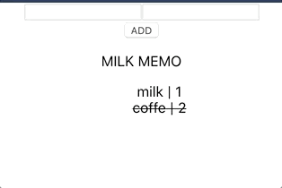

# React+Redux+TypeScript で ToDo アプリを作った話

今回の作ったサービスの技術スタック

- 技術スタック
  - React
  - Redux
  - create-react-app(v3~)
- 新しく取り入れた分
  - TypeScript (★)
  - ESLint
  - Prettier

## React+Redux+TypeScript で ToDo アプリを作った話

→[アプリ](https://snamiki1212.github.io/example-typescript-todo/) / [github](https://github.com/snamiki1212/example-typescript-todo)

今回は、TypeScript を学習することをメインに ToDo アプリを作りました。以前作った Redux の Example とほぼ同じなので、完全に復習ですね。

[snamiki1212/redux-todo](https://github.com/snamiki1212/redux-todo)

作った中での気付きなどをまとめていきます。

### Redux の学習

Redux については前回サービスを作ったので大丈夫かと思ったのですが、実際は再度サービスを作ってみると「あれ？どうやって書くんだっけ？」な点がいくつか出てきて結構詰まりました。

[Redux を使ってアイキャッチジェネレータを作った話](./create-icatch)

Redux くらい学習コストが高いものは 1 度サービスを作ったら OK ではなくて、2 回くらい作ってみるほうが良さげです。2 回目に「自分がわかったつもりになってた箇所」がわかるからです。

### Redux の Presentetional / Containers について

「ロジック」と「表示」の分割にて再利用が行える設計ということで、理解はしていたが今回実際にそのシチュエーションにあたったので、より理解が進みました。

具体的には下記のコミットで、Input のモジュールを切り出して汎用化させています。

[snamiki1212/milkmemo - commit](https://github.com/snamiki1212/milkmemo/commit/13008af06985c8ce6a4fcb89566085f4b0b5e66f)

気付いた点を踏まえて改めて下記のように認識しました。

- 【全体像】イベントドリブンにて props に定義した「 dispatcher を実行する関数」を実行する。

- 【Containers】props に dispatcher を定義しておく。dispatcher の名称は具体的にする。`ex: () => addMemo()`
- 【Presentetional】イベントドリブンで関数を実行する。Presentetional 側には、抽象的な名称にしておく。`<ex> (event)=>handleChange(event.target.value)`

- 【学び】Presentetional 側は再利用するため抽象的な関数名に、Containers 側は実行する内容について責務を持つので具体的に関数名を命名する。

### TypeScript の学習

とりあえず「使う」だけなら、手軽に始められますが、きちんと使いこなすにはコストがかかりそうで、また、初期は TypeScript でゴリゴリ書くことは少なく「よくわからんエラーを潰す」コストが高いです。

書き始める前は「型を表現するためだけの AltJS だろ？そこまでコストかからんだろ」と思っていたけども、すべての機能を理解していくのは、かなり大変です。予想していたよりも遥かに機能が膨大でした。また、<b>型を表現していくのは、抽象的な表現が多かったりします。つまり端的に言えば難しいです。</b>

学習は、公式ドキュメントと Qiita の下記の記事を参考にしました。

- [TypeScript - HandBook](https://www.typescriptlang.org/docs/handbook/basic-types.html)
- [TypeScript の型入門](https://qiita.com/uhyo/items/e2fdef2d3236b9bfe74a)

Hand Book の半分も読めなかったですが、少なくともライトに使うレベルでは問題なかったです。作りながら困ったらググって使い方を学んでいくのが効率が良いかと思います。

### TypeScript の感想

噂通りエディタ ( VS Code ) との親和性がメチャクチャ良いですね。

このレベルの小さいアプリですら、型推論・型チェックなどでかなり助けられました。中規模〜大規模なサービスにならないと恩恵が出にくいと思っていたので、この点は良い意味で意外でした。

デメリットとして、初学者目線だとわかりにくいエラー発生が多い印象です。「ルールに沿っているかどうか？」のチェックなので、エラー文や指摘内容が必然的にやや汎用的になります。そのため、汎用的なメッセージから「具体的にコードのどこが不適切か？」を人間が考えないといけないので、ハマると長いです。

全体的に、とりあえず型は any にして回避してても、結構いろいろな箇所でよくわからないエラーが出るので、それなりにコストが掛かりそうだなー、という印象です。

### Lint & Formatter

設定を色々と入れてみたが、DeveloperExperience がとても良いです。

設定はこちらを参考にしました。

[oukayuka/ReactBeginnersBook-2.0](https://github.com/oukayuka/ReactBeginnersBook-2.0/tree/master/06-lint)

コードを書きながらリアルタイムに Lint チェックが行われ、保存(`Ctrl + S`) をするたびにコードフォーマットが走る環境はある種の CI/CD のようです。

今後のプロジェクトでも引き続き設定をしていこうと思います。

### まとめ

今回は TypeScript + Lint + Formatter という開発環境を改善する系の学習をメインにしたサンプル作成でした。

どうしても初期は「よくわからんがエラー」系が多くて辛いですが、それを乗り越えたあとは DeveloperExperience が爆上がりするので、初回は出来る限り辛みをうまく回避しつつ、恩恵を得られるように進めていこうかと思います。
