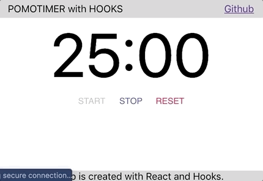

# React(Hooks)を使ってポモドーロタイマー作った

React の Hook を使ってサンプルタイマーを作ったので、そのまとめ

→[アプリ](https://snamiki1212.github.io/example-react-basic-hooks/)/ [Github](https://github.com/snamiki1212/example-react-basic-hooks)

## 使った技術

今まで作ってきた分と同じように、基本的なところは流用。

- React：本体
- TypeScript：AltJS
- Prettier：フォーマッター
- ESlint：Linter
- gh-pages：デプロイとホスティング

### Hooks

Hooks とは関数コンポーネントでもライフサイクルメソッドやステート保持など実現するための API 群で、由来はこれら２つを『Hook into(接続する) 』から来ている。

Hook とは複数 API の総称で、今回使ったのは下記です。

- `useState`：関数コンポーネントに、ステータス保持を実現するための API
- `useEffect` ：関数コンポーネントにて、ライフサイクルメソッドを実現するための API

過去は、関数コンポーネントにてライフサイクルメソッド・ステート保持をするために HOC にてラッピングしたクラスコンポーネント上でこれらを実現する必要があり、このメジャーなライブラリが`Recompose` だった。

今では、Hooks にて関数コンポーネントにてライフサイクルメソッド・ステート管理が行えるので、`Recompose` が死に、Hooks がメインストリームになった。

### `useEffect`の概要

`useEffect(<関数1>, <配列1>)`の概要について、簡単にまとめ。

- `<関数 1>`

  - 引数：なし
  - 処理：componentDidMount / ComponentDidUpdate 時に行いたい処理を記載
  - 返り値：ComponentDidUnmount 時に行いたい関数を記載

- `<配列 1>`
  - 目的：componentDidUpdate 時に「`<関数 1>の処理`」を実行するかをハンドリングする
  - 挙動：componentDidUpdate 時に、前回渡した`<配列1>`の内容と比較して、同一でないなら「`<関数1>の処理`」を実行する

### 所感

学習ロードマップ的にいきなり `useEffect` から始めると「ライフサイクルメソッドとは？」となりそう。逆に、キチンとクラスコンポーネントで使われているライフサイクルメソッドについて基本的な観点は抑えた上で学習すれば、混乱することはなかった。

特に、個人的に`useEffect` に関しては、書き方がなんというかカッコ良すぎる（語彙力）。
