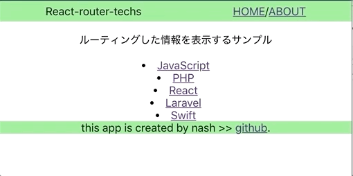

# react-router/react-router-transition を使ってサンプルアプリを作った

react-router/react-router-transition を使ってサンプルアプリを作ったので、その過程をまとめ。

- [Github](https://github.com/snamiki1212/react-router-techs)
- [アプリ](https://snamiki1212.github.io/react-router-techs/)



## 使った技術群

新しく学んだ技術

- `react-router`
- `react-router-transition`

他には下記を使用。

- React
- TypeScript
- gh-pages：デプロイ・ホスティング

## 学んだこと：react-router

- リクエストせずにページ遷移を実現する HistoryAPI をコア機能としていて、SPA はすべて作られている。
- すべてのコンポーネント HistoryAPI が使えるように、`<BrowserRouter>`でラッピングする。

- a タグでページ遷移を書くと、そのページ自体の JS 再読込してしまうので、Link モジュールを使って擬似的なページ遷移を行う。

- SPA における Routing は url に応じて紐づく component を表示することで実現する。

react-router だけで１アプリだとさすがに、物足りなかったので、アニメーション系のライブラリを探してみたら良さげなのが合ったので、試してみた。

## 学んだこと：react-router-transition

### アニメーション package の選定

いくつかあるアニメーションライブラリを見て、スター数が多そうだった react-motion の example に react-router-transition があったのでこちらを使ってみた。

- 候補のアニメーションライブラリと 2019/05/07 時点のスター数
  - [react-motion: 16573](https://github.com/chenglou/react-motion)
  - [popmotion: 16695](https://github.com/popmotion/popmotion)
  - [react-spring:12552](https://github.com/react-spring/react-spring)
  - `react-transition-group`：アニメーションライブラリではなく、アニメーションのために DOM 操作を手助けするためのライブラリとのことで、今回はお手軽にアニメーションライブラリをとりあえず試してみたかったので、他のにしてみた。

### [react-router-transition](https://github.com/maisano/react-router-transition) の概要

react-router-transition は、react-motion を使って react-router に対して薄いレイヤーでお手軽なアニメーションを提供しているライブラリ。

今回、react-router のお勉強がてらアニメーションを付けてみたかったのでちょうど良いライブラリだった。


基本的に公式のドキュメントをそのまま使っただけなので、詳細は割愛。
ともあれ、これで、リンク遷移でコンポーネントの表示／非表示にアニメーションを付けられようになった。

### ハマったポイント

自分のサンプルは TypeScript で書いているが、このパッケージに型定義ファイルが無いため、[型定義が無いときの対応](https://qiita.com/Nossa/items/726cc3e67527e896ed1e)を調べて実施する必要があった。

また、そこまで時間をかけたくなかったので、ドキュメントを斜め読みしてとりあえずコードを中心に読んで手を動かして挙動を理解してみようとしたが、独特の挙動があったりして、割とハマったのでやはり素直に英文をキチンと読んだほうが早かった可能性が高い。というかドキュメントというかコメントに書いてある箇所を読めば済む話のレベルだったので、めんどくさがらずによめばよかった。

具体的には、styles の transform を使ってアニメーションさせたいときは別途`mapStyles` props に関数を渡して、値の変更を明示する処理を書かないといけなかった。

```typescript
// we need to map the `scale` prop we define below
// to the transform style property
function mapStyles(styles) {
  return {
    opacity: styles.opacity,
    transform: `scale(${styles.scale})`,
  };
}

// tsx
...
  <AnimatedSwitch
  	// ...
		atLeave={{ opacity: bounce(0), scale: bounce(0.8) }}
    mapStyles={mapStyles}
    // ...
  >
```

## 所感：react-route

考え方自体は MVC における Routing と同じだった。そのため、概念的に新しく理解することは無い。なので、モジュールが提供している API 群の使い方を覚えることがメインだったので、学習コストは低そう。また、実務を通じて必要な機能はドキュメントを参照しながら、学習を継続するのが、効率が良さそう。
