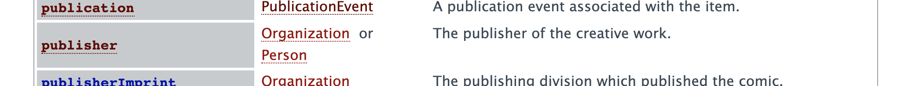
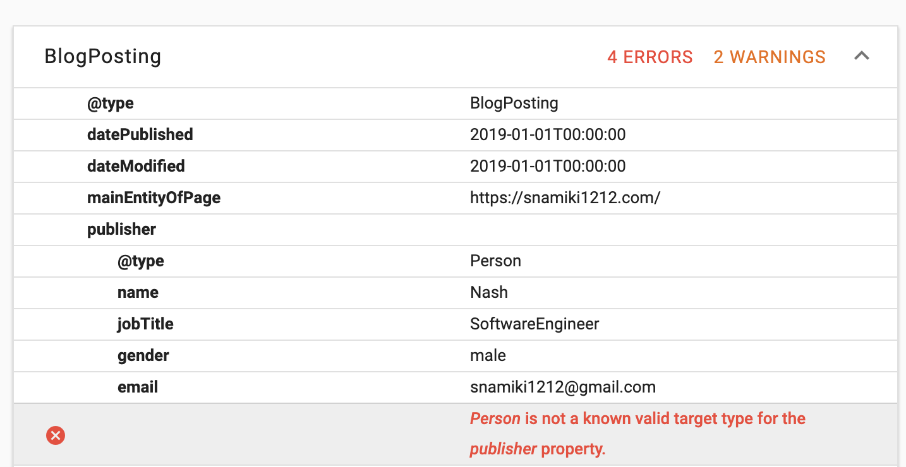
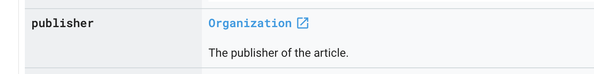

# 静的サイトジェネレータで構造化データマークアップを入れた知見【GatsbyJS】

こんにちはNashです。GatsbyJSでブログを構築しています。

この記事は「**静的サイトジェネレータ(GatsbyJS)で構造化データマークアップを作り込むにあたってやり方・ハマったポイント**」の記事です。

結論を箇条書きにしていきます。

- 構造化データマークアップって？
  - ←　Webページのメタ情報。Googleのクローラに詳細を教えるために必要。
- どう表現するの？
  - ←JSON形式でページに埋め込んでおくのがベター。Personみたいに繰り返し使うようなものはEntityが決められている。
- どう作っていくのが良い？
  - ← Googleのツール・ドキュメントでTry＆Errorが確実。
- 作る際の効率化
  - ← ローカルで開発してNgrok経由でPublicに開放してツールで確認。

では見ていきます。

## 構造化データマークアップについて

### 構造化データマークアップとは？

Webページに対するメタ情報のことで、Googleの検索クローリングの精度をあげるのが目的。

例えば、あるWebページが「ブログの記事」だとして「サムネイル画像」を構造化データマークアップで明示してURLを記載してあげると、クローラーがそのデータを「サムネイル画像」だと認識してくれる。場合によっては、検索結果に画像つきで出してくれたりする。

2019年の現時点では、SEOの順位に直接的な影響はないが、今後影響がある旨がアナウンスされている。ただ、現時点でも、構造化データマークアップを入れるとGoogle検索結果に上記のように反映されるので、SEO的には有利になるケースが多い。

### 構造化マークアップのデータ構造は？

JSON+LDという構造が推奨なので、素直にそれに従うのが良いし、データもJSONになるので、静的サイトジェネレータなどでも取り扱いやすい。

- 詳細はこちら：[Qiita - Google推奨「JSON-LD」で構造化マークアップ](https://qiita.com/narumana/items/b66969b80cce848b2ddf)

## 構造化データマークアップ＋静的サイトジェネレータで実装

### 実装の流れ

「テストツールに値を入れる」→「Error・Wraningを潰しこむ」のサイクルが一番良かったです。

むしろドキュメント見てたらハマりました。

- [GoogleStructuredDataTestingTool](https://search.google.com/structured-data/testing-tool/u/0/)
- [Google のドキュメント](https://developers.google.com/search/docs/guides/search-gallery)
- [Scheme.orgのドキュメント](https://schema.org/)（「参考程度に見る」を推奨。理由後述。）

### ハマリポイント：Scheme.orgとGoogleのドキュメントでズレ

- Scheme.orgのドキュメント
- Googleのドキュメント＋テストツール

で、でズレがあったため、ハマりました。

なので、ドキュメントドリブンで開発しないほうが良かったです。

- Scheme.org のドキュメント
  - 
  - ドキュメント「BlogPostingのプロパティのpublisher にはPersonかOrganizationを入れてね！」
  - じぶん「ふむふむ。Personを入れるか。」

- Google Structure Date Testing Tool
  - 
  - ツール「publisherにPersonの型？そんなやつは知らん」
  - じぶん「え？」

- Google のドキュメント
  - 
  - ドキュメント「ArticleはScheme.orgのBlogPostingとかを参考にしろ。だが、PublisherはOrganizationだけな。」
  - じぶん「なんでや」

完全に互換性があるわけではない？みたいなので、Scheme.org のドキュメントは参考程度に、「テストツールに値を入れる」→「Error・Wraningを潰しこむ」のサイクルが最終的に一番良かったです。

---

ですが、テストツールはパブリックなURLにしか有効ではありません。
「ローカルで修正」→「デプロイ」を何度も行うのは手間なので、Ngrok を使いました。

### 開発ポイント：Ngrok使う

NgrokはローカルのTCPネットワークをNgrokが提供してくれるドメイン経由でパブリックに開放してくれます。

- Ngrokとは？→ [Qiita - ngrokが便利すぎる](https://qiita.com/mininobu/items/b45dbc70faedf30f484e)
- Ngrok＋GoogleStructureDataTestingTool：[How to test localhost website with Google SEO tools](https://www.aymen-loukil.com/en/blog-en/how-to-test-localhost-website-with-google-seo-tools/)

これで、ローカルで開発した結果をToolに流し込んで確認できます。

### 終わりに

普段はWebアプリケーションが中心なので、構造化データマークアップなどSEO寄りの知識が全然なかったので、概要知識から手に入れるところから始めたので思ったよりも時間がかかってしまいました。

WordPressなどなら、ここらへんもテーマがよしなにやってくれるので（たぶん）、GatsbyJSなどでオレオレで作るとすべて自分作る必要があるので、勉強になりますね。
