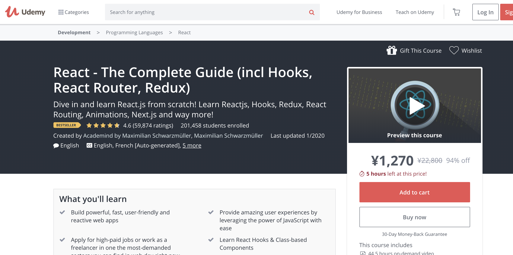

# 【現役エンジニア】Udemy で React ＋ JavaScript のおすすめは？→『The Complete Guide』

こんにちは。元バックエンドで今 React を書いている Nash です。

この記事は現役 React エンジニアがおすすめする 「**Udemy の講義 『The Complete Guide』 のレビュー**」になります。

結論は「**ES2016 の JavaScript から学びたい**＋**React を学びたい**って人に最強」です。

理由は下記のとおりです。

- 【その ①】動画の構成が最強
- 【その ②】最新情報に日々アップデートされている
- 【その ③】高い質が、更に高い質を生んでいる

では見ていきましょう。

## 『React - The Complete Guide』とは？

Udemy にある React のトップクラスの学習動画です。

- 全レッスン数 543 個 (2020/01 時点)
- 全レッスン時間 45 時間 (2020/01 時点)
- 【内容】ES6(JavaScript) / React / Hooks / Redux / React Routing / Animations / Next.js (2020/01 時点)
- ★4.6 (59,874 評価数) 201,458 受講人数 (2020/01 時点)

あと、受講者数と評価数が React 学習動画の中でトップです。（2020/01 時点）

評価数が 6 万人を近いのに、評価がほぼ 5 なあたり質の高さが垣間見えますね。

では、この動画がおすすめな理由を見ていきます。

## おすすめな理由 ①：動画の構成が最強

動画の構成が、ざっくりこんな感じです。

- 【その ①】JavaScritpt ES6(ES2015)
- 【その ②】React の基礎
- 【その ③】React の応用

ここで大事なのは、

「**React 学習の前に、JavaScript ES6(ES2015)が講座内容に入っている**」

という点ですね。

### React を学ぶ前に JavaScript を学ぶ理由は？

理由は、JavaScript をきちんと理解できていないと、React の学習スタートラインにすら立てないからです。

React の公式ドキュメントを読み始めても、

「**JavaScript のことを知らない？チュートリアルを読み直してきてね（にっこり）**」

みたいな感じで、初心者をつつぱねることもあります。

> React は JavaScript ライブラリなので、JavaScript 言語の基本的な理解があることを想定しています。あまり自信がない場合は、JavaScript のチュートリアルを一通り読んで知識レベルを確認し、このガイドを迷わず読み進められるようにしてください。 -- ([React -- Hello Word](https://ja.reactjs.org/docs/hello-world.html))

初心者に対して平気でハードルをあげていくのは、React というライブラリの学習曲線・コストがそれなりに高く、ハードルが高いためです。

そのため、Vue.js のように「誰でも書けるよ！」みたいな甘い言葉は使いません。

実際、前提として、きちんと ES6 を学習していないと React の学習を始めるのは辛いはずです。

### 次世代 JavaScript について

また、JavaScript は毎年メジャーバージョンアップが行われています。

その中でも、ES6(ES2015)は今までにない大規模なアップデートで、「もはや別言語」と言われるほどです。

<!-- Twitter -->
<blockquote class="twitter-tweet">
ES6の仕様見てるけどもはや別言語だろこれ…だがしかし大歓迎だ！
&mdash; わかめ@毎日猫がいる (@vvakame) <a href="https://twitter.com/vvakame/status/394646066982703104?ref_src=twsrc%5Etfw">October 28, 2013</a></blockquote> 

また、これによって JavaScript の書き方が大幅に効率的になったため、もし JavaScript を学習する際には、「ES6(2015)以降であるか？」は大事な観点です。

### React.js を開始する前に ES6 から始められる

ということで、この動画なら、React.js の学習する前にきちんと**その土台の ES6(ES2015)の JavaScript の学習もできちゃうお得なコース**なわけですね。

他の React の学習動画だと、この ES6 の学習がスキップされているケースもあったりするので、別途 ES6 を購入しないといけません。

ES6 の学習も抑えておくべき人にとってはかなり有意義な動画です。

## おすすめな理由 ②：最新情報に日々アップデートされてる

JavaScript 界隈の情報の陳腐化は「異常」な速度で行われます。

「つい先日まで、ベストなライブラリだったはずが、次の日に新しいものがベストなライブラリになってる。」なんて、日常茶飯事です。

そのため、キャッチアップし続けるコストがそれなりに高く、また最新の情報を得るための情報感度も必要になります。

その点、**この動画は最新情報を高い速度でキャッチアップ出来ているように感じました**。

例えば、2019/9 時点でも、すでに講義内容に HooksAPI まで組み込まれています。

自分がこの講義を見ていたときも CreateReactApp のメジャーバージョンアップデートを受けて、割と早い段階で対応が行われていました。

## おすすめな理由 ③：「圧倒的な質」が更に質を高めている

この動画の評価は下記のようになっています。

- ★4.7（レビュー数 46,888）（2019/9/1 時点）

上記でも書いていましたが、圧倒的ですね。４万人くらいのレビュワーのほとんどが ★4~5 しかつけていないです。

ここで大事なのは、過去・現在にもこれだけの動画の閲覧者がいるため、かなりの人間が「間違いの指摘」「わからないところの QA」を行っている点です。

つまり、「うーん、ここよくわからないなー。」となっても、たいてい

「**すでに質問している人がいて、すでにその回答もある**」

ということです。

そして、高い質が人を呼び、更に質を高めているわけです。

### おまけに：英語の勉強になるよ

さて、この動画、日本語音声がないため、英語音声・英語字幕で受講しないといけません。

「難しそうかな・・・」と最初は思っていましたが、意外と英語音声・字幕だけでも、言っている内容が理解できます。

簡単な英語ですし、字幕もついているので、これを気に試してみてはどうでしょうか？

### まとめ

「ES2016 の JavaScript から学びなおしたい＋ React を学びたい人には最強」な理由

- 【その ①】動画の構成が最強
- 【その ②】最新情報に日々アップデートされている
- 【その ③】高い質が、更に高い質を生んでいる

というわけで、『The Complete Guide』のレビューでした。

<!-- AFFI A8.net -->

<a class="affi-custom-button" href="https://www.udemy.com/react-the-complete-guide-incl-redux?deal_code=JPA8DEAL2PERCENTAGE&aEightID=s00000016735001">「Udemy での購入はこちら」</a>

<!--  -->

実際、自分はこの Udemy で学習をはじめてから React エンジニアとして仕事ができていますので、かなりおすすめです。
