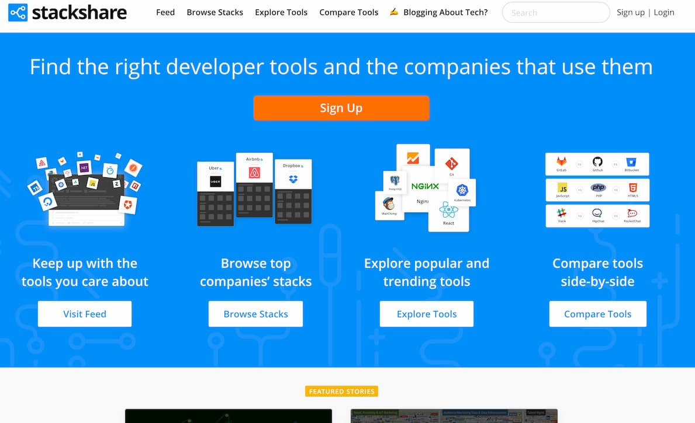
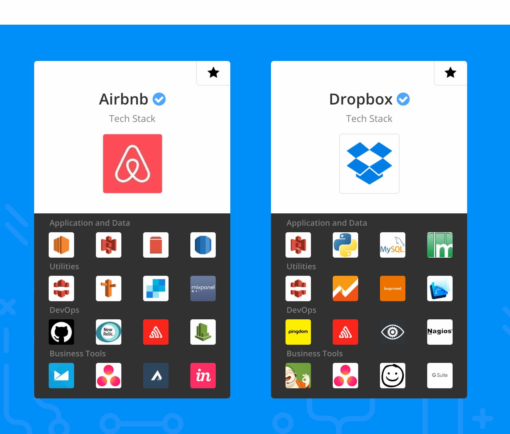
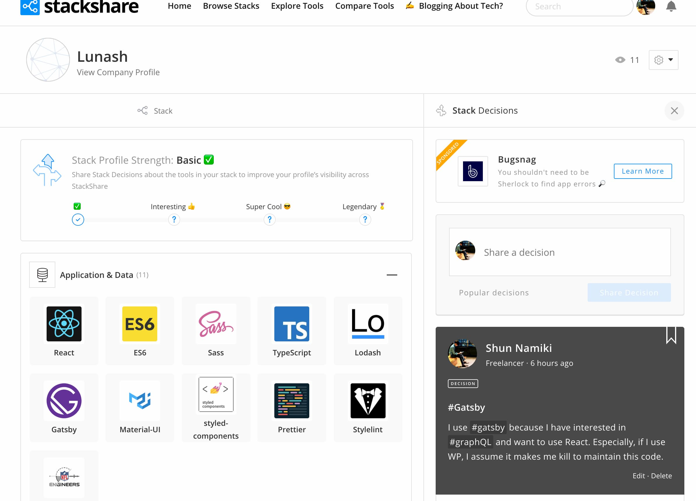
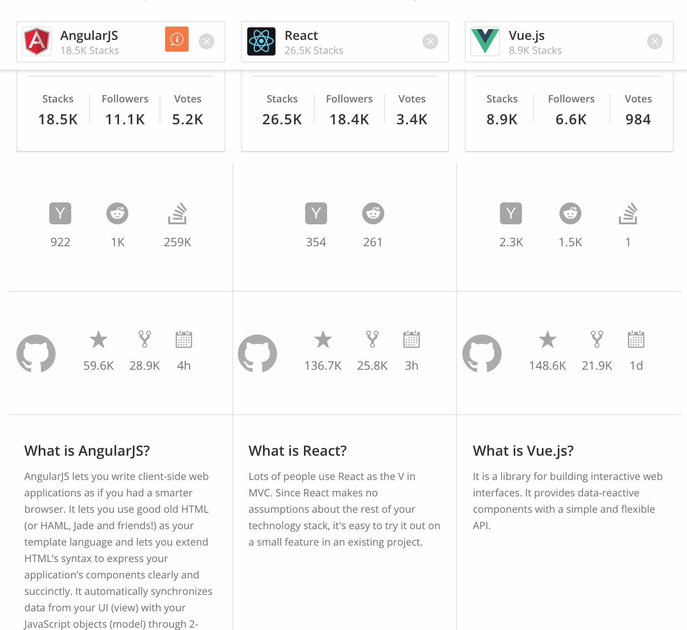
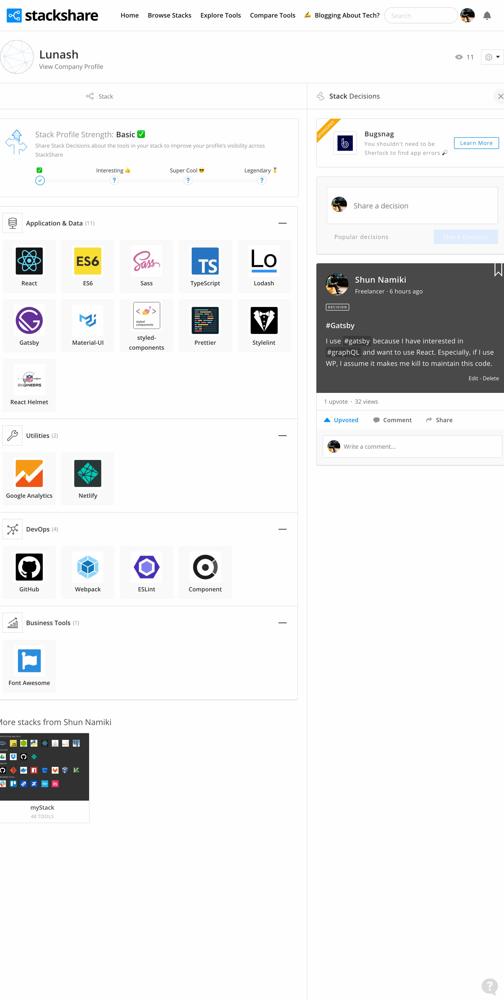

# 【レビュー】stackshareとは？使ってみた結果をまとめた

こんにちは、Nash です。

この記事は「stackshare」についての下記についてまとめた記事です。

- 概要　＝ StackShare とは？
- 使った結果　＝　所感
- 使いどころ　＝　考察

「使い方」は詳細を書くほどでもないので、ラフに書きます。

では、見ていきます。

## stackshare とは？技術スタック管理サービス



stackshare とは、技術スタックのビジュアル化・管理サービスです。

→[StackShare](https://stackshare.io)

ポチポチすれば、下記みたいな感じで、プロジェクトの技術スタックを可視化して管理できます。



### どんなことが出来るの？

いくつか機能があるけれど、メインなのは下記の３つの印象でした。

- ① 自分のプロジェクトの技術スタックを、可視化する
- ② 他社プロジェクトの技術スタックが、見れる（Airbnb、Netflix、Dropbox とか）
- ③ 技術スタックの比較専用ページを、作成したり、見れる

他にも、技術スタックに対して「投稿」したり、「コメント」とか、各技術スタックに対して「投票」みたいな機能もあります。ちなみに、料金は無料です。

- ① 自分のプロジェクトの技術スタックを、可視化する
  
- ② 他社プロジェクトの技術スタックが、見れる（Airbnb、Netflix、Dropbox とか）
  
- ③ 技術スタックの比較専用ページを、作成したり、見れる
  

## 使ってみた。

上記の「① 自分のプロジェクトの技術スタックをまとめておける」を、試してみました。

使い方は、説明を書くほどではないです。下記の３ Step で終わります。

- 【STEP①】自分のアカウント作成（Github とかで連携を推奨）
- 【STEP②】自分のプロジェクトのリポジトリを登録（サイトの URL でも OK）
- 【STEP③】技術スタックを登録

5~10 分もかからないので、仕事の息抜き時間で終わります。

登録すると、下記のようなページができます。



もし、README.md に技術スタックを文字でベタ書きしているなら、こいつをリンク・バッジで貼ったり、スクショを持ってきたり、すればだいぶスマートになりますね。

## 不満点：悪かった点

### Version の管理がない

あくまで、「どの技術スタックか？」だけなので、「どのバージョンか？」までは管理対象外のようです。

自分の場合は、「過去に行った仕事の技術スタックを残しておこうかな？」と思っていたので、Version の管理が出来ないのが、割と致命的でした。

下記の「メモ機能がない」の不満点と相まって、このサービス内であわせて管理する方法も基本的にはないです。よしんば、メモ帳があっても、結局メモに書かなきゃいけないなら、生テキストで管理するのと変わらなくなります。

```markdown
# 下記みたいのメモを別に必要になる。なら、SatckShare いらなくない？な状態

TypeScript: '3.5.0'
```

### リポジトリからの自動読み込みが貧弱

自分のプロジェクトを登録する際に、おそらくパッケージマネージャの管理ファイルを元に技術スタックを自動的に出してくれます。が、この機能が正直貧弱です。

自分のブログは `Gatsby.JS` で作っています。もちろん `package.json / yarn.lock`にて管理されています。が、リポジトリを登録しても、自動的には技術スタックに登録されませんでした。なので、結局、自分でポチポチしないといけないです。

それと、誤った技術スタックも多く登録されていたので、消す作業も地味に面倒でした。むしろ自分で０からポチポチして、技術スタックを埋めていったほうが早かったような気もします。。。。

１つのリポジトリを管理するなら、そこまでコストが高くないですが、「社内の全プロジェクトを〜」とかなると、割と大変そうだな〜、という印象でした。

### メモ機能がない

自分のプロジェクトの技術スタックを登録したのですが「メモ」的な機能がないです。

「Disicion」という機能があるのですがこれは登録した技術スタックに対して、「なぜこの技術スタックにしたの？」的な思いを書くことを想定されている機能みたいです。

なので、これがメモ代わりになるっぽいのですが、プライベートなメモが残せられないです。

### Export がない

エンジニア足るもの、生 Text で常に持っておきたい！けど、export がない。なので、基本的にこのサービスに、技術スタックの情報がロックインされてしまいます。なので、コピペでの転記などが、気軽にできなくなります。

とはいえ、逆にロックインを是とするなら、URL 共有ができたり、ビジュアルがカッコいいので、割とありかと思います。

## 使いどころ・使いどこでないケース

結論：管理のために使う、のではなくて、可視化のために使う

### 使いどころ

**軽めに技術スタックを把握したいとき・説明するケースに重宝しそうです。**

例えば、仕事探しているときに会社情報や求人情報にこの画像があると、パット見で技術スタックがわかりやすそうです。

また個人の技術スタックについてもまとめておけば、今まで、自分が何をやってました、的な説明もやりやすそうかも、という印象です。

### 使いどころじゃないケース

「バージョンがわからない」「管理コストが微妙にありそう」という理由で、**社内の複数プロジェクトを管理するために使うのは微妙そうかな〜、というのが感想**です。

また、そもそも、エンジニアがきちんと技術スタックを把握するときは「コード見ろ」になるかと思います。というか、自分は心配なので、そうなります。ドキュメントが陳腐化している可能性があるので。なので、「パッケージマネージャの管理ファイルを見ろ」となるわけです。

ただ、プロジェクトが少ない＋管理が行き届くなら、「あり」かと思います

### 所感

この記事ではあまり言及していないですが、下記の機能については、見ていて楽しいです。

- ② 他社プロジェクトの技術スタックが、見れる
- ③ 技術スタックの比較専用ページを、作成したり、見れる

個人で開発しているプロジェクトや、プロジェクト数が少ない会社だと、割とマッチしそうかな？と思うサービスでした。
