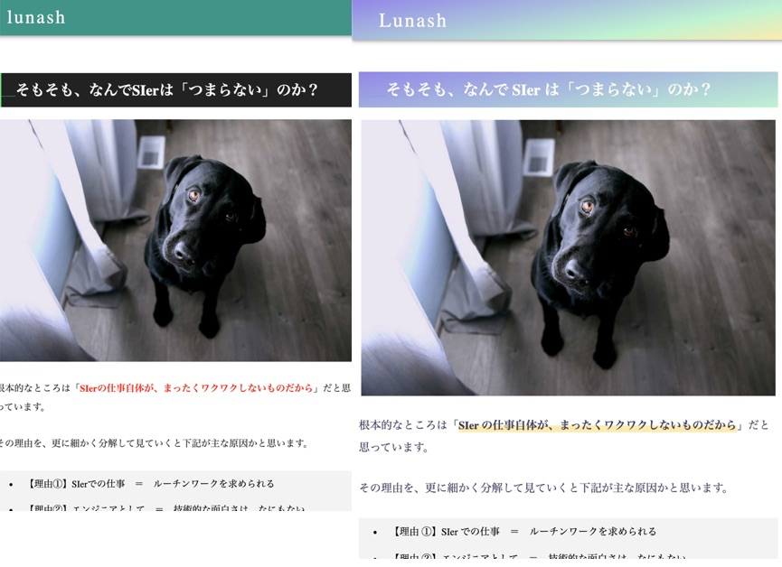

# 2019 年振り返り⇒ 2020 年目標｜フリーランスになりました

こんにちは Nash です。

この記事は、自分用の備忘の意味合いが強い記事で、下記内容の通りです。

- 2019 年にやったことの振り返り
- 2020 年の目標とやること

では、見ていきます。

## 2019 年振り返り

2019 年にやってきたことの振り返りです。

キーワードとしては、「**フリーランス**」「**フロントエンド**」「**英語**」の３つでした。

具体的にやったことを見ていきます。

- 個人ブログ開始（正確には 2018 年の 11 月くらい）
- 英語留学をやってみた（フィリピンに 3 ヶ月）
- フリーランスを始めた
- フロントエンドをメインで仕事で始めた
- Rails を仕事で始めた

では、見ていきます。

### 個人ブログ開始

（2019 年ではなくて 2018 年 11 月くらいからだけど、合わせてここで書く。）

技術系を中心にしたブログを自分のドメイン・サーバーで始めました。

内容も、どういう方針のブログにするかも定まっていなかったので、ひとまず最初は「技術」「キャリア」「海外留学」などを中心とした記事をチョロチョロ書いていて、だいたい70記事くらいまでいきました。

[Netlify + Netlify CMS + GatsbyJS ( React + GraphQL )でブログ作ったときにハマった点](./create-blog-with-netlify-netlifycms-gatsbyjs)

あと、2019 年の末らへんにブログデザイン・レスポンシブ・テーマカラーを色々変えて、とりあえず今の色調にしてみたり。多分、すぐに変える気がするけど。

ブログの方針だが、2019 年辺りからは時代は完全に「ブログはオワコン、時代は YouTube」という空気を感じているので、ブログは自己ブランディングをメインにしようかなー、という思いがありつつ、今後も書いていこうかと思ってます。

### 英語留学（フィリピンに 3 ヶ月）

「完全な英語環境の海外で生活してみる」という想定・狙いで、フィリピンに英語留学してきました！

[いち Web エンジニアがフィリピン留学に行く前に考えていること](./think-about-filipin)

予想していた通りだが、英語学習という側面での英語留学は正直あまり旨味が少ないです・・・。今ではオンライン英会話も格安で出来るので、コスパを追求するなら日本の田舎なりに籠もってひたすら英語の勉強してるほうが圧倒的に伸びるかと。

ただ、「海外で英語だけでの生活」という経験を通した気付き・学びはかなり多かったので、そういう観点ではこのタイミングでやっておいてよかったです。

ココらへんについては、練習がてらブログで記事を大量に書いたので、詳細はそっち参照で。

[【PINES ｜バギオ】パインスを完全レビュー【経験談】](./philippines-baguio-pines-summary)

[IT エンジニア目線でフィリピンをおすすめしない理由 ←3 ヶ月滞在の結論](./not-recommend-philippines)

### フリーランス始めた

2018 年末に会社辞めて、2019 年からフリーランスを始めました。

請け負った案件は下記の通り。

- 2019 年上旬に請負契約
- 2019 年 6 月からオンサイトで準委任契約
- 2019 年 6 月からリモートで準委任契約

フリーランス周りの振り返りなどは、別の記事でまとめようかと思っているので、詳細はそっちで。

追記：振り返りました。

[フリーランスエンジニアになって約１年半が経ったので振り返り【2020 年】](./freelance-one-year)

### フロントエンドをメインで仕事で始めた

今まではバックエンドでの開発をメインにしていたが、2019 年ではフロントエンド（React）をメインに仕事しました

理由は下記。

- 今までが Elixir/Phoenix がメインなので、潰しが弱かった。

- 海外就職を見越した技術選定。

Vueだと日本や特にアジア圏ではある認知度が伸びているけど、アメリカ・ヨーロッパ圏ではまだまだ全然普及していない状況なので、FWはReactにしました。

また、フロントはほぼ未経験ながら、幸いReact系のフリーランスでの仕事を見つけられて、
プライベート＋仕事での学習でとりあえずは、下記らへんは一通りはできるようになりました。

- React.js / Redux / Hooks
- Next.js
- ReactNative
- Firebase

記事も細々と書いていて、下記のとおりです。

▼2019年に書いた記事

- [React.useEffect でハマったポイントのまとめ](./react-useeffect-pitfall)

- [React の ContextAPI での正規化を Redux と比較](./compare-normalized-context-redux)

- [Redux の State 設計の正規化の記事まとめ](./investigate-redux-state-architecture)

- [【Firestore】「WhereIN」が使えない時の代案のまとめ](./summary-alt-plan-insted-of-wherein-about-firestore)

- [【Firestore】「orWhere」が使えない時の代案のまとめ](./summary-alt-plan-insted-of-orwhere-about-firestore)

- [【現役エンジニア】UdemyでReact＋JavaScriptのおすすめは？→『The Complete Guide』](./udemy-javascript-react-the-complete-guide)

- [react-router/react-router-transition を使ってサンプルアプリを作った](./create-react-router-techs)

- [React(Hooks)を使ってポモドーロタイマー作った](./create-pomotimer-with-hooks)

- [React+Redux+TypeScript で ToDo アプリを作った話](./create-todo-with-typescript)

- [Redux を使ってアイキャッチジェネレータを作った話](./create-icatch)

### Rails を仕事で始めた

前職ではバックエンドは PHP/Laravel か Elixir/Phoenix だったが、フリーランスとして請け負った仕事が Rails だったので、初めて仕事で使ってみました。

最初は「まぁ、なんとかなるだろー」と思って始めたけど、Rails 特有の黒魔術が多すぎて、正直いまでもストレスを感じながらコードを書いてることが多いです・・・

ただ、メインはフロントエンドながら、1 年も Rails を書いていれば大体のポイントは理解してきている状態です。

2020 年に自分の出来ることの整理として Rails で何か作ろうかなーということをなんとなく考えている状態です。

### 総括

総評として、2019 年はチャレンジなアクションが多い反面、プライベートでの学習はそこまでストイックにしなかったなー、という感じです。

なので、2020年はそこらへんをの反省を踏まえたテーマにしようかと思います。

## 2020 年目標とやること

2020 年のテーマとして「**ストイック**」「**海外就職**」を考えてます。

2019年はプライベートが割と緩く生きていたので2020年での学習はストイックにいこうかと。

具体的なアクションの予定としては下記の通り

- 海外就職のためにカナダに行く
- 個人プロジェクトをいくつか作る
- CSのfundamentalな学習
- vlog はじめる

### 海外就職のためにカナダに行く

前々から「海外就職したいなー」という思いがありながらも日々、日本の現場で仕事をしていました。
が、ある現場でアメリカの大学生で夏休みに日本に戻ってインターンしている子と数ヶ月一緒に仕事をすることがあり「やっぱり自分も海外に行きたいなー」という思いが強くなったので、2020 年にチャレンジすることを決めました。（他にも理由はいろいろあるけど）

なにはともあれ、具体的には、下記を行っていこうかと思ってます。

- 英語力をつける（学力・コミュニケーション力）
- カナダに行って短期の現地学校に入る
- 就職時の英語コードインタビューを練習していく
- ポートフォリオを整える

すでに、このアクションの準備のために、仕事も減らしていて 2019 年の 12 月に週２＋リモートだけの稼働にしていったので、この調子で準備を進めていく予定です。

### 個人プロジェクトをいくつか作る

上述のポートフォリオのためにも、個人プロジェクトをいくつか作ってみようかと思ってます。

国内での面接だと技術証明をする必要が弱くて、フリーランスで仕事探してるときも、なんとなく会話してれば内定が出ちゃう、みたいなケースが多かったですが、海外では技術証明していく必要があります。

というわけで、すでに作りかけが何個かあるのと、アイデアもあるので、英語学習や渡航準備とバランス取りながら作っていこうかと思ってます。

### CSのfundamentalな学習

自分はコンピュータサイエンスの学士を持っているけど、正直当時は真面目に勉強してこなかった人間です。
なので、CSの基礎知識が欠如しているのが自分の課題の１つとしてあるわけなので、2020年から少しずつ学び始めようかと思ってます。

特に、主戦場を海外にしていくと、ここらへんの知識を求められるケースが多くなりそうなのと、
ReactやRailsなど高レイヤーの高級知識や技術のトレンドを学んでいると常にラットレースになる感じ否めないので、長期的にも枯れた知識に対してある程度コミットしていこうかと思ってます。

### Vlog はじめる

時代を読むに、今後の流れとして blog が衰退して vlog の台頭が顕著になりそうで、特に 2020 年ではその流れがかなり一般化しそう、と考えてます。

国内でもそうだけど、すでに海外ではいろいろな種類のエンジニアチャンネルが増えているのもあり、自分も自己ブランディングを兼ねて練習がてらとして 2020 年に落ち着いたタイミングで始めてみようかと思ってます。

ただ、懸念として、顔出し動画だとそのデータを元にしたディープフェイクが作られるリスクが生まれそうかなー、という思いがあるけど・・・。

### おわりに

来年の自分が、この中からどこまで出来ているかがわからないけど、少なくとも 2021 年の自分に恥じないように日々行動していきますー！
