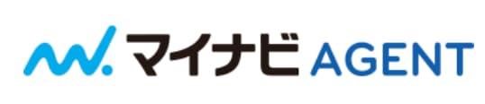
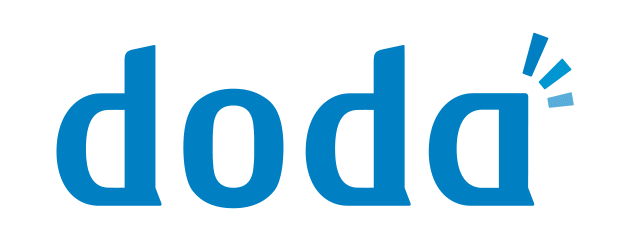
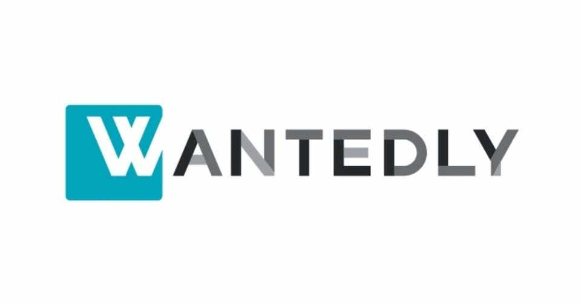

# SEからWeb 系へのおすすめ転職サイト【現役エンジニア談】

こんにちは、SEからWeb系に転職して今はフリーランスWebエンジニアの Nash です。

この記事は「**SE から Web 系へのおすすめ転職サイトについて、経験談を交えて紹介する記事**」です。

まずは結論です。

別々のタイプのエージェントを１つずつ登録するのがオススメです。

<!--  -->

- 【① 総合系】 <a href="//ck.jp.ap.valuecommerce.com/servlet/referral?sid=3476840&pid=886293700" rel="nofollow">マイナビ</a>
- 【②特化系】<a href="//ck.jp.ap.valuecommerce.com/servlet/referral?sid=3476840&pid=886294543" rel="nofollow">レバテック</a>
- 【③その他】<a href="https://www.wantedly.com/" rel="nofollow">Wantedly</a>

<!--  -->

では、見ていきましょう。

※ SE＝システムエンジニア、でSIer系の話です。

## おすすめ転職エージェント

まずは、SEからWeb 系への転職時に使えるエージェントを１つずつ見ていきます。

### レバテック

<!--  -->

<!--  -->

**IT系で最強と名高い転職エージェントサイト**です。

理由は「IT 系の転職エージェント」として尖っているからです。

SEからWeb系への転職なら、レバテックグループの中の「**レバテックキャリア**」を使いましょう。

- 実績年数＝１５年
- 求人数　＝５０００件
- 平均年収アップ額＝５０万円

（2019年2月時点）

自分も実際に求人を頂きましたが、他の転職エージェントよりも優良案件を数多く持っている印象でした。

自分もですが、他のフリーランス友人に聞いてもほぼ全員がレバテックには登録してました・・・。

結論、**「とりあえず登録する」レベルで抜群にオススメです。**

<!--  -->

<a class="affi-custom-button" href="//ck.jp.ap.valuecommerce.com/servlet/referral?sid=3476840&pid=886294543" rel="nofollow">レバテックへの無料登録はこちら</a>

<!--  -->

### マイナビ

<!--  -->

<!--  -->

超大手のマイナビグループです。

大規模な会社なので、エージェントも専門ごとに細かく別れています。
SEからWebなら、**ITに特化した「マイナビ・エージェント」** です。

担当者エージェントですが、SE 系と Web 系で明確に別の人でした。

IT系というカテゴリでこの２つの業界を合わせて語られやすいですが、企業体質とかが全然違うので**担当エージェントがきちんと別れてるのは好感が持てました**。

ただ、企業数が浅いベンチャーはほぼ取り扱ってないようです。
頂いた求人情報も、メガベンチャーなど少し大きい会社以上が中心になります。

結論、**Web系の中でも中規模以上の企業を狙いたい人に合いそうです**。

<!--  -->

<a class="affi-custom-button" href="//ck.jp.ap.valuecommerce.com/servlet/referral?sid=3476840&pid=886293700" rel="nofollow">マイナビへの無料登録はこちら</a>

<!--  -->

### DODA

<!--  -->
<noscript></noscript>
<!--  -->

こちらも転職に関しては大手ですね。

ちなみに、自分が SE から Web 系に転職したときは DODA 経由で転職を成功させました。

担当エージェントですが、年数が浅いベンチャーまでチェックしてるベンチャー専門の担当チームがいました。
DODAレベルの企業がリサーチしているベンチャーだと、**イケてるベンチャー企業を把握している可能性が高い**かと思います

実際、自分が入社した会社も 30 人くらいの規模感でしたが、最終的に自分がやめるときは社員数が倍以上の規模に成長していました。

結論、**チャレンジングにベンチャー企業を選びたい人にオススメです**。

<!--  -->

<a class="affi-custom-button" href="//ck.jp.ap.valuecommerce.com/servlet/referral?sid=3476840&pid=886294707" rel="nofollow">DODA への無料登録はこちら</a>

<!--  -->

### Wantedly

企業と転職者をつなげるビジネスSNSです。

正確には、「転職サイト」では無いかと思います。

ベンチャー企業を多く掲載していて気軽にアポを取りやすいです。

- メリット　＝　企業に直接コンタクトが取れるので爆速

- デメリット＝　エージェントがいないので自分でやることが多い

このサービス１つで転職活動を進めるのはリスクが高いかと思います。
他の転職サイトと併用して、参考くらいにするのがベターです。

<!--  -->

<a class="affi-custom-button" href="https://www.wantedly.com/" rel="nofollow">Wantedly への無料登録はこちら</a>

<!--  -->

---

以上が転職サイトの紹介でした。

ここからは、SEからWeb系の**転職を成功した経験者としてアドバイス**を語りたいと思います。

## 転職サイトのオススメの考え方

「**転職サイトを選ぶときの考え方**」も合わせて公開していきます。

大きく下記のカテゴリに分けるのが良い、というのが結論です。

- ① 大手の総合転職エージェント

- ② 〇〇特化の転職エージェント

- ③ その他の転職系サイト

なので、この中から**少なくとも１つずつは登録したほうが良い**かと思っています。

というのも、それぞれのエージェントで取り扱っている**求人の守備範囲が異なるから**です。

### SEからWeb系転職時のカテゴリー

この考えをもとに、カテゴリ分けをしました。

<!--  -->

- 【① 総合系】 <a href="//ck.jp.ap.valuecommerce.com/servlet/referral?sid=3476840&pid=886293700" rel="nofollow">マイナビ</a>
- 【②特化系】<a href="//ck.jp.ap.valuecommerce.com/servlet/referral?sid=3476840&pid=886294543" rel="nofollow">レバテック</a>
- 【③その他】<a href="https://www.wantedly.com/" rel="nofollow">Wantedly</a>

<!--  -->

なので、迷っている人はとりあえず、ここから１つずつ申し込むのをオススメします。

### 転職を迷ってる人へ１つだけアドバイス

最後に個人的なアドバイスを１つだけさせてください。

それは、転職を考えているなら「**今すぐに何でも良いので行動してください**」。

具体的には「転職サイトに登録すること」を自分はオススメしています。

というのも、

- 「どの転職サイトがいいの？」
- 「転職するの初めてで不安・・・」
- 「Web 業界についてよくわかってないから！」
- 「履歴書もまだ書いてないし・・・」

みたいに、迷ったり踏みとどまってる時間って**あまり意味がないんです**。

理由は、**転職エージェントに登録して相談すれば全部おしえてくれるから**です。

<!-- ### 自分がSEからWeb系に転職できた理由

自分も昔は SIerでSEとして働いていました。
そこからWeb系に転職して、今ではWeb系フリーランスエンジニアとして働いています。

SEのときは同期・友人と飲み会で仕事の話になったときにも「仕事つらいんで転職したい・・・」みたいな話題のトークもしてました。

そんな中で、同期・友人達よりも、自分が早い段階で転職できた理由はただ１つです。
転職を視野にいれたタイミングで、**行動しただけ**です。

（結局、その同期や友人は飲み会のたびにずっと「転職しようかな〜」とぼやいているだけだったのですが・・・） -->

### さいごに

転職に対して不安だったり億劫になる気持ちもわかります！（自分もそうでした）

ですが、**行動しないと何も変わらないんです**。

なので、１つだけおすすめできることがあるとすれば、**今すぐ行動に移すこと**だけです。

この記事がその助けになれば幸いです。

---

▼この記事で紹介した転職サイト

<!--  -->

- 【① 総合系】 <a href="//ck.jp.ap.valuecommerce.com/servlet/referral?sid=3476840&pid=886293700" rel="nofollow">マイナビへの無料登録はこちら</a>
- 【②特化系】<a href="//ck.jp.ap.valuecommerce.com/servlet/referral?sid=3476840&pid=886294543" rel="nofollow">レバテックへの無料登録はこちら</a>
- 【③その他】<a href="https://www.wantedly.com/" rel="nofollow">Wantedly への無料登録はこちら</a>

<!--  -->