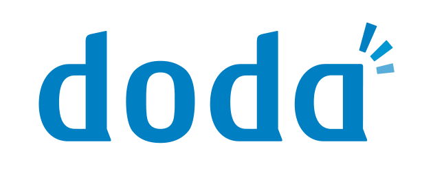
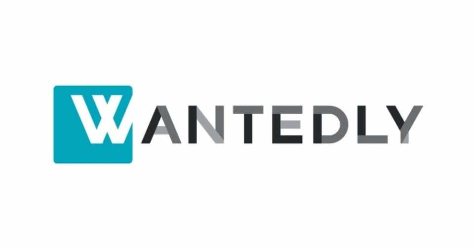

# SEからWeb 系へのおすすめ転職サイト【現役エンジニア談】

こんにちは、SEからWeb系に転職して今はフリーランスWebエンジニアの Nash です。

この記事は「**SE から Web 系への転職サイトについて、経験談をベースに個人的なおすすめを公開した記事**」になります。

また、エージェントを１つずつ紹介したあとに、どういう観点でも転職を考えると良いか？まで言及していきます。

いきなり結論ですが、こちらの通りです。

- 【① 大手の転職エージェント】
  - <a href="//ck.jp.ap.valuecommerce.com/servlet/referral?sid=3476840&pid=886293700" rel="nofollow">マイナビへの無料登録はこちら</a>
- 【②Web 系特化の転職エージェント】
  - <a href="//ck.jp.ap.valuecommerce.com/servlet/referral?sid=3476840&pid=886294543" rel="nofollow">レバテックへの無料登録はこちら</a>
- 【③ その他の転職系サイト】
  - <a href="https://www.wantedly.com/" rel="nofollow">Wantedly への無料登録はこちら</a>

では見ていきます。

## おすすめ転職エージェント

というわけで、個人的に SE⇒Web 系への転職時に使ったおすすめの転職サイトについて紹介していきます。

### レバテック

<!--  -->

<!--  -->

「関東の Web 系の転職エージェント」として尖ってる分、Web 系としては最強と名高い転職エージェントサイトです。

- SEからWeb系なら、レバテックグループの中の「レバテックキャリア」になります。
- 他の転職エージェントよりも、Web系については有料案件を特に多く持っている印象です。

<!--  -->
<a href="//ck.jp.ap.valuecommerce.com/servlet/referral?sid=3476840&pid=886294543" rel="nofollow">レバテックへの無料登録はこちら</a>
<!--  -->

### マイナビ

<!--  -->

<!--  -->

20 代の第二新卒に特化した「マイナビジョブ 20's」や IT に特化した「マイナビエージェント IT」などの独立エージェントがあります。

- 自分が使ったときはマイナビエージェント IT で、個人的にはコチラがオススメです。
- SE 系と Web 系で明確に担当エージェントの人もわかれていました。
- なので、SE から Web 系に行きたいなら、最初からその方向性で話を進めておいたほうが良いです。
- ただ、企業数が浅くて少数のバリバリなベンチャー求人はあまり取り扱っていなかった印象。
- 取り扱っている求人も、メガベンチャーが中心。ベンチャーの中でも大きい会社や大手会社の Web サービス部門などが中心。

<!--  -->
<a href="//ck.jp.ap.valuecommerce.com/servlet/referral?sid=3476840&pid=886293700" rel="nofollow">マイナビへの無料登録はこちら</a>
<!--  -->

### DODA

<!--  -->
<noscript></noscript>
<!--  -->

- ちなみに、自分が SE から Web 系に転職したときは DODA 経由で転職を成功させました。
- ベンチャー専門のエージェント担当者もいて、年数が浅いけど見込みがありそうなスタートアップにまでアンテナを伸ばしている印象でした。
- 実際、自分が入社した会社も 30 くらいしかいない規模感のところです（最終的に自分がやめるときは倍以上になってましたが）

<!--  -->
<a href="//ck.jp.ap.valuecommerce.com/servlet/referral?sid=3476840&pid=886294707" rel="nofollow">DODA への無料登録はこちら</a>
<!--  -->

### Wantedly

- 企業と転職者をつなげるビジネスSNS。
- ベンチャー企業を多く掲載していて、気になったら気軽にアポが取れる。
- とりあえず登録してる、って Web 系のエンジニアは結構多い。
- エージェントを間に挟まないで直接コミュニケーションが取れるので、スピード感が段違いに早い。
- これ１つだけだとエージェントへの相談ができないので、他の転職サイトと併用して使うのが良い。

<!--  -->
<a href="https://www.wantedly.com/" rel="nofollow">Wantedly への無料登録はこちら</a>
<!--  -->

---

以上が転職サイトの紹介でした。

ここからは、SEからWeb系の転職を成功できた上でのポイントを少しだけ語りたいと思います。

## 転職サイトのオススメの考え方

転職サイトのオススメの選びかたなのですが、色々使ってみた結果、転職は大きく下記のカテゴリに分けられそうだなーという結論です。

- ① 大手の総合転職エージェント

- ② 〇〇特化の転職エージェント

- ③ その他の転職系サイト

なので、この中から、少なくとも１つずつは登録はしておいたほうが良いかと思います。

というのも、それぞれのエージェントで取り扱っている求人の守備範囲が異なるからです。

### SEからWeb系転職時のカテゴリー

この考えをもとに、SE から Web 系への転職時のカテゴリ分けを考えてみました。

合わせてカテゴリごとに１つずつ転職サイトを厳選しておきましたので、迷っている人はとりあえず、ここから１つずつ申し込むのをオススメします。

- 【① 大手の転職エージェント】
  - <a href="//ck.jp.ap.valuecommerce.com/servlet/referral?sid=3476840&pid=886293700" rel="nofollow">マイナビへの無料登録はこちら</a>
- 【②Web 系特化の転職エージェント】
  - <a href="//ck.jp.ap.valuecommerce.com/servlet/referral?sid=3476840&pid=886294543" rel="nofollow">レバテックへの無料登録はこちら</a>
- 【③ その他の転職系サイト】
  - <a href="https://www.wantedly.com/" rel="nofollow">Wantedly への無料登録はこちら</a>

### 転職を迷ってる人へ１つだけアドバイス

さて、ここまで、転職サイトのオススメ紹介だったのですが、最後に個人的なアドバイスを１つだけさせてください。
それは、転職を考えているなら「**今すぐに何でも良いので行動してください**」です。ほんとこれだけ。

自分としては、具体的には無料転職サイトに登録することをオススメしています。

というのも、

- 「どの転職サイトがいいの？」
- 「転職するの初めてで不安・・・」
- 「Web 業界についてよくわかってないから！」
- 「履歴書もまだ書いてないし・・・」

みたいに、**迷ったり踏みとどまってる時間ってあまり意味がないんです**。

まずは転職エージェントに登録して相談して、そこで業界のことを教えてもらったり、履歴書を書いていく、っていう順番が圧倒的に効率的ですから。

### 自分がSEからWeb系に転職できた理由

自分も昔は SIerでSEとして働いていましたが、そこからWeb系に転職して、今ではWeb系フリーランスエンジニアとして働いています。

SEのときは同期・友人と飲み会で仕事の話になったときにも「仕事つらいんで転職したい・・・」みたいな話題でのトークもしてました。

そんな中で、同期・友人達よりも、自分が早い段階で転職できた理由はただ１つです。
転職を視野にいれたタイミングで、**行動しただけ**です。

（結局、その同期や友人は飲み会のたびにずっと「転職しようかな〜」とぼやいているだけだったのですが・・・）

### さいごに

転職に対して不安だったり億劫になる気持ちもわかります！（自分もそうでした）

ですが、**行動しないと何も変わらないんです**。

なので、１つだけおすすめできることがあるとすれば、**今すぐ行動に移すこと**だけです。

この記事がその助けになれば幸いです。

---

▼この記事で紹介した転職サイト

- 【① 大手の転職エージェント】
  - <a href="//ck.jp.ap.valuecommerce.com/servlet/referral?sid=3476840&pid=886293700" rel="nofollow">マイナビへの無料登録はこちら</a>
- 【②Web 系特化の転職エージェント】
  - <a href="//ck.jp.ap.valuecommerce.com/servlet/referral?sid=3476840&pid=886294543" rel="nofollow">レバテックへの無料登録はこちら</a>
- 【③ その他の転職系サイト】
  - <a href="https://www.wantedly.com/" rel="nofollow">Wantedly への無料登録はこちら</a>

