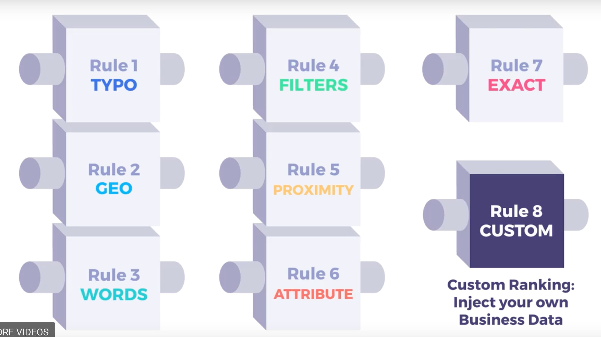

## 【入門用】Algolia の概念的知識のまとめ

こんにちは。Firebase を使ってるプロジェクトで「検索機能を作っておいてくれ」となって、定番の Algolia を導入するになった Nash です。

この記事は「**Algolia の中で使われる概念や用語の説明・まとめた記事**」です。基本的には、Algolia の公式ドキュメントを読めばわかることです。ただ、独自の単語が出てくることが多いので、その整理となります。

また、API の詳細・使い方については、この記事では取り扱いません。概要説明くらいです。

## 基礎知識

### Algolia とは？

全文検索を提供する Saas です。

たとえば、Firestore では SQL ライクなクエリを発行してデータを操作ができます。ですが、検索を実現するためのクエリ・API が容易されていません。（やろうと思えば力技で出来ますが・・・）

そのため、Firebase の公式としても、検索を実現したい場合は Algolia を併用する旨が記述されてます。

### 検索を行うデータは？

Algolia の中で JSON 形式でデータを保持しておき、その中で検索を行います。

アプリケーションの各種データは RDS や Firesotre などで管理されていると思います。ですが、更に検索用に Algolia にもデータを入れないといけません。つまりデータを重複して管理することになります。

データの扱いはキャッシュと同じように扱うのがベターです。つまり、RDS などのデータを主とします。主のデータに対して CREATE/UPDATE/DELETE が行われたら、Algolia 側にもその命令を発行する形です。

### RDS と対応した用語

RDB における、テーブル・レコード・カラムが Algolia だと微妙に違う言葉を使ったりします。

| RDB    | Algolia   | MEMO                                |
| ------ | --------- | ----------------------------------- |
| Table  | Index     | 複数形は indicies。レコードの集合体 |
| Record | Record    | Attribute の集合体                  |
| Column | Attribute | key/value ペア。値の集合体。        |

Algolia を使うときは、これを丸暗記したほうが良いです。

### Algolia の検索までの流れ

検索機能を使うまでは、大きく分けて３つのフローに別れます。

- ①DataSync ＝ Algolia にデータを突っ込む。

- ②Ranking ＝ Algolia 内部でインデックスを作成してくれる。

- ③Fetch ＝ 検索をかけると理想的な結果が表示される。

② は Algolia 側で行ってくれるので、Developer が行うのは ①／③ のみなので直感的ですね。

（② は、`Index-time`とか、とも書かれてる)

### 提供されている API

2 種類。普通の API かコンポーネントです。普通の API では、PHP や Ruby などから呼び出して実行します。

もう１つは、コンポーネント（InstantSearch Widgets）にです。

React・Vue・Angular 用にコンポーネント単位で機能が用意されています。なので、簡単な検索ボックスは、これを導入するだけで完了です。ただ、デザインの制約やロジックなどが複雑な機能だった場合は、オレオレコンポーネントを作ったほうがベターです。

## 用語知識

### Synonyms

同義異音を定義する。アプリのビジネスドメインによって発生するであろうものをユーザーが定義できる。PC ＝パソコン、みたいなもの。

（Algolia 特有ではなくて、普通に英単語ですね）

### Ranking formula

検索結果にて、どの順番で表示させるか？の計算アルゴリズム。
Algoliaはあいまい検索なので、順番が肝です。

具体的には、「tie-breaking アルゴリズム」→「ソート」→「ranking-criteria（8 つのルール）」の優先度で、表示する内容・順番を決めてます。

ちなみに、custom-ranking を設定していると、RankingCriteriaの8つ目のルールとしてソートが行われる。

▼ RankingCriteria

<!-- TODO: ここからは、ちょっと調べが甘いので、どこかのタイミングで調べてから。

### Faceting

- saveする前時点で定義する
- マネジメントコンソール上や、APIの関数の結果にて、件数をグループ単位にて集計できるようになる。

### Relavance

- とは、「検索をしたときに、検索文言と結果の関連性」は、どう実現しているか？RDB|Algolia

- ランキングは、`ranking-formula`のフェーズにて行われる。

### Attributes の４つの種類に分類される

### 検索用`searchableAttributes`

- default だと、すべての attributes が検索対象になる。これを設定することで、検索対象の attributes を指定できる。
- `['title, comments', 'type']`と定義すると、title と comments が同一の優先度になる。

### 表示用

まんま、表示する用。以上。ちなみに、表示用 attributes は、検索することも可能。

### フィルター用

- facets として定義しないといけない？？
- filterable な値として定義するタイミングは、indexing time 時点でしないといけない。
- ただし、numeric/boolean の場合は、この定義をしないでもフィルター可能。

### 順番用(customizing-ranking)

- 検索アルゴリズムに対して、特定の attributes へ重さを与えるためのもの。
- 例えば、「地震」という単語で検索して更に「いいね数」が多いツイートを検索上位に持ってきたい、という場合、liked-count の attribuets を customizing-ranking として登録する。

-->

## プラクティス

ここでは、各種プラクティスをまとめました。これも公式DOCに乗っているものもあれば、自分が調べたMEMO的なのもあります。

### データサイズはできる限り小さくする

検索用・表示用・ソート用、だけに絞って、それ以外のデータは保存しない。が公式提供のプラクティスです。

仮に Attribute が増える場合は、既存の Record に対しても Attribute を更新すれば良いだけです。

### Index 設計について

複数企業が使う想定のサービスだったので、Indexをどうするかなー？というわけでIndex設計を色々考えてみました。

結論、マルチテナントであっても１つの Index に全企業のデータを入れて、fetch するときに filter して取得するのが一番良さそうです。

この選択の懸念として、Filter 条件をミスったりで事故ると、他の企業の情報が見れてしまう危うさがあります。

他のやり方として、企業毎に Index を切り分ける方法もあります。こちらはセキュリティ的な危うさがなくなりますが、マイグレーションがとんでもなく辛くなります。仮に登録企業数が 1000 とかになると、マイグレーションがその分実行されるわけです。

考え方はこちらの記事を参考にしました。

▷[つらくないマルチテナンシーを求めて: 全て見せます！ SmartHR データベース移行プロジェクトの裏側 - builderscon tokyo 2018](https://builderscon.io/tokyo/2018/session/5485dc21-810e-4d12-9102-30b2812cd64f)

▷["Best practices with how to structure an index - Open Q&A - Algolia Community"](https://discourse.algolia.com/t/best-practices-with-how-to-structure-an-index/6040/2)

この件はAlgolia、というよりもマルチテナント系のシステムについてのプラクティスですね。

### 各種設計などで迷ったら

困ったらここで検索するとたいていのことは探せられる。特に設計については先に調べたり、考慮してから行うべきかと。

▷[Algolia Community](https://discourse.algolia.com/search)

### おわりに

Algoliaについては知っていたのですが、自分が実装するタイミングが初めてだったのと、周りに有識者が誰もいなかったので概念的なところをまとめてみました。

Algoliaに記事はどれもハンズオンが多くて、自分も動けばOKな感じで進めようかなー、とも思ったのですが、気になったので調べてみました。

この記事が誰かの助けになれば幸いです。
