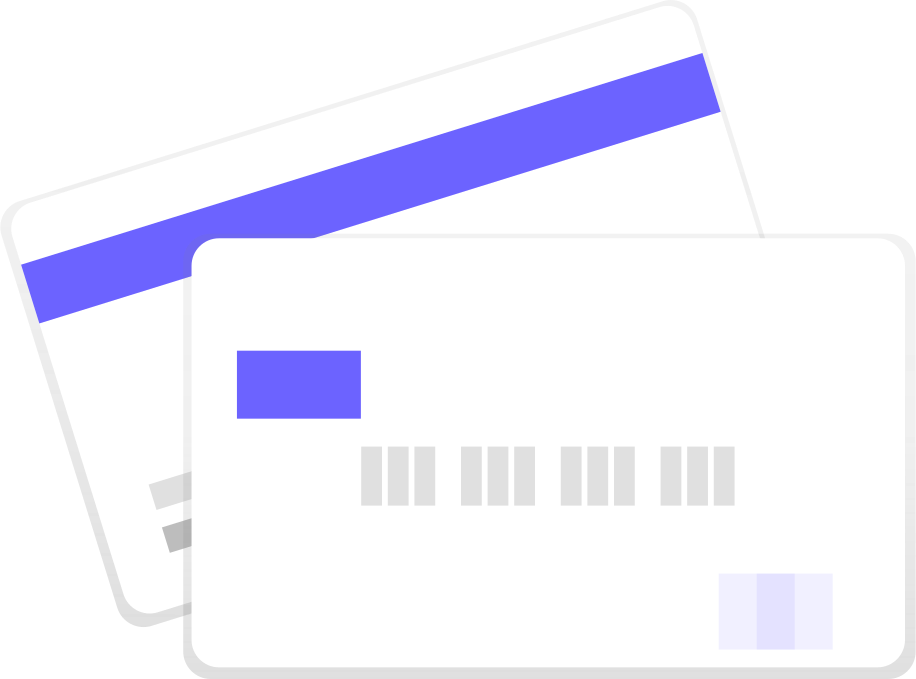

# 【厳選】フィリピン留学でおすすめのクレカ【２枚】

こんにちは。フィリピン留学を終えて、次はカナダ留学予定の Nash です。

この記事は「**フィリピン留学でおすすめのクレカを紹介**」というトピックの記事です。

先に結論です。

- なんで複数クレカを持つの？　⇒　海外保険金額が合算になる
- おすすめクレカ　＝　EPOSカード ＋　楽天カード

では、見ていきましょう。

## なぜ複数クレカが必要なのか

複数クレカを用意するのは「**クレカの海外保険の金額が合算されるから**」です。

### クレカの海外保険について

実は、クレカって海外保険がついているんです。
しかも、その保険金額は合算されます。

例えば、下記みたいになります。

- 海外で怪我して、入院して 300 万になった
- クレカ A（200 万負担） + クレカ B（150 万負担）を持っている
- ⇒ 自己負担が 0 円になる。

これ、クレカを持っていなかったら？
まず 300 万はその場で払わないといけません。

ただ、実は海外でも国民保険が適用されます。
なので、3 割の自己負担になります。
つまり、

- その場で 300 万払って
- 日本に戻ったら210 万返ってきて（国民保険）
- 自己負担は 90 万（最終的な出費）

となります。

あと、少なくとも、その場で 300 万は払わないといけませんよ。

### 海外の医療費は高額

「医療費で 300 万とか高くない？」と思います？
[ここの価格.com](https://hoken.kakaku.com/insurance/travel/select/cost/philippines/)にて、フィリピンの医療費の過去事例があります。

なんと、**1 ヶ月以下の入院でも 400 万のケースがあります**。

意外とフィリピンの医療費・入院費って、高いんですよ。

確かに、国民保険なら 70%はカバーはできます。
ですが、クレカを複数持つだけで医療費を 100%カバーできるようになるんです。

クレカなら無料で持てますし、そっちのほうが良くないです？

### 疾病・傷害の保険金額が大事

また、クレカの宣伝文句で、
「海外保険が最高 1000 万！」
みたいによく書かれてます。

あれ、たいてい死亡保険なので注意してください。
海外生活で大事なのは「疾病・傷害保険」にかかる金額です。

例えば、高級カードで有名なアメリカン・エキスプレス。
これ、死亡保険だけは高いですが「疾病・傷害保険」は 100 万ずつ。低すぎです・・・。

### 合算で 400 万くらいは欲しいところ

少なくとも合算で 400 万くらいは欲しいところです。

というわけで、具体的に下記のようにオススメしています。

▼ 2020/1 時点

| クレカ | 傷害   | 疾病   |
| ------ | ------ | ------ |
| EPOS   | 200 万 | 270 万 |
| 楽天   | 200 万 | 200 万 |
| ＝ 合計 | ＝400 万 | ＝470 万 |

---

では、おすすめのクレカについて紹介していきます。

## 【おすすめのクレカ ①】EPOS カード

EPOSカードです。保険周りで最強のカードです。

### 自動付帯

保険の種類は「自動付帯」です。

自動付帯とは、クレカを持っているだけで保険が適用される、というもの。
他にしないといけないことはありません。

### 保険金額が高い

傷害・疾病治療に対する保証金額がめちゃ高いです。

| 種類     | 金額   |
| -------- | ------ |
| 傷害治療 | 200 万 |
| 疾病治療 | 270 万 |

無料＋自動付帯で傷害・疾病治療が、ここまで高額なクレカも少ない、というか無いです。

### 即日発行も可能

もし、留学までの日程がギリギリでも OKです。

OIOI で受け取りなら、即日発行も可能です。

### 年会費無料

年会費も無料です。ゴールドの方が保険金額も高いですが、年会費が有料になっちゃいます。

### まとめ

特にEPOSは、海外保険に対してメチャクチャ優秀です。
自動付帯＋高額な傷害・疾病保険がという特徴があります。

<!--  -->
<a class="affi-custom-button" href="https://www.eposcard.co.jp/index.html" rel="nofollow">EPOSカードの無料登録はこちら</a>
<!--  -->

### おまけ：無料でゴールドカードにランクアップ。

EPOS カードを使い続けると、どうなるか？

実は、無料で EPOS のゴールドカードを発行できる可能性があるんです。
自分も、使い続けてちょうど 1 年後にこの招待が届きました。
なので、いま年会費を無料でゴールドカードを使ってます。

なので「クレカを育てる」という観点で、海外に行かない人にもオススメしてます。

## 【おすすめのクレカ ②】楽天カード

楽天カードです。圧倒的なポイント還元率でオススメ。

### 保険は利用付帯

保険の種類は「利用付帯」です。（ここだけちょっとデメリット）

利用付帯とは、海外への交通手段をクレカで支払えば保険が適用される、というもの。
具体的には、行きの飛行機は楽天カードで払う必要があります。

とはいえ、後述のポイント還元率の話にも繋がるのですが、
どちらにしても飛行機代は楽天カードで払ったほうが良いです。

### ポイント還元率が圧倒的に高い

クレカのポイント還元率って、どれくらいだと思います？
普通のクレジットカードはたいてい 0.5%です。
その点、楽天カードはポイント還元率が 1%なんですよ。

なんだかんだ、フィリピン留学って
飛行機代＋授業代＋生活費＋・・・
と、支払う金額が多いです。
なので、出来る限り楽天カードで払うのがオススメなんです。

というわけで、できるかぎり楽天カードで支払ってください。
**フィリピン留学から帰ってきたら、ポイントが溜まってるんで、楽天市場で買い物でもしてください**。

### 保険金額が高い

利用付帯ではありますが、無料クレカの中では傷害・疾病治療がかなり高いです。

| 種類     | 金額   |
| -------- | ------ |
| 傷害治療 | 200 万 |
| 疾病治療 | 200 万 |

### 年会費は永年無料

楽天カードは年会費が無料です。

ゴールド・プラチナと上位のカードもあります。
が、これらは年会費がかかるので通常の楽天カードでOKです。

### まとめ

特に、楽天カードはポイント還元率が高い＋補償金額が高いのが特徴です。

<!--  -->
<a class="affi-custom-button" href="//af.moshimo.com/af/c/click?a_id=1742990&p_id=58&pc_id=58&pl_id=669&guid=ON" rel="nofollow">楽天カードの永年無料登録はこちら</a>
<!--  -->

## クレカ申請はなるべく早く

実は、自分もフィリピン留学する前にクレカをたくさん申請したのですが、
ギリギリに申請したので、全部は間に合わなかったんです・・・。
（そもそも、そんなにいらなかったですが）

クレカを受け取るにしても、下記のような流れがあります。

- ①クレカ申請
- ②審査
- ③発行
- ④郵送
- ⑤受け取り

ギリギリになった理由ですが、留学前って思ったよりもやることが多いんです。

なので、クレカの申請、ほんとに後回しにしないほうが良いです！

この記事を見終わったら、すぐに行動することをオススメします。

---

▼ この記事で紹介したクレカ

<li>
<!--  -->
<a class="affi-custom-button" href="https://www.eposcard.co.jp/index.html" rel="nofollow">EPOSカードの無料登録はこちら</a>
<!--  -->
</li>

<li>
<!--  -->
<a class="affi-custom-button" href="//af.moshimo.com/af/c/click?a_id=1742990&p_id=58&pc_id=58&pl_id=669&guid=ON" rel="nofollow">楽天カードの永年無料登録はこちら</a>
<!--  -->
</li>
