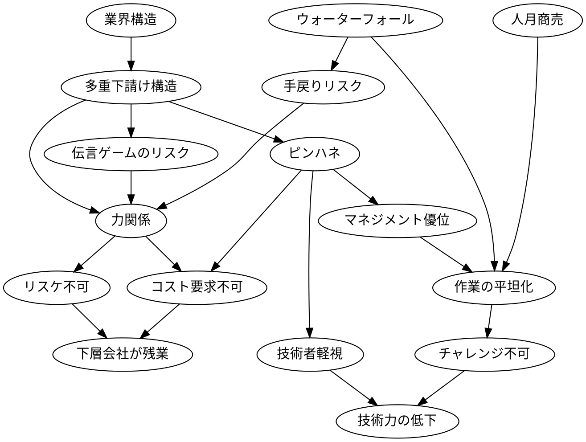
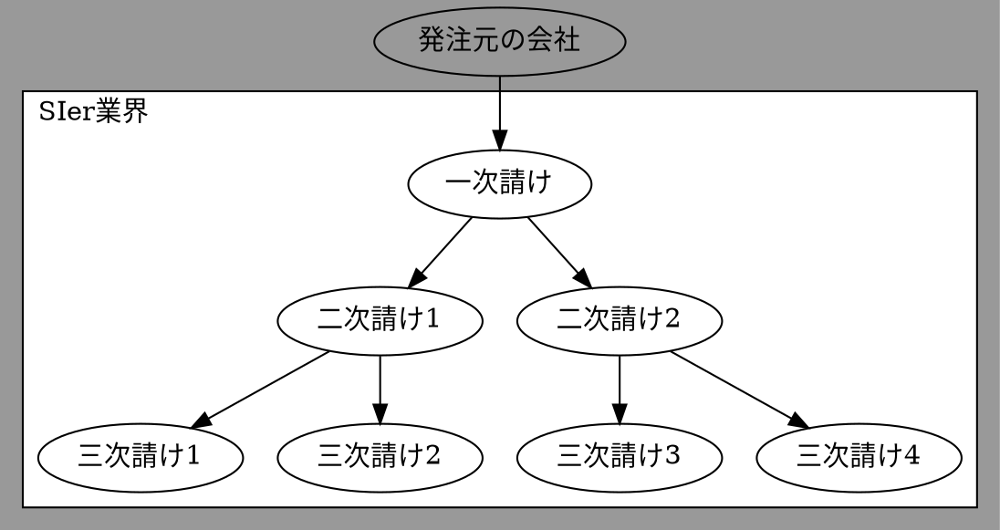
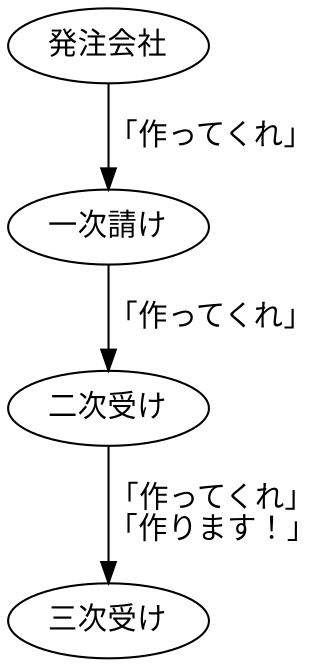
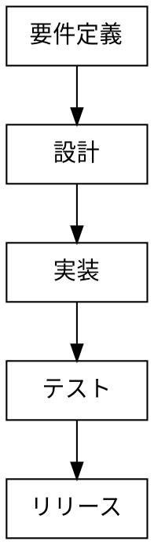

# 【完全理解】SIer業界 がブラックな理由を解説【わかりやすさ重視】

こんにちは。SE の闇が深すぎたので Web 系に転職した Nash です。

この記事は「**どうして SIer業界 がブラックになってしまうのか？の背景を解説する記事**」です。

下記の流れで進めます

- ①前提知識の確認
- ②ブラックの内容／原因

複雑な背景なので、脱線しないようにトピックを短くして、わかりやすさ重視で書いていきます。

では見ていきましょう。

※SIer 業界も広いので、必ずしもこの記事の通りではないです。

## SIerがブラックになる前提知識

まずは、**SIer業界に対する前提知識を整理**していきます。

「SIer がブラック」の原因は多く複雑です。

自分の考える全体の関係図が下記です。

（**この図でも全貌を語り尽くせれていない**です）

はい。複雑ですね。

でも、ブラウザバックしないでください！

重要なポイントを絞って説明しますので。

最初は、もっとも重要な「SIer の業界構造」です。

### 業界構造＝ピラミッド

SIerの業界構造は、**ピラミッド構造**。

「IT ゼネコン」とも言われます。

SIer 業界での大規模システム開発って、超簡単に言うと「**複数社で超大掛かりな伝言ゲーム**」で実現します。

ピラミッドですね。この図の通りに SIer 業界では、仕事が流れます。

- ピラミッドの上から仕事が振ってくる。
- 上層の会社　＝　要件定義〜設計。
- 下層の会社　＝　プログラミング・テスト。
- 上層で作るモノを決める ⇒ 下層で作る 
- ＝伝言ゲーム

こんな感じです。

### 業界構造 ⇒ 多重下請け構造

多重下請け構造とは、**請け負った案件をそのまま別の会社に依頼していくビジネスモデル**です。

SIerでは、ピラミッドの上から下へ仕事を流すことです。

### 開発手法＝ウォーターフォール

ウォーターフォールとは、**工程を厳格に管理して１工程ずつ確実に終わらせて順々に進める開発手法**です。

- 「要件定義 ⇒ 設計 ⇒ 実装 ⇒ テスト ⇒ リリース」の、流れ。
- 「後半に問題が発覚したとき、手戻りコストが膨大」という特徴。

こんな流れです。

手戻りコストですが、例えば、リリース直前に「設計間違えた！」となると「設計→実装→テスト」と多くの手戻り作業が必要になるわけです。

具体例を「家を建てる作業」で考えます。

- 建築家：家を考える（要件定義〜設計）

- 大工：家を作っていく（実装〜リリース）

こんな感じです。

ちなみに、よく勘違いされますが**ウォーターフォールという開発手法がダメってことではない**です。

（たしかに、すでに旧時代的な手法ではありますが。）

これと他の要素が混ざった時にブラックな SE が爆誕してるだけです。

### 人月商売

**作業量に「人月」という単位を使う見積もり手法**です。

定義＝「１人で１ヶ月かかる作業量を１人月」です。

▼ 例

- １０人月　＝　１０人が１ヶ月必要な作業量
- １０人月　＝　１人が１０ヶ月必要な作業量

**人月商売は個人の能力差を考慮できない**です。

理由は、見積もり時点で「どのタスクを誰がやるか」が決まっていないからです。

## SIer のブラックを見ていく

ここまでで、前提知識を見ていきました。

これらが組み合わさったりすると SIer がブラックになっていくわけです。

見ていきましょう。

### 多重下請け構造 ⇒ 力関係が生まれる

▶**上層の会社ほど立場が強く、下層ほど弱い**です。

理由は、多重下請け構造が原因で力関係が生まれてしまうからです。

その結果、

- 上層ほど、立場が高く旨味がある。
- 下層ほど、立場が低く旨味がない。

となります。

### 多重下請け構造 ⇒ 伝言ゲームリスク

▶「上層から下層」「下層から上層」の**伝言ゲームリスク**があります。

伝言ゲームのリスクが具体的になにかを、それぞれ見ていきます。

▼ 上層 ⇒ 下層

上層で考えた仕様を伝言ゲームで下層に伝えます。ですが、**途中で内容が変わっちゃう可能性**があります。

そのため「発注時に伝えたモノと、出来上がって納品されたモノがぜんぜん違う・・・」みたいなリスクがあります。

▼ 下層 ⇒ 上層

下層から中層に「スケジュール厳しいです！」みたいに言っても**握りつぶされます**。

なぜなら、都合の悪い報告だからです。

その結果、**上層はプロジェクトの本当の進捗率を把握できません**。

本来は必要だったリスケ計画も立てられず、実行もされないです。

結果、品質が低い**バグだらけの成果物を納品されたり、そもそも完成しないリスク**があります。

他にも、下層の会社は残業して納期に間に合わせようとします。つまりは、**残業でカバー**します。

### 多重下請け構造 ⇒ ピンハネ

▶ 仕事が上から下に渡るにつれて、**ピンハネされます**。

「多重下請け構造」のため、仕事は一次請けが貰いそれを下に流します。

そして、会社を経過するごと**報酬が「ピンハネ」**されていきます。

仕事を流しても、アプリケーションを作る上での仕事量は変わっていません。

ですが、**下層に仕事が来たときには仕事の報酬だけが低くなっている**わけです。

### ピンハネ ⇒ 技術者軽視

▶ピンハネが原因で、**マネジメント系優位で技術者系不利になります**。

**技術者は、ピンハネされている報酬単価なので給与が低い**です。
努力して成果を出しても変わりません。

逆に、上層でピンハネして仕事を下に流すタイプのマネジメントの仕事は高給与になります。
なぜなら会社も儲かっているから給与も高いわけです。

少なくともマネジメント能力が高い人が評価される点は良いことです。
（これを本当にマネジメント能力と呼んでOKかは微妙だけど。）

ですが、**技術能力が高くてもお金が回りにくい構造が問題**です。

強い言葉で表現すると技術者軽視だと思っています。

### 人月商売 ⇒ 作業の平坦化 ⇒ チャレンジ不可

**チャレンジングしにくい環境になります**。

人月商売では「作業の平坦化」が好まれます。
（だれがやっても同じような結果になるもの）

なぜなら、**スケジュールの予測がしやすいから**です。

例えば、以前にやったことある技術・やり方なら「どれくらい時間がかかるか？」が計測がしやすいです。つまり、見積もりやすいわけです。

弊害として、チャレンジをしなくなります。

なぜなら、

- チャレンジなタスク

- ＝予測可能が難しい

- ＝見積もれない

となるからです。

見積もりに責任を持つのはマネージャーなどのラインです。

エンジニアが新しい技術を使おうとしたり、ツールを導入しようとしても、マネージャーが責任を負いたくないので承認されない可能性があるわけです。

### 力関係＋ α⇒ 下層会社が残業

⇒力関係として下層が弱いので、**問題発生時は「下層会社の残業」で解決します。**

例えば、上層〜中層のミスでプロジェクトに問題が発生し仕様変更が起きたとします。

本来ならクオリティ（品質）を落とすか、デリバリー（期日）を伸ばします。

**SIer では基本的に残業して解決します**。そして、コストをSIerの人たちで負担するわけです。

特に立場が弱い下層に行くほど、この傾向が顕著になります。

---

以上で、SIerになる理由の説明でした。

### まとめ

まとめとして、下記のグラフの通りです。

### おわりに

わかりやすさ優先で、１つずつのトピックを短くして、脱線しないことを心がけてみました。

この記事がどなたかの助けになれば幸いです。
