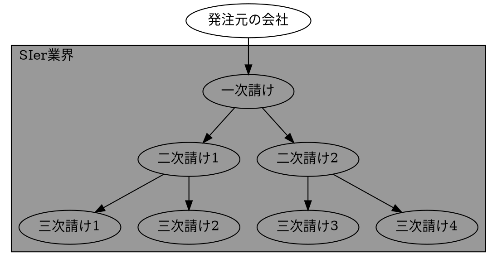
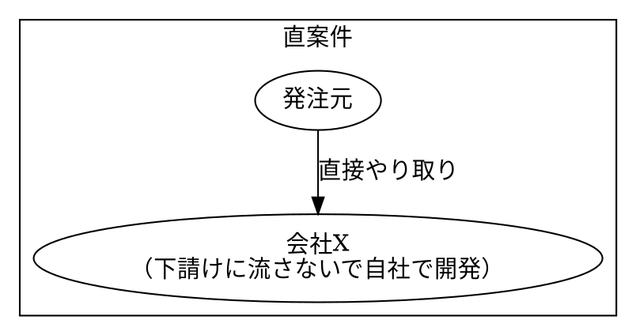
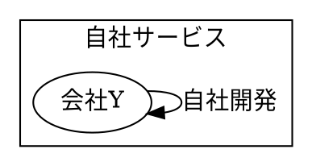

# 【SE】ブラックじゃない環境へ行く選択肢【４選】

こんにちは、Nash です。

この記事は、「**SE がブラックじゃないところに行く方法を選択肢としてまとめた**」記事です。

結論として、下記へ移動・転職です。

- ① 上流 SE
- ② 社内 SE
- ③ 直案件・社内案件を持つ SIer
- ④ 別業界

では、見ていきましょう。

※ SE＝システムエンジニア、でSIer系の話です。

## SE がブラックじゃないところに行く

大きく分けて２つの方向性があります。

- ① ピラミッドの上に登る
- ② 構造から抜ける

ちなみに、「SIer 業界がなんでブラックなの？」は理解している上で進めていきますね。

下記の記事で説明しています。

[【完全理解】SIer 業界 がブラックな理由を解説【わかりやすさ重視】](./reason-of-se-black)

整理のためにも、一読することをオススメです！

では、具体的に見ていきましょう。

### 上流 SE へ転職

⇒ **下流 SE から上流系の SE へ転職。**

今、下流系の SIer で SE として働いている人が上流系の SIer へ上流 SE として転職する方向です。

SIer 業界では構造な問題で下流にいるだけでブラック環境が**自然発生**します。

なので、救いを求めて上へ上へと行く形です。

この選択肢は**技術系でキャリアを進める人にはおすすめできません**。

上流ほど技術力ではなくてマネジメントで勝負する世界だからです。

なので、オススメできる人は、下記です。

- マネジメントが大好きで得意。
- すでにマネジメントで実績を出せている。

ただ、注意点なのは「**上流 SE ＝残業しない」ではない点**です。

少なくとも年収は上がります。ですが、ハードワークだったりします。

なので、個人的にはオススメはしません・・・。

### 社内 SE に転職

⇒**１次請けの更に上の発注元の企業のシステム部に転職する**。

SIer 業界構造的に、実は１次請けが一番トップではありません。

**発注元の企業にいるシステム部門**です。

つまり、「社内 SE 」にあたるかと思います。

そして、SIer 業界で上流 SE やマネジメント寄りの**経験があれば転職できる可能性は十分あります**。

実際に自分もこのポジションで働いていました。

ほぼ定時帰りな職場環境でしたよ。

[ホワイト社内 SE を経験して SIer のブラックを実感した話](./white-internal-se-and-black-se)

なので、オススメな人は下記です。

- マネジメント＋技術がそこそこ出来る。
- ハードワークに疲弊してるから、そこから抜けたい。

ただ、「**技術力がつかない**」という点で将来的なキャリアについて、やや不安感じる点があります。

「**一時的にハードワークから抜けるため**」という観点では悪くない選択かと思います。

## 直案件

⇒ ピラミッド構造から抜けて**直案件または社内開発系の企業へ行く**。

SIer がブラックになる原因の１つは「IT ゼネコン」とも呼ばれる業界構造です

なので、ピラミッド構造から抜けて、直案件または社内開発で仕事が回っている企業・プロジェクトへ行く方法です。

ただ、この企業・プロジェクトへ行くためには、下記のどちらかのスキルは必須です。

<!-- TODO：上流スキルSEのスキルを整理（1/25） -->

- 技術力
- マネジメント力

プロジェクト規模がそこまで大きくならないので、どちらかというと技術力のほうが需要がありそうな印象です。

### 別業界に行く（Web 系、社内 SE、コンサル

⇒**別業界に行く選択肢です**。

SIer の業界構造から別の業界へと転職する選択肢です。

具体的な選択肢として、下記がオススメです。

- Web 系
- 社内 SE
- コンサル

社内 SE はすでに上述してますね。

この中では個人的には Web エンジニアを１番オススメです。

[SE から異業種への転職先【おすすめ３選】](./recommend-job-change-choices-from-se)

自分も Web エンジニアに転職しました。

### まとめ

というわけで、SE がブラックじゃないところへ行く選択肢でした。

- ① 上流 SE
- ② 社内 SE
- ③ 直案件・社内案件を持つ SIer
- ④ 別業界

もし、「転職とか考えてみようかな〜」と思ったら、まず転職エージェントに相談するべきです。それが最短経路で転職活動が進むからです。

詳細については下記です。

[【転職活動】最初にやることは１つだけ【エージェントに相談】](./job-change-do-one)

### おわりに。

ブラックから抜けるための選択肢について考えてみました。

この記事がどなたかの助けになれば幸いです。
