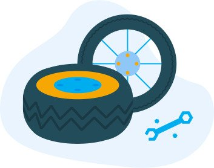

# 【転職可能】上流 SE のスキルを整理【オススメ３選】

こんにちは。上流 SE〜発注側まで経験して今は Web エンジニアの Nash です。

この記事は「**転職・キャリアアップなど将来を視野にいれた上流 SE のスキルを整理した記事**」です。

結論は下記です。

- 「技術力／マネジメント力」＝どっちかを主軸にする。
- 「業務知識」＝その上で希少性が欲しいなら頑張る。
- 「作業／調整力」＝スキルとは呼べない。

では見ていきます。

## 上流 SE のスキルを整理

上流工程 SE として、将来のキャリアを見据えたスキルセットを考えていきます。

大きく分けて３つです。

- 技術力
- マネジメント力
- 業務知識

## 技術力⇒技術系SE

技術力をつけることで「技術系の SE」としてキャリアを進められます。

### 特徴

技術系の SE は**汎用性がメチャクチャ高い**です。

技術力は知識による部分が大きいので、学習した分がそのまま技術力へ変換しやすいです。そのため、個人的には向き／不向きなどの**適正を考えることがないので誰にでもオススメ**できます。

（あえて言えば、IT 系の勉強に興味あるか？が向き不向きになる）

まず、ジョブチェンジの候補となる**転職の選択肢が別業界〜Web 系まで広がります**。また、需要も「技術力」という観点で極めて高いです。

### 具体的なスキル

例えば下記のようなスキルです。

- データベースを使いこなせる。
- Linux を使いこなせる。
- セキュリティを深く知る。
- プログラミングをできる。

### 懸念点

- 技術者評価が低い
- 開発環境が古く制限が多い
- モダンな技術ができない

▼ 技術者評価が低い

SIer 業界では技術者の評価が高くありません。特に多重請負構造などが理由により、生粋のプログラマーなどは下位職の待遇です。

▼ 開発環境が古く制限が多い

**開発環境がとにかく悪いです**。メモリが 8GB にすら満たない PC を支給されて構築をしないといけない可能性もあります。

▼ モダンな技術ができない

SIer業界では枯れた技術＝古い技術を採用する傾向にあります。

技術者として考えると「古い技術しか使えない」は、リスキーな点なんです。

また、その現場でキャリアを長く積みすぎると、**転職してモダンな現場に行くことが難しくなる可能性が高く**なります。

### ポイント

技術系 SE としてキャリアを進めるなら、手を動かす技術よりも設計など**上流工程に関係しやすい技術者になるのがオススメ**です。

理由は SIer ではプログラマーが下位職になる＋上流工程の方が旨味が大きいからです

具体的には、下記のようなスキルです。

- セキュリティ観点でシステムを評価できる
- アーキテクトレベルで設計できる

### 転職・キャリアアップ候補

- 別業種の SE（金融 ⇒ 保険など）
- フリーランス SE
- Web 系エンジニア

### まとめ

適正／運などの要素がなく努力がそのまま力になる上、市場価値が高く汎用性が高いので、とりあえずは誰にでもオススメです、

## マネジメント力⇒マネジメント系SE

### 特徴

マネジメント力をつけて、マネジメント系の SE としてキャリアパスを進めるケースです。

### 具体的なスキル

下記などです。

- 部下のタスク／スケジュールなどの管理・教育

- 優位に進められる交渉力。

- 会議をコントロールするファシリテーション能力。

### 懸念点

- 席が限られてる
- 運の要素がある
- キャリアが詰む可能性がある
- 適正の有無が大きい

▼ 席が限られている

まず、プロジェクト＋役職の両面でマネージャーという役職になれる**人数自体に限りがあります**。

プロジェクトだとイメージしやすいと思うんですが、基本的にマネージャー・リーダーは数％しかいません。役職としても、**競争相手が多い上に座席がかなり少ない**です。

▼ 運の要素がある

もし周りのメンバー全員のマネジメント能力が自分より優秀だった場合、自分がマネジメントを任さられることはありません。彼らが優先されます。席が限られているからです。

逆に現場の上司がガンガン辞めていったら上の席が空いて、スキルが足りてなくても自動的にマネージャーをやらされる可能性があります。

つまり、自分のスキルだけに依存しないで環境、つまり**運にキャリアプランが大きく依存**します。

▼ キャリアが詰む可能性がある

スキルが成長しない ⇔ アサインされない、の循環で**キャリアが詰む可能性**があります。

マネージャーとして経験を積んでいくためにも、管理できる範囲を広げていく必要があります。

例えば

- 「5 人くらいのチーム」
- →「10 人くらいのチーム」
- →「10x3 の 30 人くらいの複数チームのトップ」

みたいな感じでマネジメントのレベルをアップさせたいと考えます。

具体的には、10 人くらいのチームを管理していた人が、次の段階に行きたいケースです。

次の段階のレベルのマネジメント力がない場合、そのキャリアにアサインさせてもらえません。そして、その経験ができないのでスキルも伸びません。

つまり**「経験できないとスキルが上がらず、スキルが上がらないから経験ができない」という循環に入る可能性**があります。

▼ 適正の有無が大きい

今までの経験上、マネジメントは適正の有無が大きいように思います。

つまり**向いていない人は、トコトン向いてない**です。

なので、自分の過去を考えて適正が本当にあるか？を考えてから選択したほうが良いかと思います。

適正がないのに選ぶとストレスがヤバい上に、成果が出せれないので、将来的にもキャリアがヤバいです。

### ポイント

マネジメントは SIer 業界の花形です。なので、この方向性でキャリアを伸ばせられる環境・適正があるなら挑戦すべきかと思います。
この方向でキャリアが確立したら、正直**将来は安泰**だと思います。

というのも、「人を管理する」というマネジメント力はどの会社に行っても上位職で重宝されます。そのため、もし、**SE から別のキャリアになる場合でも、このスキルは役立つことが多い**です。

### 転職・キャリアアップ候補

マネジメント系の SE の候補です

- プロジェクト・マネージャー
- 監査法人のアドバイザリー
- IT 系コンサルタント

### まとめ

適正・運・環境によるところが大きいが、SIer業界の花形な上に、どの会社でも上位職としてやっていけるので、将来安泰になる可能性が高くなる。

## 業務知識⇒業務系SE

### 特徴

業務知識をつけて、業務知識がわかる IT 技術者としてのキャリアです。

例えば、金融・保険・不動産とかですね。

### 具体的なスキル

下記です。

- 業務知識
- 課題解決・対顧客折衝などのビジネススキル

### 懸念点

- 市場価値がやや低い
- 汎用性が低い

▼ 市場価値がやや低い

**市場価値を見出すのが少し難しい**ように思います。

業務知識を持っている IT 技術者が必要になるケースがあまり一般的ではないためです。
また、IT 技術者／業務知識の両面でスキルセットが**中途半端になるケースも**ありえます。

▼ 汎用性が低い

「技術力」「マネジメント力」が、どの業界・職種でも通じるスキルで汎用力がある一方で、「業務知識」は**限られた業界だけで使える知識**になりがちです。

### ポイント

「技術力／マネジメント力」のどちらかのスキルを持っている前提で、さらに「業務知識」があれば相乗効果で市場価値がかなり高くなるかと思います。

なので、個人的には SE が業務知識を伸ばすところから始めるのはオススメしません。

### 転職・キャリアアップ候補

下記です。

- ユーザー系の社内 SE
- ベンチャーの業務ディレクター

**穴場だとベンチャー系**に行ける可能性がある点です。例えば、金融系をやっていれば、FinTech 系ベンチャーのディレクターとか。SE で言うところのリーダー〜マネジメントに近いかと思います。

### まとめ

これ１つではスキルとしては魅力が弱すぎるのでオプションとして考えることをオススメする。

---

ここまでが上流SEとして重要になるスキルセットでした。

ここからは、上流SEとして仕事をしていると、よく使うのでスキルと勘違いしがちな、評価されないスキルセットについて整理します。

## 評価されないスキルセットとして

大別すると２つです。

- 作業
- 調整

これらもスキルではあります。
ただ、**スキルとしての価値が低くて昇進にも繋がりにくく、転職でも評価されにくい**です。

また、ビジネス的にも価値を生み出していないです。
ただ、けっこう楽しいので、仕事をしているつもりになりますが、俗に言う「仕事ごっこ遊び」というものだと思っています。

### 作業＝ Excel／Word／PowerPoint

具体的には、下記です。

- Excel で WBS がキレイに早く作れる
- Word で資料が作れる

これらはスキルとしては「作業」に分類されます。
極端なケースではバイトの人を雇ってお願いしても同じ結果なので、**こればっか頑張ってもAIどころかバイトによって代替されちゃう人材**になります。

当たり前ですが「VBA でプログラミングができます」なら技術力としてカウントして OK です。

### 調整＝顧客折衝／会議／ヒアリングなど

具体的には、下記です。

- 障害時に顧客とやり取りしたり。
- 会議で資料内容を顧客に説明したり
- 顧客から仕様などを聞き出したり。

これらは、スキルとしては「調整」に分類されるかと思っています。
必要最低限のビジネス・スキルがあれば、これらの作業は行えてしまいます。

**スキルではあるんですが市場価値としては低い**です。

### おわりに

以上が自分が考える上流 SE のスキルセットについてでした。

自分が新卒 SE のころは、いかに Excel で資料を早くキレイに作るか、とかを頑張っていましたが今振り返るとあれはスキルアップと呼べるものではなかったです。

この記事がどなたかの助けになれば幸いです。
