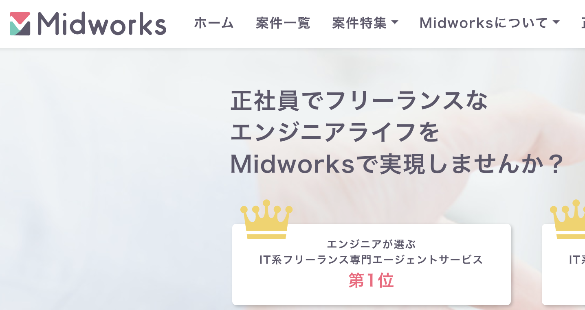
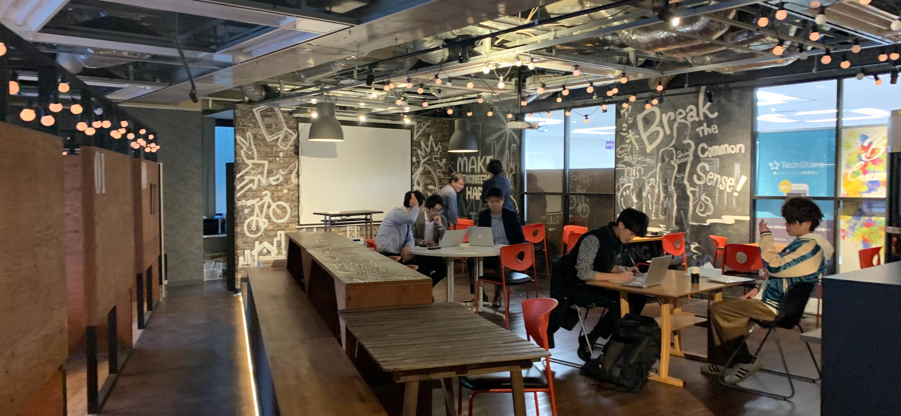
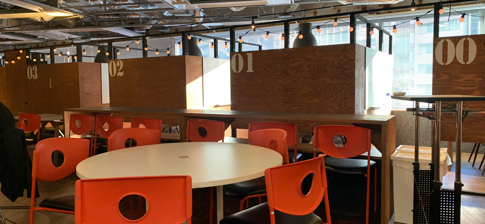
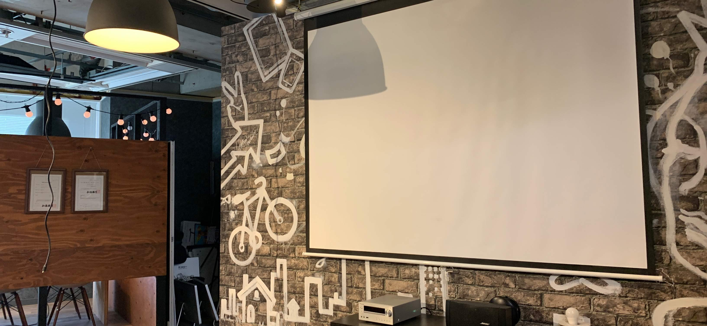
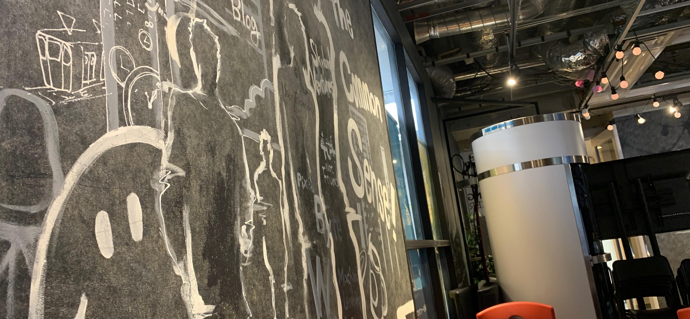
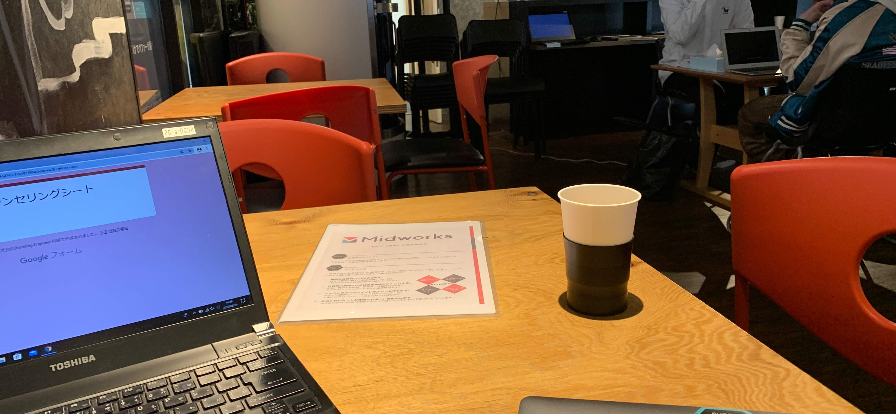

# 【写真あり】Midworks を現役エンジニアが使ったのでレビュー

こんにちは、Nash です。週 2 フルリモートで働いていて、稼働日数を増やそうかと思っている今日このごろです。

この記事は「**フリーランス向け求人・案件の紹介サービスの Midworks を利用してきた結果の記事**」になります。

結論ですが「**正社員の人が、はじめてフリーランスとして活動したくて案件を探している**」というケースにおすすめです。

<!-- アフィ -->

<!--  -->

もちろん、すでにフリーランスでゴリゴリ活動しているケースでも OK ですが、自分なら違うエージェントか直接クライントにコンタクト取って案件を見つけたほうが良さそうかなー、と思います。

では、下記の流れで見ていきましょう。

- 自分の背景
- Midworks の特徴
- Midworks へ行ってきた（画像５枚あり）
- Midworks を使ってわかったこと
- Midworks を使った所感

## 自分の背景

レビューの前にまずは自分の背景について簡単に説明させてください！３行で説明します！

- Web 開発はそろそろ 3 年目。フロント＋バックエンド出来る(React/Rails)
- フリーランスのエンジニアとして、すでに 1 年くらい活動してる
- 週 3~4 のフルリモート案件でフロントエンドを探してる。

以上です。

モデルケースとしては、ありきたりなので結構わかりやすいんじゃないですかね？

ではでは、次に Midworks について見ていきます。

## Midworks の特徴

**Midworks は「IT 系フリーランスに特化しているエージェント」**です。

強みを２つあげるなら下記かと思います。

- フリーランス向けの保証制度が充実してる
- 良心的なマージンかつマージン率をオープンにしてる

これらを踏まえて、詳細を１つずつ見ていきます。

### 【特徴 ①】IT 系フリーランスに特化しているエージェント

Midworks は IT 系フリーランスに特化しているエージェントサービスです。

- 公式 HP タイトル＝「**フリーランス**エンジニアのための求人・案件サイト【Midworks】」
- 公式 HP トップ＝「正社員で**フリーランス**なエンジニアライフを Midworks で実現しませんか？」

と、まぁフリーランスに全振りしているエージェントですね。

### 【特徴 ②】案件数＋非公開案件数は少なめ

オープン案件数は 1100 件でした(2020/3 時点)。ここから、更にクローズドな案件もあるので計算で出していきます。

「非公開案件数は 80%以上」と公式 HP で記述があるので、仮に最低値の 80%だとすると下記の計算になります。

- オープン案件数：1100 件(20%)
- 非公開案件数：4400 件(80%)
- ⇒ **全体案件数：5500 件**以上(100%)

IT 系エージェントで最強のレバテックフリーランスはオープン案件数が 10989 件(2020/3 時点)です。さらにクローズな案件もあるので、**案件数だけで比較するなら、レバテックのほうが圧倒的に多い**ですね。

### 【特徴 ③】フリーランスでも正社員並みの保障付き

Midworks 経由では案件に参画すると、**Midworks の保証・サービスがついてきます**。

- **報酬保証**：仕事が見つからなかった場合、契約単価の 8 割を支給
- キャリアップ支援：月 1 万円の学習費が支給
- 交通費支給：最大 3 万円まで
- （生命保険半額、福利厚生サービス、会計ソフト、etc）

フリーランスとして活動すると稼げる金額は増える一方で、正社員のように常に仕事＝収入があるとは限らない、などの**リスクが出てきます**。

その点、Midworks 経由で活動すればフリーランスの高所得を得つつ、Midworks の保証でリスクヘッジを行えますね。

特に、**報酬保証が他にエージェントにない強み**です。

### 【特徴 ④】良心的なマージン＆単価公開でクリアな契約

エージェントを仲介して案件を取る場合は、必ずエージェントにマージン（仲介料）が発生します。このマージン率はエージェントごとに、かなりピンきりです。

Midworks では、**マージン率をオープン**にしていて、かつ**一般的なマージン率よりも低い とされる 20%**に設定されているため

- このエージェントがボッタクってるんじゃないか？と疑心暗鬼にならない
- マージンが低いので、その分エンジニアの取り分が増える

と言ったメリットがあります。

ただ、20%が低いか？と言われれば、おそらくは IT の系のエージェントでは中間値くらい、なのかなー、というのが感覚値です。
エージェントによってはマージン率が 8%のところや、35%のところも知っているので。有名なところはざっと調べた感じでは 20%くらいが普通みたいなので。

---

さて、ここまでが Midworks についての説明でした。

次は実際に Midworks へ行ってきたところについてです。

⇒<a href="https://px.a8.net/svt/ejp?a8mat=3B5063+2LH2R6+3TVC+BX3J6" rel="nofollow">Midworks への登録はココから</a>

## Midworks へ行ってきた（画像５枚あり）

渋谷にある Midworks へ相談してきました。

ビル自体は素朴なビジネスビルでした。
内装を見ていきます。

▼Midworks の写真です。オープンなラウンジがあり、自分はここで面談しました。

▼ 半個室がいくつかあり、ここで面談をすることもありそうです。

▼ プロジェクターもあるので、ここでイベントもありそうですね。

▼ 内装は今どきの IT 系のエージェントって感じですね。

▼ 面談の開始前です

ここで実際に面談をしてきました。

では、ここからは実際に Midworks の面談を通じて使ってわかったことについて記述していきます。

⇒<a href="https://px.a8.net/svt/ejp?a8mat=3B5063+2LH2R6+3TVC+BX3J6" rel="nofollow">Midworks への登録はココから</a>

## Midworks 使ってみてわかったこと

わかったことを QA 形式で記述していきます。

### 【わかったこと ①】週 3 の案件はあるか？リモートの案件はあるか？

両方ともあるけれど全体からピックアップすると「**かなり少ない**」とのこと。

Midworks をレビューしてる他のサイトで

- 「週３でもいっぱい案件あります」
- 「リモート案件もいっぱいあります！」

みたいなレビューをしているサイトもあったけど、少なくとも 2020 年 3 月時点ではかなり少ないようでした。

（ただ、自分の条件の問題もあるので一概には少ないとは言えないですが。）

自分のケースでは、具体的に「週 3~4 ＋将来的にリモート可能」でお願いしたんだけど、自分の条件だとそもそも選択肢として**全部で 5 件しか案件がない**状態です。（ちょっと、少なすぎないかな）

とはいえ、Midworks の案件数が少ないというわけではなくて、どこも下記の条件だと案件が少ないのが現状なんだと思います。

- 週 3~4
- リモート可

以前、他のエージェントさんでも「この条件だと、案件数は少ないですね〜」と同じこと言われたので。

### 【わかったこと ②】週 5 で、リモートじゃない案件はあるか？

**かなりあります**。少なくとも自分の経歴なら「どこも欲しがる人材なので、マジで選びたい放題ですよ」的なニュアンスで言われました。

とはいえ、東京都心のエンジニアならどこも求人ではモテモテなので、いつもどおりな感じですね。Midworks の案件数はやや少ない印象です。

### 【わかったこと ③】月単価 100 万代の案件とかある？

少なくとも自分の条件では「65 万〜80 万」くらいでした。

エンジニアのキャリア次第なので、一概には無いとは言えないですね。ただ、Midworks をレビューしている別のサイトで**「月単価 100 万が案件の中心です」というレビューがあったのですが、これにはちょっと懐疑的**ですが。

### 【わかったこと ④】優良案件がある？

**Midworks のみが先行して取っている案件もある**ようです。（エージェントから口頭説明にて聞きました）

具体的には、「案件化する前の案件を見つけ出す部隊がいる」とのことでした。案件が発生しそうなクライアントへ、定期的にヒアリングを行っているため、案件がエージェント系の市場に出る前に確保できるそうです。

とはいえ、案件は「今日の朝増えました！」から「今日の夜にはなくなりました！」という、速度で増減するので、**ひとまず登録してエージェントに案件を探しておいてもらう**のが良いかと思っています。

⇒<a href="https://px.a8.net/svt/ejp?a8mat=3B5063+2LH2R6+3TVC+BX3J6" rel="nofollow">Midworks への登録はココから</a>

---

ここからは、Midworks を使って調べた結果、自分の所感をまとめていきます。

## Midworks についての所感

### 【感じたこと ①】クリーンな企業：継続を前提としたエージェントモデル

世の中には、単発の付き合いで利益を上げていく「あくどいビジネス」というのも存在します。

具体的に、紹介する案件は炎上案件でエージェントは美味しく仲介料をガツンと取ります。炎上案件に投入されたエンジニアは二度とそのエージェントを使わないし口コミで敬遠されがちです。エージェントは仲介料を大きく取れる代わりに、信頼を大きく犠牲にするスタイルですね。

その点、**Midworks では継続利用を前提にしたエージェントモデルを採用している**ように感じられました。

それが透けて見えるのは下記の制度・保証・サービスなどが理由です。

- マージン率を公開して信頼を高めている
- 継続利用がされやすいようにマージン率が良心的
- 継続利用のためにアフターケア専属の部署がある（と言われた）

Uber・Amazon・楽天みたいに、Evil な運営をしながら成長している企業が多い中でクリーンなモデルを全面に出しているエージェントなので、**個人的にはかなり好感が持てるエージェント**でした。

なので、エージェントとエンジニアという繋がりではなく、個人的にクリーンな企業だと感じたので応援してますー。

### 【感じたこと ②】「給与保証制度付き」は精神衛生のために使う

「給与保証制度」は、正社員からフリーランスになる人が**精神衛生のために活用すべき制度**だと思いました。

前述しましたが、「給与保証制度」は**案件の契約が出来なかった場合に 8 割の単価金額が Midworks から支給**されます。

ただ、都心でエンジニアをしていればわかりますが、1~3 年くらいのエンジニアのキャリアがあるだけで超売り手市場なので、**食いっぱぐれることはほぼ 100%ない**です。

高単価・高優遇な案件を探すのは、確実には出来ないかもしれないですが「下〜中の案件」なら、かなりの数があるわけです。

なので、給与保証制度が実際に使われるケースは本当にレアケースなんじゃないかなー、というのが個人的な意見です。

結果、給与保証制度は**正社員からはじめてフリーランスになる人が不安をケアするための精神衛生剤として機能**しそうです。

ちなみに、給与保証制度を使う場合は使っているエージェントサービスが Midworks「のみ」でないといけなかったり、と縛りがあるので、事前にエージェントの方に詳しく聞いたほうが良いです。

⇒<a href="https://px.a8.net/svt/ejp?a8mat=3B5063+2LH2R6+3TVC+BX3J6" rel="nofollow">Midworks のエージェント相談はココから</a>

### 【感じたこと ③】はじめてフリーランスになる人にベター

「正社員からフリーランスになる」と思うと、一番のネックは「**リスクに対する心配**」かと思います

少なくともフリーランスでは下記のようなリスクがあります。

- 正社員のように必ず収入があるわけでない
- 怪我などで働けなくなると収入が０になる

実際、よく言われるこれらのリスクも、エンジニアならほぼ無いようなものだと個人的には思っているのですが、とはいえ**「不安」はありますよね**。

Midworks 経由でフリーランス活動を開始すれば「給与保証制度」がリスクヘッジとしてカバーしてくれるので**「フリーランスになりたいけど、リスクが心配」**という人の精神衛生がケアできます。

なので、**正社員からフリーランスに初めてなる人にこそマッチするエージェント**なんだと思いました。

### まとめ

まとめです。

Midworks は「**IT の系フリーランス専門のエージェント**」でした。

- マージン率を公開しているオープンネスの文化がある
- マージン率が良心的で継続した付き合いを前提にしたエージェントモデル
- フリーランスで活動しながら正社員のような保証が受けられる

個人的には「**正社員から初めてフリーランスになる人におすすめしたいエージェントの１つ**」になります。

もし、フリーランスになるリスクに対して不安があって決断が出来ないなら、一度相談するところから始めることをおすすめします。

⇒<a href="https://px.a8.net/svt/ejp?a8mat=3B5063+2LH2R6+3TVC+BX3J6" rel="nofollow">Midworks への登録はココから</a>
