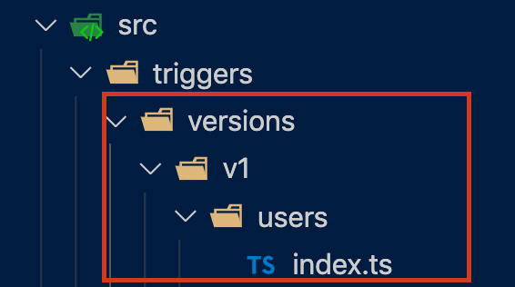
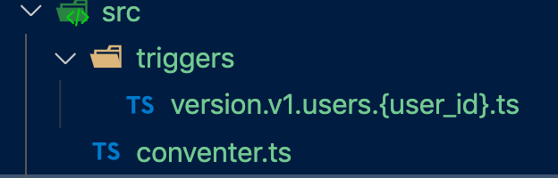
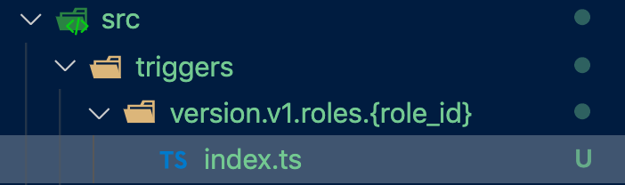

<!-- tweet -->
<blockquote class="twitter-tweet">
CloudFunctionトリガーを0⇒1で入れてるのでディレクトリ設計してみたけど、以前の現場ではFirestoreのパスに対して実行されるファイルが「ディレクトリ構造」で表現されてて、それだとネストが深くてツラかったので、今回は1階層にしてFirestoreのパスを全部「ファイル名」で表現してみる
&mdash; Nash⚡️ReactNative書いてる (@snamiki1212) <a href="https://twitter.com/snamiki1212/status/1263800367801757697?ref_src=twsrc%5Etfw">May 22, 2020</a></blockquote> 
<!-- tweet -->

## はじめに

機会があって CloudFunction を 0->1 で導入することになったので、ディレクトリ設計について考えたので、そのまとめです。

考えた結果は下記の３案になります。

- 案１）ディレクトリ構造で表現
- 案２）ファイル名で表現
- 案３）フォルダ名で表現

では、見ていきます。

（ちなみに、便宜上は Firestore について言及してますが、Realtimedatabase でも可能です）

### tl;dr

- 案１）で作りがちですが、個人的にはネストが深くてすぐに可読性が落ちるので微妙な設計かと思ってます。
- 案２）は小〜中規模のプロジェクトで、案３）は中〜大規模のプロジェクトで合うように思います。

### Firestore のストレージパスとトリガーファイル

案について述べる前に、ディレクトリ設計をする理由などについて簡単におさらいします。

Firebase で提供されている Firestore と CloudFunction のトリガーを組み合わせると、

- 任意の Firestore のストレージパスに対して CRUD されたことを発火点に、任意のトリガー関数を実行する

ということが出来ます。

そのため、下記についてのマッピングを考えます。

- A）発火元のストレージパス
- B）実行されるトリガーのファイル・ディレクトリ

それぞれが紐づくわけですが、B）の設計についてこの記事では考えます。

では、各案を見ていきます。

## 案１）ディレクトリ構造で表現

一番、一般的なやり方かと思います。

`version/v1/users/index.ts` のようにディレクトリ配下にトリガーファンクションのファイルを管理します。

こんな感じ。

### メリット

- 直感的にわかりやすい
- `helper.ts`などを近くに起きやすい

### デメリット

- ネストが深くなる
  - Firestore の構造が複雑になり対応するトリガーも増加すると、合わせてこのディレクトリ構造のネストも深くなります。
- 規約違反な書き方・置き方をしていても漏れやすい
  - ディレクトリが多くなってごちゃごちゃすると、どのファイルがどのストレージパスとマッピングしているか？で間違いが出てきたりします。

### 所感

普通に設計するとこの構造になるかと思うのですが、上に挙げたデメリットの負の部分が大きいと思っているので、個人的には案２）か案３）が良いかと思ってます。

## ２）ファイル名で表現

最近、試していて個人的に気に入ってます。

`version.v1.users.{user_id}.ts` のようなファイル名でトリガーファンクションのファイルを管理します。

こんな感じです。

メリデメは下記かと思います。

### メリット

- ネストがない。ファイル名で深さを表現するので常にネストなしになります
- １つのストレージパスに対して、絶対に１つのファイルになる。なので間違って変なところにトリガーを書くことがなくなる。

### デメリット

- 「ファイル名で表現」ということに抵抗があるメンバーがいるかも。。。（とはいえ、Next.js とか Nest.js でも割と使われてる方法なので、それを引き合いに出せば説得できるんじゃないかな）
- 「あるストレージパスの配下だけで使う helper.ts」みたいのを定義できないです。
  - helper は、`/triggers`の外のパスに出して`/src/helper.ts`とかに置いてここを参照するような感じになるかと思います。

### 所感

１つのストレージパスに対して複数のファイルを置くことができないので、大規模になると辛そうですが、小〜中規模ならメリットのほうが大きいと思ってます。むしろこの置き方のほうが制限ができるのでカオスになる可能性がなくなりますしね。

ちなみに、ファイル名による規約化も簡単にできるので規約化しちゃうコードを書くのもありかもです。

## 案３）フォルダ名で表現

`version.v1.users.{user_id}/index.ts` のようにフォルダ名でトリガーファンクションのファイルを管理します。

こんな感じです。

メリデメで列挙すると下記かと思います。

### メリット

- ネストが１層だけでこれ以上は深くならない
- １つのストレージパスに対して、絶対に１つのフォルダになる。なので間違って変なところにトリガーを書くことがなくなる。

### デメリット

- 案２）と同じく、やや直感的ではない命名なのでチーム内で嫌がる人もいるかも。。。
- ネストが１層あるので、ファイルの確認のために 1 回オープンしないといけないです。ネストが深くなることはないですが、エディタとかで見るときに絶妙に見づらいですし、意識しないと見にいけないです。

### 所感

比較で考えると、「ファイル名で表現する案２」と比較して、１層多くディレクトリを切るので複数ファイルを格納することができるようになります。

なので、

- onCreate/onRead/onUpdate/onDelete が Fat になってしまうのでファイル単位に分けたい
- 近くに`helper.ts`を置きたい

みたいなことができるようになるので、中〜大規模のときに向いてるのかな、と思います。

### おわりに

いろいろ設計を考えてみました。案１）で実際に開発していた経験はあるのですが、案２）・案３）ではあまりゴリゴリ開発した経験がないので、ここに書かれている以外の隠れた問題があるかもしれないです。

あと、案２）のファイルで設計する構造のときに規約化するロジックもまとめたのでこちらでどうぞ。

[CloudFunctionsのトリガーのファイルを規約化する - Qiita](https://qiita.com/snamiki1212/items/d908fe23257bc909e5ff)

