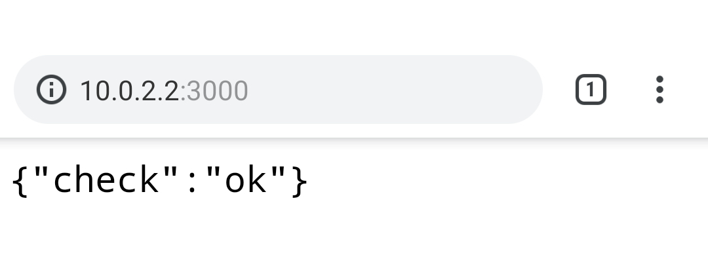

# 【手順】Expo＋Android Studio のエミュレーターでローカル環境構築

この記事は下記の構築手順です。

1. Android Studio の導入

2. Android Studio のエミュレータにて、ReactNative の Expo アプリケーションを動かす

3. そのアプリケーションから、自マシンのローカルホストの API と疎通するところ

モダンな環境の手順なので陳腐化が激しいのと基本的にドキュメントを参照すれば OK なのだが、3 とかをそもそも知らないのでかなりハマったので流れ自体をメモがてら記事として残します。

### 前提

- すでにExpo のアプリケーションを開発してる
- これから Andoroid のエミュレーターを入れたい。
- brew cask は入れてある（なければ、先に入れてください）

### android studio取得

```shell
# Andorid-Studio取得
# > brew cask経由を推奨。他のやり方に比べて、ワンライナー＋管理も簡単なので。
brew cask install android-studio

```

### android studio での環境構築

公式 Doc（[Expo Documentation - Android Studio Emulator](https://docs.expo.io/versions/latest/workflow/android-studio-emulator/)）に、手順があるが、2020/1/29 時点では下記なので微妙。

- 画像とか少なくてわかりにくい
- 手順が完結してない。（Virtual Device を起動するところで手順が終了してて Expo 周りの話がない。なんでだ。Expoが出してるDocだろｗ）

なので下記の Stackoverflow を参照。

▷[react native - Expo run on android emulator using windows 10 - Stack Overflow](https://stackoverflow.com/questions/52751874/expo-run-on-android-emulator-using-windows-10)

（タイトルに Windows と入ってるけど関係ない。Mac で出来る。）

---

これでエミュレーター上で Expo のアプリケーションの起動までは完了。

クラサバでなくて、クライアントのみのスタンドアローンなアプリケーションならこれで終了。
クラサバ構成で、サーバーを localhost に設定しているなら次。

### ローカルで起動しているアプリケーションサーバーのローカルホストの IP

下記ケース。

- ローカルに直接／Docker とかでアプリケーションサーバーを立てている

- エミュレーターから、このアプリケーションサーバーにリクエストを投げる。

現状のままだと、タイムアウトになる。理由は、**エミュレーターからみた localhost がエミュレーター自身を指してしまう**ので、正しくリクエストが投げられていない。

なので、コード内で`localhost` と設定している箇所をすべてエミュレーターからみた「ホストマシンのローカルホスト宛て」の IP に変える。

```shell
# リクエスト先を、localhost宛てにしてると
エミュレーター　⇒　エミューレータのlocalhost

# リクエスト先を、ホストマシンのlocalhost宛てに変更
エミュレーター　⇒　ホストマシンのローカルホスト（アプリケーションサーバー）
```

具体的な IP などは、下記参照。

▷ [How do you connect localhost in the Android emulator? - Stack Overflow](https://stackoverflow.com/questions/5528850/how-do-you-connect-localhost-in-the-android-emulator)

もし、これでもタイムアウトエラーになるなら問題の切り分けとして、ブラウザ経由で自マシン上のローカルホストへリクエストを投げられているか、の確認とかすると、良いと思う。



こんな感じ。

---

ともあれ、これでエミュレーターからローカルに立てたAPIサーバーへの疎通まで完了。

### おわりに

Expo で開発してる案件で Android だけで発生するバグ調査のために、エミュレーターの環境構築をしたが、環境を作るところでかなりハマってしまった。

この記事がどなたかの助けになれば幸いです。
