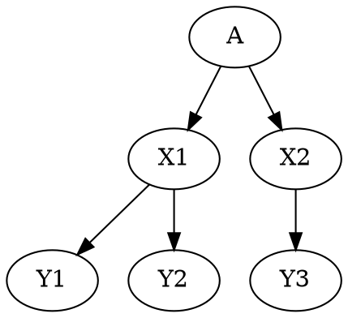

# h1

this is body

## h2

this is body

### h3

this is list

- list1
- list2
- list3

this is list

## Texts

- **bold** and _italics._
- lists
- [links](https://astro.build)
- and more!

## Number List

1. one
2. two
3. three

## Nest List

- parent
  - child
    - grand-child
- parent2

## Long sentence in List

- Tokyo (/ˈtoʊkioʊ/;[7] Japanese: 東京, Tōkyō, [toːkʲoː] (listen)), officially the Tokyo Metropolis (東京都, Tōkyō-to), is the capital and most populous city of Japan.[8] Formerly known as Edo, its metropolitan area (13,452 square kilometers or 5,194 square miles) is the most populous in the world, with an estimated 37.468 million residents as of 2018;[9] the city proper has a population of 13.99 million people.[4] Located at the head of Tokyo Bay, the prefecture forms part of the Kantō region on the central coast of Honshu, Japan's largest island. Tokyo serves as Japan's economic center and is the seat of both the Japanese government and the Emperor of Japan.
  - Tokyo (/ˈtoʊkioʊ/;[7] Japanese: 東京, Tōkyō, [toːkʲoː] (listen)), officially the Tokyo Metropolis (東京都, Tōkyō-to), is the capital and most populous city of Japan.[8] Formerly known as Edo, its metropolitan area (13,452 square kilometers or 5,194 square miles) is the most populous in the world, with an estimated 37.468 million residents as of 2018;[9] the city proper has a population of 13.99 million people.[4] Located at the head of Tokyo Bay, the prefecture forms part of the Kantō region on the central coast of Honshu, Japan's largest island. Tokyo serves as Japan's economic center and is the seat of both the Japanese government and the Emperor of Japan.

## Code Block

TypeScript

```tsx
const Component = () => {
  return <div>Hi :D</div>;
};
```

Diff

```diff
const Component = () => {
+   return <p>Hi :D</p>;
-   return <div>Hi :D</div>;
};
```

Dot file


