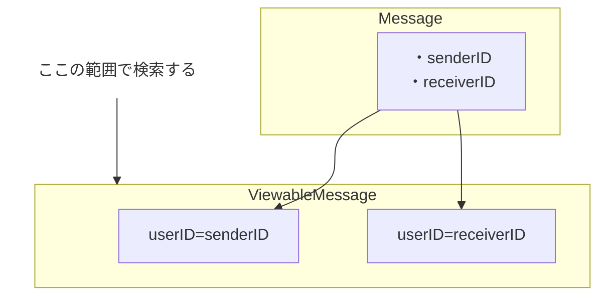
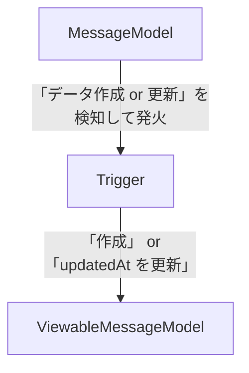
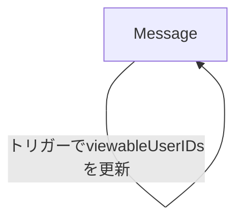
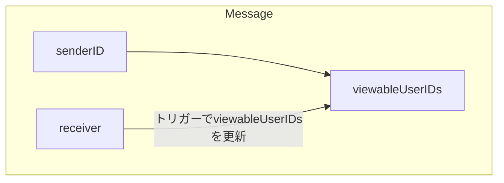

## 【Firestore】「orWhere」が使えない時の代案のまとめ

この記事は、「Firestore のような NoSQL で orWhere が使えないときの、代案をまとめた記事」です。

### 背景

Firestore を使っている現場で orWhere が必要なケースが出てきました。
ですが、Firestore は orWhere がサポートされていません。(2019/9 時点)

- [firebase/firebase-js-sdk - FR: Firestore OR operator in WHERE query #321](https://github.com/firebase/firebase-js-sdk/issues/321)

NoSQL なので、ここらへんは仕方ないですが、どうにか代案を考えて実現はしないといけないので、そのときに考えた結果をまとめました。

(追記: 2019-09-09)
また、[公式ドキュメント - Cloud Firestore で単純なクエリと複合クエリを実行する | Firebase](https://firebase.google.com/docs/firestore/query-data/queries)にて、言及されていました。

> 論理 OR クエリ。この場合は、OR 条件ごとに独立したクエリを作成し、アプリでクエリ結果を結合する必要があります。

ただ、後述の案 ③ なら、ビューフィールドを用意する必要はありますが、クエリレイヤーで解決できます。

### ユースケース

```ts
////// Entity

// firestore:users/{user}
type user = {
  id: string;
  // ...
};

// firestore:messages/{message}
type message = {
  id: string;
  senderID: string; // = userID
  receiverID: string; // = userID
  createdAt: Date;
  updatedAt: Date;
};
```

＜ユースケース＞

- 「自分が投げた Message」＋「自分が受け取った Message」のリストを表示
- updatedAt の DESC 順

## orWhere の 代案

出てきた案として下記 3 つです。
（追記：さらに 1 個追加。実装終わってから気付いたのが悔やまれる(2019/9/6)）

### 【案 ①】クエリを２つ投げて、アプリレイヤーで１つの List に結合して、最後にソート。

- メリット：データを持つ必要がない ⇐ データ整合性を気にしないで良い
- デメリット：結合やデータ取得のロジックが複雑になる

### 【案 ②】検索用のビューをコレクションに作る

- メリット：データ取得のロジックが案 ① よりも簡素になる。
- デメリット：データを保持するので、データ整合性を担保しておかないといけない
  - ⇐Firebase を使っているケースなら、CloudFunctions のトリガーも使えると思うので、データ整合性の担保を取りやすい
- デメリット：検索用コレクションで絞ったリストを元にクエリを投げるが、Firestore には whereIN もない（2019/9 時点）。なので、N+1 回のクエリが必要なので fetch 回数が多い
  - ⇐Firestore なので、むしろそういうもの、だど割りきる。

### 【案 ③】検索用のビューをフィールドに Array で作る

- メリット：クエリレイヤーですべて解決できる
- デメリット：トリガーの発火元と更新先が自分自身なので、無限ループする可能性を少し秘めている。
  - ただ、そこまで気にするほどではないかと思う
- デメリット：データを保持するので、データ整合性を担保しておかないといけない（案 ② と同じ。）

~結論ですが、案 ② の方針にしました。案 ① だと無限スクロールとの併用が特につらそうだったので。~

今なら、案 ③ で実装します。実装が終わった後に、array-contains の機能を知ったので気付かなかったです。

では、１つずつみていきます。

## 【案 ①】2 つクエリを投げて、1 つに結合

だいたいこんな感じになります。

```ts
const me = "<Userモデルの自分のデータ>";
const lastQ1Visible = "<q1の前回取得分の最後>";
const lastQ2Visible = "<q2の前回取得分の最後>";

const snap1 = await db
  .collection("messages")
  .where("senderID", "==", me.id)
  .orderBy("updatedAt")
  .limit(10)
  .startAt(lastP1Visible)
  .get();

const snap2 = await db
  .collection("messages")
  .where("receiverID", "==", me.id)
  .orderBy("updatedAt")
  .limit(10)
  .startAt(lastP2Visible)
  .get();

const [q1, q2]: Message[] = [snap1, snap2].map((snap) => ({
  id: snap.id,
  ...snap.data(),
})); // 結果をentity に格納

const result = sortDesc([...q1, ...q2]); // `sortDesc` はupdatedAt で ソートをしてくれるようなヘルパーの想定
```

実際は結合する前にきちんと「ソート条件とデータ順番」についての確認してあげないといけないです。

例えば

- p1 の条件のデータ群の 20 件は最近の分
- p2 の条件のデータ群の 20 件は 5 年前の分
- Limit がそれぞれ 10 件ずつ

となると、1 回目の fetch 結果が、

**「最近の p1 の 10 件」＋「5 年前の p2 の 10 件」 を updatedAt でソートした結果**

になってしまいます。

なので、結合して良いかを確認して、結合不可の場合はキャッシュの変数に格納しておいて、次の fetch タイミングではそこから取って、みたいな処理にしないといけなさそうです。

更に、無限スクロールが入ってくると、ここらへんの処理が複雑になるかと思います。

この案は、「ページネーション がないような、一度ですべてのデータを取得できるようなケース」のときに良さそうです。

## 【案 ②】検索用のビューをコレクションに作る

下記のような Model でのコレクションを作っておきます。

```ts
// firestore:viewableMessages/{viewableMessage}
type ViewableMessage = {
  messageID: string;
  userID: string; // <= senderID or receiverID
  createdAt: Date;
  updatedAt: Date;
};
```

関係性として、1 つの Message に対して、2 つの ViewableMessage の Document が存在する関係です。



データ生成については後述しますが、ひとまずデータも用意されている前提で話を進めます。

実装は、下記のようになるかと思います。

```ts
const me = "<Userモデルの自分のデータ>";
const lastVisible = "<前回取得分の最後>";

// ①viewableMessageから取得。これで、ほしいMessageIDの一覧がわかる。
const snaps1 = db
  .collection("viewableMessages")
  .where("userID", "==", me.id)
  .orderBy("updatedAt")
  .limit(10)
  .startAt(lastVisible)
  .get();
const viewableMessages: ViewableMessage[] = snaps1.map((snap) => ({
  id: snap.id,
  ...snap.data(),
}));

// ②viewableMessage が持つMessageIDの、Messagesをすべて取得。
const snaps2 = viewableMessages.map((viewableMessage) =>
  db.collection("messages").doc(viewableMessage.messageID).get()
);
const result = snaps2.map((snap) => ({ id: snap.id, ...snap.data() }));
```

案１に比べて、案２はロジックも少なく、Pagination・無限スクロールなども入れやすい形ですね。

ただ、① ＋ ② で N+1 の回数分だけクエリが発行されてしまいます。ただ、Firestore なので、「そういうもの」だとと思っているので、ここは個人的には許容範囲です。

### 案 ② のデータ保持

さて、案 ② の ViewableMessage ですが、message とデータ整合性を取らないといけません。

特に、今回のユースケースが `updatedAt` の順番なので、message の値が更新されたら、viewableMessage の `updatedAt` も更新してあげないといけません。

こういうときには、CloudFunctions のトリガーを使うのがベターだと思っています。



こんな感じで、データ整合性の担保をします。

今回のケースでは、一方方向のデータ依存性なので、トリガーが連鎖してループする可能性も少ないかと思います。

## 【案 ③】検索用のビューをフィールドに Array で作る (追加)

Message に viewableUserIDs などの userID のリストを保持するフィールドを用意します。

```ts
type message = {
  id: string;
  senderID: string;
  receiverID: string;
  viewableUserIDs: string[]; // <<< これを追加
  createdAt: Date;
  updatedAt: Date;
};
```

そして、格納するデータは`viewableUserIDs = [senderID, receiverID]` として、閲覧可能な User の ID を入れておきます。

これなら、Create するときに、合わせて作成できるので、わざわざトリガーにする必要もないですね。

そして、検索条件として、`array-contains`を使います。`array-contains`は、Array の中に任意の値が含まれていれば fetch してくれる、リスト内検索機能です。

```ts
const me = "<Userモデルの自分のデータ>";
const lastQueryVisible = "<前回取得分の最後>";

const snap = await db
  .collection("messages")
  .where("viewableUserIDs", "array-contains", me.id) // << こいつ
  .orderBy("updatedAt")
  .limit(10)
  .startAt(lastQueryVisible)
  .get();

const message: Message = { id: snap.id, ...snap.data() };
```

案 ①、案 ② よりも、かなりスッキリしましたね。

### 案 ③ のデータ保持

また、仮に「送信先の User を変更可能にする」という要件が出てきたとします。

このとき、Message の中の receiverID の変更に合わせて、viewableUserIDs の値も変更しないといけません。

変更する際は、案 ② と同じくトリガーを使う想定で考えます。

このとき、案 ② とは異なり、自己参照の関係になるので、トリガーの条件に注意しておかないと、トリガーがループする可能性がある点です。

つまり、下記が同じ Message になる、ということです。

- トリガー発火の元の Document
- トリガー発火で起きる更新先の Document



とはいえ、フィールドごとに見れば、単方向の関係性なので、そこまで問題はないかと思います。



### 所感

案 ② で、実体ありビューを作成することになりますが、トリガーを使えば管理コストもそこまで高くならないかと思います。

実装が終わってから、案 ③ に気付いたのが悔やまれる。
